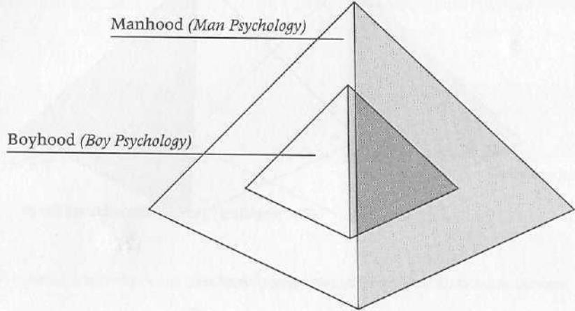

THE LAYERED PYRAMID, OR THE PYRAMID WITHIN A PYRAMID, OF THE MASCULINE SELF STRUCTURES

Figure 3.

and vulnerable, in a reed basket and set adrift on the Nile. The model for this story was the much older legend of the infancy of the great Mesopotamian king Sargon of Akkad. And from all over the world we hear legends about the wondrous infancy of the baby Buddha, the baby Krishna, the baby Dionysus.

Even less known is that this figure of the Divine Baby Boy, universal in our religions, is also universal inside ourselves. This can be seen from the dreams of men in psychoanalysis, who frequently, especially as they start to get better, dream about a Baby Boy who fills the dream with light and joy and a sense of wonder and refreshment. Often, too, when a man in therapy starts to feel better, the urge comes to him, perhaps for the first time in his life, to have children.

These events are signals that something new and creative, fresh and "innocent," is being born within him. A new phase of his life is beginning. Creative parts of himself that he had been unconscious of are now thrusting upward into awareness. He is experiencing new life. But whenever the Divine Child within us makes itself known, attack from

the Herods, within and without, is not far behind. New life, including new psychological life, is always fragile. When we feel this new energy manifesting within us we need to move to protect it, because it is going to be attacked. A man may say in his therapy, "I may actually be getting better!" And right away, he may be answered by an inner voice that says, "Oh no, you're not. You know you can never be well." It is then time to get the fragile Divine Child to "Egypt."

Picking up on the theme in the Christmas story of the adoring animals and the angels' proclamation of peace on earth, we can see in the Greek myth of Orpheus that the Divine Child is the archetypal energy that prefigures the mature masculine energy of the King. The man-God Orpheus sits at the center of the world playing his lyre and singing a song that brings all the animals of the forest to him. They are drawn by the song, prey and predator. And they come together around Orpheus in perfect harmony, their differences resolved, all of the opposites brought together into a world-transcending order (characteristic functions of the King, as we shall see).

But this theme of the Divine Child bringing peace and order to the whole world, including the animal world (and animals, looked at psychologically, stand for our own often conflicting instincts), is not limited to ancient myths. A young man who had entered analysis once told us a story about an unusual event in his childhood. When he was probably five or six years old, he told us, he went out into his backyard one spring afternoon yearning for something he was too young to identify but that, upon reflection later in life, he saw was a yearning for inner peace and harmony and a sense of oneness with all things. He stood with his back to a huge oak tree which grew in his yard, and he began to sing a song he made up as he went along. It was hypnotic for him. He sang his longing. He sang his sadness. And he sang a kind of minor-key deep joy. He sang a song of compassion for all living things. It was a kind of self- and other-soothing lullaby (a song to the Baby Boy). And pretty soon he began to notice that birds were coming to the tree, a few at a time. He continued singing, and as he sang, more birds came, whirling and circling around the tree and alighting in its branches. At last, the tree was filled with birds. It was alive with them. It seemed to him that they had been lured by the beauty and compassion of his song. They confirmed *his* beauty, and answered *his* yearning by coming to adore him. The tree became a Tree of Life, and refreshed by this confirmation of his inner Divine Child, he could go on.

The Divine Child archetype that appears in our myths as Orpheus, as Christ, as the infant Moses, and as various figures in the myths of many religions, in the dreams of men undergoing therapy, and in the actual experiences of boys appears to be in the "hard wiring" of us all. We seem to be born with it. It goes by many names and is evaluated differently by the different schools of psychology. Usually, psychologists condemn it and, in effect, try to disconnect their clients from it. The important thing is to see that the Divine Child is built into us as a primal pattern of the immature masculine.

Freud talked about it as the Id, the "It." He saw it as the "primitive" or "infantile" drives, amoral, forceful, and full of God-like pretensions. It was the underlying push of impersonal Nature itself, concerned only with satisfying the unlimited needs of the child.

The psychologist Alfred Adler talked about it as the hidden "power drive" in each of us, as the hidden superiority complex that covers our real sense of vulnerability, weakness, and inferiority. (Remember, the Divine Child is both all-powerful, the center of the universe, and at the same time totally helpless and weak. In fact, this is the actual experience of infants.)

Heinz Kohut, who developed what he called "self-psychology," talks about it as "the grandiose self organization," which is demanding of ourselves and others in ways that can never be fulfilled. The most recent psychoanalytic theory suggests that people who are possessed by or identified with this "infantile" grandiosity are expressing a "narcissistic personality disorder."

The followers of Carl Jung, however, view this Divine Child differently. They do not see it in largely pathological terms. Jungians believe that the Divine Child is a vital aspect of the Archetypal Self—the Self with a capital *S*, because it is different from the Ego, which is the self with a small *s*. For Jungians, this Divine Child within us is the source of life. It possesses magical, empowering qualities, and getting in touch

with it produces an enormous sense of well-being, enthusiasm for life, and great peace and joy, as it did for the young boy under the oak tree.

These differing schools of psychoanalysis, we believe, are each right. Each picks up on the two different aspects of this energy—the one integrated and unified, and the other the shadow side. At the top of the triangular archetypal structure, we experience the Divine Child, who renews us and keeps us "young at heart." At the base of the triangle, we experience what we call the High Chair Tyrant and the Weakling Prince.

# The High Chair Tyrant

The High Chair Tyrant is epitomized by the image of Little Lord Fauntleroy sitting in his high chair, banging his spoon on the tray, and screaming for his mother to feed him, kiss him, and attend him. Like a dark version of the Christ child, he is the center of the universe; others exist to meet his all-powerful needs and desires. But when the food comes, it often does not meet his specifications: it's not good enough; it's not the right kind; it's too hot or too cold, too sweet or too sour. So he spits it on the floor or throws it across the room. If he becomes sufficiently self-righteous, no food, no matter how hungry he is, will be adequate. And if his mother picks him up after "failing" him so completely, he will scream and twist and reject her advances, because they were not offered at exactly the right moment. The High Chair Tyrant hurts himself with his grandiosity—the limitlessness of his demands—because he rejects the very things that he needs for life: food and love.

Characteristics of the High Chair Tyrant include arrogance (what the Greeks called hubris, or overweening pride), childishness (in the negative sense), and irresponsibility, even to himself as a mortal infant who has to meet his biological and psychological needs. All of this is what psychologists call inflation or pathological narcissism. The High Chair Tyrant needs to learn that he is not the center of the universe and that the universe does not exist to fulfill his every need, or, better put, his limitless needs, his pretensions to godhood. It will nurture him, but not in his form as God.

The High Chair Tyrant, through the Shadow King, may continue to be a ruling archetypal influence in adulthood. We all know the story of the promising leader, the CEO, or the presidential candidate, who starts to rise to great prominence and then shoots himself in the foot. He sabotages his success, and crashes to the earth. The ancient Greeks said that hubris is always followed by nemesis. The gods always bring down those mortals who get too arrogant, demanding, or inflated. Icarus, for instance, made wings of feathers and wax in order to fly like the birds (read "gods") and then in his inflation, and against his father's warning, flew too close to the sun. The sun melted the wax, the wings disintegrated, and he plummeted into the sea.

We are familiar with the saying "Power corrupts, and absolute power corrupts absolutely." King Louis XVI of France lost his head because of his arrogance. Often as we men rise in the corporate structure, as we gain more and more authority and power, the risk of self-destruction also rises. The boss who wants only yes men, who doesn't want to know what's going on, the president who doesn't want to hear his generals' advice, the school principal who can't tolerate criticism from his teachers—all are men possessed by the High Chair Tyrant riding for a fall.

The High Chair Tyrant who attacks his human host is the perfectionist; he expects the impossible of himself and berates himself (just as his mother did) when he can't meet the demands of the infant within. The Tyrant pressures a man for more and better performance and is never satisfied with what he produces. The unfortunate man becomes the slave (as the mother was) of the grandiose two-year-old inside of him. He has to have more material things. He can't make mistakes. And because he can't possibly meet the demands of the inner Tyrant, he develops ulcers and gets sick. He can't, in the end, stand up to the unrelenting pressure. We men often deal with the Tyrant by finally having a heart attack. We go on strike against him. Finally, the only way to escape the Little Lord is to die.

When the High Chair Tyrant cannot be brought under control, he will manifest in a Stalin, Caligula, or Hitler—all malignant sociopaths. We will become the CEO who would rather see the company fail than deal with his own grandiosity, his own identification with the demand-

ing "god" within. We can be Little Hitlers, but we're going to destroy our country in the process.

It has been said that the Divine Child wants just to be and to have all things flow toward him. He does not want to do. The artist wants to be admired without having to lift a finger. The CEO wants to sit in his office, enjoying his leather chairs, his cigars, and his attractive secretaries, drawing his high salary, and enjoying his perks. But he does not want to do anything for the company. He imagines himself invulnerable and all-important. He often demeans and degrades others who are trying to accomplish something. He is in his high chair, and he is setting himself up to get the ax.

### The Weakling Prince

The other side of the bipolar shadow of the Divine Child is the Weakling Prince. The boy (and later, the man) who is possessed by the Weakling Prince appears to have very little personality, no enthusiasm for life, and very little initiative. This is the boy who needs to be coddled, who dictates to those around him by his silent or his whining and complaining helplessness. He needs to be carried around on a pillow. Everything is too much for him. He rarely joins in children's games; he has few friends; he doesn't do well in school; he is frequently hypochondriacal; his slightest wish is his parents' command; the entire family system revolves around his comfort. He reveals the dishonesty of his helplessness, however, in his daggerlike verbal assaults on his siblings, his biting sarcasm directed against them, and his patent manipulation of their feelings. Because he has convinced his parents that he is a helpless victim of life and that others are picking on him, when a controversy arises between himself and a sibling, his parents tend to punish the sibling and excuse him.

The Weakling Prince is the polar opposite of the High Chair Tyrant, and though he rarely throws the tantrums of the Tyrant, he nonetheless occupies a less easily detectable throne. As is the case with all bipolar disorders, the Ego possessed by one pole will, from time to time, gradually slide or suddenly jump over to the other pole. Using the imagery of bipolar magnetism to describe this phenomenon, we can say that the

polarity of the magnet reverses depending on the direction of an electrical current passing through it. When such a reversal occurs in the boy caught in the bipolar shadow of the Divine Child, he will switch from tyrannical outbursts to depressed passivity, or from apparent weakness to rageful displays.

# Accessing the Divine Child

In order to access the Divine Child appropriately, we need to acknowledge him, but not identify with him. We need to love and admire the creativity and beauty of this primal aspect of the masculine Self, because if we don't have this connection with him, we are never going to see the possibilities in life. We are never going to seize opportunities for newness and freshness.

Whether activist, artist, administrator, or teacher, everyone in a leadership capacity needs to be connected with the creative, playful Child in order to manifest his full potential and advance his cause, his company, and generativity and creativity in himself and others. Connection with this archetype keeps us from feeling washed up, bored, and unable to see the abundance of human potential all around us.

We have said that therapists often depreciate the grandiose Self within their clients. Although it is necessary, at times, for clients to gain emotional and cognitive distance from the Divine Child, we ourselves have not encountered many men (at least among those who seek therapy) who *identify* with their creativity. Rather, they usually need to get in touch with it. We want to *encourage* greatness in men. We want to encourage ambition. We believe that nobody really wants to be sort of gray-normal. Often, the definition of normal is "average." We live, it seems to us, in an age under the curse of normalcy, characterized by the elevation of the mediocre. It seems likely that therapists who persistently depreciate the "shining" of the grandiose Self in their clients are themselves split off from their own Divine Child. They are envying the beauty and freshness, the creativity and vitality, of the Child in their clients.

The ancient Romans believed that every human baby is born with what they called his or her "genius," a guardian spirit assigned at birth.

Roman birthday parties were held not so much to honor an individual as to honor that person's genius, the divine being that came into the world with him or her. The Romans knew that it was not the man's Ego that was the source of his music, his art, his statecraft, or his courageous deeds. It was the Divine Child, an aspect of the Self within him.

We need to ask ourselves two questions. The first one is not whether we are manifesting the High Chair Tyrant or the Weakling Prince but how—because we all are manifesting both to some extent and in some form. At the very least, we all do this when we regress into our Child when we are fatigued or extremely frightened. The second question is not whether the creative Child exists in us but how we are honoring him or not honoring him. If we're not feeling him in our personal lives and in our work, then we have to ask ourselves how we are blocking him.

#### The Precocious Child

There is a wonderful statuette of the ancient Egyptian magician and vizier, Imhotep, as a boy. Imhotep is sitting on a little throne reading a scroll. His face is gentle and thoughtful, but alive with an inner glow. His eyes look down at the written word that he holds reverently in his hands. His posture shows grace, poise, concentration, and self-confidence. Not a true portrait, this statuette is really an image of the archetype of the Precocious Child.

The Precocious Child manifests in a boy when he is eager to learn, when his mind is quickened, when he wants to share what he is learning with others. There's a glint in his eye and an energy of body and mind that shows he is adventuring in the world of ideas. This boy (and later, the man) wants to know the "why" of everything. He asks his parents, "Why is the sky blue?" "Why do the leaves fall?" "Why do things have to die?" He wants to know the "how" of things, the "what," and the "where." He often learns to read at an early age so that he can answer his own questions. He's usually a good student and an eager participant in class discussions. Often this boy is also talented in one or more areas: he may be able to draw and paint well or play a

musical instrument with proficiency. He may also be good at sports. The Precocious Child is the source of so-called child prodigies.

The Precocious Child is the origin of our curiosity and our adventurous impulses. He urges us to be explorers and pioneers of the unknown, the strange and mysterious. He causes us to wonder at the world around us and the world inside us. A boy for whom the Precocious Child is a powerful influence wants to know what makes other people tick as well as what makes himself tick. He wants to know why people act the way they do, why he has the feelings he has. He tends to be introverted and reflective, and he is able to see the hidden connections in things. He can achieve cognitive detachment from the people around him long before his peers are able to accomplish this. Though introverted and reflective, he is also extroverted and eagerly reaches out to others to share his insights and his talents with them. He often experiences a powerful urge to help others with his knowledge, and his friends often come to him for a shoulder to cry on as well as for help with their schoolwork. The Precocious Child in a man keeps his sense of wonder and curiosity alive, stimulates his intellect, and moves him in the direction of the mature magician.

#### The Know-It-All Trickster

The bipolar Shadow of the Precocious Child, like all the shadow forms of the archetypes of the immature masculine, can be carried over into adulthood, where it causes would-be men to manifest inappropriate infantilism in their thoughts, feelings, and behaviors. The Know-It-All Trickster is, as the name implies, that immature masculine energy that plays tricks, of a more or less serious nature, in one's own life and on others. He is expert at creating appearances, and then "selling" us on those appearances. He seduces people into believing him, and then he pulls the rug out from under them. He gets us to believe in him, to trust him, and then he betrays us and laughs at our misery. He leads us to a paradise in the jungle, only to serve us a feast of cyanide. He's always looking for a sucker. He is the practical joker, adept at making fools of us. He is a manipulator.

The Know-It-All is that aspect of the Trickster in a boy or a man that enjoys intimidating others. The boy (or man) under the power of the Know-It-All shoots off his mouth a lot. He's always got his hand up in class, not because he wants to participate in the discussion, but because he wants his classmates to understand that he is more intelligent than they are. He wants to trick them into believing that, compared to him, they are dolts.

The boy possessed by the Know-It-All, however, does not necessarily limit his exaggerated precociousness to intellectual showmanship. He may be a know-it-all about any subject or activity. A boy from a wealthy English family came to the United States one summer to spend a month in a YMCA camp. He spent much of his time telling the other boys, whom he called plebes, all about his many travels in Europe and Asia with his diplomat father. When the other boys asked about details of this or that foreign city, the English boy would respond with, "You stupid Americans. The only thing you know about is your cornfields!" And he performed his "I'm superior to you" show in a British upper-crust accent. Needless to say, the American boys felt ashamed and angry.

The boy or man under the power of the Know-It-All makes many enemies. He is verbally abusive of others, whom he regards as his inferiors. As a result, in grade school, he can often be found on the bottom of a pile of angry boys who are whacking away at him. He comes away from these encounters with black eyes, but with a defiant conviction of his own superiority. In one extreme case that we know of, the Know-It-All boy came to believe that he was the Second Coming of Jesus Christ. The only thing he couldn't figure out was why no one seemed to recognize him.

The Know-It-All man who is still possessed by this infantile shadow form of the Precocious Child wears his superiority in his suspenders and in his business suits, carries it in his briefcase, and displays it in his "I'm too busy and too important to talk with you now" attitude. He's characteristically smug, and often wears a cocky grin. He frequently dominates conversations, turning friendly discussions into lectures and arguments into diatribes. He depreciates those who don't know what he knows or hold opinions that differ from his. Because the Trickster is

the umbrella complex under which the Know-It-All operates, the man caught in this infantile influence is usually deceiving others—and perhaps himself as well—about the depth of his knowledge or the level of his importance.

But he also has a positive side. He is very good at deflating Egos, our own and those of others. And often we need deflating. He can spot, in an instant, when, and in exactly what way, we are inflated and identified with our grandiosity. And he goes for it, in order to reduce us to human size and expose to us all of our frailties. This was the role of the Fool in the kings' courts of medieval Europe. When everyone else at a great ceremony was adoring the king, and the king himself was beginning to adore the king, the Fool would caper into the middle of the ceremonies, and—fart! He was saying, "Don't get inflated. All of us here are only human beings, no matter what status we accord each other."

Jesus in the Bible calls Satan the Father of Lies, thus identifying Satan with the Trickster in his negative aspect. However, in a roundabout way the Bible also shows Satan, the Trickster, in a positive light, though most of us have probably missed this. The story of Job, for instance, depicts a relationship of mutual respect between Job and God. God has given Job great wealth and material security, health, and a large family. Job, for his part, ceaselessly praises God. It's a mutual admiration society. Then in comes Satan, sniffing out the hypocrisy in the whole thing. He's a troublemaker-for the sake of truth. His idea is that if God curses Job, Job will eventually stop singing the Lord's praises. God doesn't want to believe Satan, but he goes along with the plan, probably instinctively knowing that Satan is right. And he is! Once God has taken away everything Job had—his family, his wealth, his health—Job finally throws off his superficial piety, shakes his fist at God, and rips him up one side and down the other. God responds by intimidating Job.

Even in the story of the Garden of Eden, Satan makes trouble for the sake of exposing the fraudulent and delusional nature of the supposedly "good" creation. God wanted to believe that everything he had made was good, but then, after all, he had made evil and hung it on the

Tree of the Knowledge of Good and Evil. Satan, in the form of the serpent, was determined to expose the shadow side of this "all-good" creation. He succeeded through the "fall" of Adam and Eve. Only after Satan had exposed the evil in creation—and, by implication, in the Creator—could honesty and healing begin.

The young gang members in *West Side Story*, who in a clowning and tricksterish way try to make excuses for themselves and their destructive behavior to their mock-up Officer Krupke, are actually, and quite accurately, exposing the shadow side, the less than idyllic side, of the society that made them what they are.

How does the Trickster work? Let's say that you are preparing to give what you regard as the most brilliant presentation of your life. You're so proud of your special insights! You sit down at the computer and order it to print out the notes you had put into it earlier, and the printer doesn't work. Your own inner Trickster has tricked you.

Or you're going to make an appearance at an important function. You're timing it so that you know everyone will be waiting for you—just for a few minutes, just long enough for them to realize how important you are. You go to the car at last, preparing to make your triumphal journey. And you can't find your keys. There they are, locked in the car, still in the ignition. Hubris leads to nemesis. This is how the Trickster works against (in the long run, perhaps, for) us.

But he works, through us, against others too. Maybe you're the practical joker, mercilessly hounding others with your pranks until someone does you one better and you are forced to realize how much it hurts. You're the car salesman who cheats your customers on the true markup of the car—and then management cheats you on your commission.

We once knew a graduate student who was really possessed by this aspect of the archetype. He couldn't stop exposing others' weaknesses through his charming, and not so charming, humor at their expense. He laughed at his professors' blunders in the classroom. He laughed when the president of the school stumbled over his words. He himself had political aspirations, hoping to create a student movement for his favorite cause. But he alienated the very people he needed as supporters

and mentors. His tricksterish behavior finally isolated him and left him powerless. It was only afterward, in therapy, when he had made himself familiar with the possessing force of this archetype, by studying Native American portrayals of the Trickster, that he was able to free himself of his compulsive and self-destructive behavior.

Perhaps the most familiar Trickster is in the Bible, in the story of Jacob and Esau and how Jacob got Esau's birthright through "selling" him a bowl of soup. Jacob tricked his older brother into giving up all his rightful status and wealth as the heir to their father's fortune. Through manipulation, he took what was not his.

We need to clearly understand this immature energy. Though its purpose in its positive mode seems to be to expose lies, if it is left unchecked, it moves into its negative side and becomes destructive of oneself and others. For the negative side of this immature masculine energy is really hostile and deprecating of all the real effort, all the rights, all the beauty of others. The Trickster, like the High Chair Tyrant, does not want to do anything himself. He does not want to honestly earn anything. He just wants to be, and to be what he has no right to be. He is, in psychological language, passive-aggressive.

This is the energy form that seeks the fall of great men, that delights in the destruction of a man of importance. But the Trickster does not want to replace the man who has fallen. He does not want to take up that man's responsibilities. In fact, he doesn't want any responsibilities. He wants to do just enough to wreck things for others.

The Trickster causes a boy (or a boyish man) to have an authority problem. Such a boy (or man) can always find a man to hate him and eventually shoot him down. He will readily believe that all men in power are corrupt and abusive. But, like the man possessed by the Weakling Prince, he is condemned forever to be on the outskirts of life, never able to take responsibility for himself or his actions.

His energy comes from envy. The less a man is in touch with his true talents and abilities, the more he will envy others. If we envy a lot, we are denying our own realistic greatness, our own Divine Child. What we need to do, then, is to get in touch with our own specialness, our own beauty, and our own creativity. Envy blocks creativity.

The Trickster is the archetype that rushes in to fill the vacuum in the

immature man or boy left by the boy's denial of and lack of connection with the Divine Child. The Trickster gets activated developmentally within us when we have been depreciated and attacked by our parents (or older siblings), when we have been emotionally abused. If we don't feel our real specialness, we will come under the power of the Trickster, the "Know-It-All," and deflate others' sense of their specialness, even when such deflation is not called for. The Know-It-All Trickster has no heroes, because to have heroes is to admire others. We can only admire others if we have a sense of our own worthiness, and a developing sense of security about our own creative energies.

# The Dummy

The boy (or man) who is under the power of the other pole of the dysfunctional Shadow of the Precocious Child, the naive Dummy, like the Weakling Prince, lacks personality, vigor, and creativity. He seems unresponsive and dull. He can't seem to learn his multiplication tables, count change, or tell time. He is frequently labeled a slow learner. In addition, he lacks a sense of humor and frequently seems to miss the point of jokes. He may appear to be physically inept as well. His coordination is off, so he often becomes the butt of ridicule and contempt when he fumbles the ball on the playing field or strikes out in the last of the ninth. This boy may also appear to be naive. He is, or seems to be, the last kid on the block to learn about the "birds and the bees."

The Dummy's ineptitude, however, is frequently less than honest. He may grasp far more than he shows, and his duncelike behavior may mask a hidden grandiosity that feels itself too important (as well as too vulnerable) to come into the world. Thus, intimately intertwined with a secret Know-It-All, the Dummy is also a Trickster.

# The Oedipal Child

All the immature masculine energies are overly tied, one way or another, to Mother, and are deficient in their experience of the nurturing and mature masculine. Although the boy for whom the Oedipal Child is a powerful archetypal influence may be deficient in his experience of the nurturing masculine, he is able to access the positive qualities of the archetype. He is passionate and has a sense of wonder and a deep appreciation for connectedness with his inner depths, with others, and with all things. He is warm, related, and affectionate. He also expresses, through his experience of connectedness to Mother (the primal relationship for almost all of us), the origins of what we can call spirituality. His sense of the mystic oneness and mutual communion of all things comes out of his deep yearning for the infinitely nurturing, infinitely good, infinitely beautiful Mother.

This Mother is not his real, mortal mother. *She* is bound to disappoint him much of the time in his need for connectedness and perfect, or infinite, love and nurturing. Rather, the Mother that he is sensing beyond his own, beyond all the beauty and feeling (what the Greeks called *eros*) in the things of the world, and that he is experiencing in the deep feelings and images of his inner life is the Great Mother—the Goddess in her many forms in the myths and legends of many peoples and cultures.

A young man who once came into analysis in part because he was trying to work through his mother issues reported a remarkable insight that his own unconscious handed him. About halfway through his analysis, while visiting his mother, he and she got into one of their frequent quarrels. He could not get her to see his point. And he blurted out in disgust, "God, All-Mother, Mighty!" It was a Freudian slip, as we say. He had meant to say, "God Almighty, Mother!" He and his mother were stopped cold in their argument. Both were embarrassed and laughed nervously, because both realized the significance of his slip of the tongue. From that moment on, he began to direct his spiritual sense of the All-Mother, Mighty, toward the archetypal Great Mother, who, he realized with an inner conviction, was the Mother of his own mortal mother. He began to stop experiencing his mother as the Great Mother and began to be able to relieve her, and all other women, from carrying so heavy a burden as God-likeness for him. Not only did his relationships with his girlfriend and his mother improve, but his spirituality

began to deepen significantly. He began to turn his sense of deep relatedness into spiritual gold.

# The Mama's Boy

The Oedipal Child's Shadow consists of the Mama's Boy and the Dreamer. The Mama's Boy is, as we all know, "tied to Mama's apron strings." He causes a boy to fantasize about marrying his mother, about taking her away from his father. If there is no father, or a weak father, this so-called Oedipal urge comes on all the stronger, and this crippling side of the Oedipal Child's bipolar Shadow may possess him.

The term Oedipus complex comes from Freud, who saw in the legend of the Greek king Oedipus a mythological account of this immature masculine energy form. The story is familiar.

King Laertes and his wife, Jocasta, had a baby boy whom they named Oedipus. Because of a prophecy that said that Oedipus would grow up to kill his father, Laertes had this special child taken out into the country and exposed on a hillside, where, it was assumed, the elements would kill him. However, as is always the case with Divine Boys, Oedipus was rescued. He was found by a shepherd and raised to manhood.

One day, as Oedipus was walking along a country road, a chariot nearly ran him down. He got into a fight with the owner of the chariot and killed him. The chariot's owner, unbeknownst to him, was his father Laertes. Oedipus then went on to Thebes, where he learned that the queen was seeking a husband. The queen was Jocasta, his mother. Oedipus married her and took his father's throne. It was only years later, when blight descended upon the kingdom, that the awful truth was uncovered, and Oedipus, the wrongful king, was cast down. The underlying psychological truth in the story is that Oedipus was inflated. He was struck down by the gods for killing his father (the "god") and marrying his mother (the "goddess"). Thus, he was destroyed for the unconscious inflation of his unconscious pretensions to godhood. For every child, from a developmental point of view, Mother is the goddess and Father is the god. Boys who are too bound to the Mother get hurt.

There is also the story of Adonis, who became the lover of Aphrodite, the goddess of love. A mortal boy making claims on a goddess could not be tolerated, so Adonis was struck down by a wild boar (really, a god in animal form—the Father) and killed.

Something else happens to the Mama's Boy. He often gets caught up in chasing the beautiful, the poignant, the yearning for union with Mother from one woman to another. He can never be satisfied with a mortal woman, because what he is seeking is the immortal Goddess. Here we have the Don Juan syndrome. The Oedipal Child, inflated beyond mortal dimensions, cannot be bound to one woman.

In addition, the boy under the power of the Mama's Boy is what is called autoerotic. He may compulsively masturbate. He may be into pornography, seeking the Goddess in the nearly infinite forms of the female body. Some men under the infantile power of the Mama's Boy aspect of the Oedipal Child have vast collections of pictures of nude women, alone or making love with men. He is seeking to experience his masculinity, his phallic power, his generativity. But instead of affirming his own masculinity as a mortal man, he is really seeking to experience the penis of God—the Great Phallus—that experiences all women, or rather that experiences union with the Mother Goddess in her infinity of female forms.

Caught up in masturbation and the compulsive use of pornography, the Mama's Boy, like all immature energies, wants just to be. He does not want to do what it takes to actually have union with a mortal woman and to deal with all the complex feelings involved in an intimate relationship. He does not want to take responsibility.

### The Dreamer

The other pole of the dysfunctional Shadow of the Oedipal Child is the Dreamer. The Dreamer takes the spiritual impulses of the Oedipal Child to an extreme. Whereas the boy possessed by the Mama's Boy also shows signs of passivity, he at least actively seeks "Mother." The Dreamer, however, causes a boy to feel isolated and cut off from all human relationships. For the boy who is under the spell of the Dreamer, relationships are with intangible things and with the world of

the imagination within him. As a consequence, while other children are playing, he may sit on a rock, dreaming his dreams. He accomplishes little and appears withdrawn and depressed. Often his dreams tend to be melancholy, on the one hand, or highly idyllic and ethereal, on the other.

The boy possessed by the Dreamer, like a boy possessed by some of the other shadow poles, is less than honest, though his dishonesty is usually unconscious. His isolated, ethereal behavior may mask the hidden, and opposite, pole of the Oedipal Child's Shadow, the Mama's Boy. What this boy really shows, in a roundabout way, is his pique at failing to achieve possession of the Mother. His grandiosity in seeking to possess the Mother lies hidden by the Dreamer's depression.

#### The Hero

There is much confusion about the archetype of the Hero. It is generally assumed that the heroic approach to life, or to a task, is the noblest, but this is only partly true. The Hero is, in fact, only an advanced form of Boy psychology—the most advanced form, the peak, actually, of the masculine energies of the boy, the archetype that characterizes the best in the adolescent stage of development. Yet it is immature, and when it is carried over into adulthood as the governing archetype, it blocks men from full maturity.

If we think about the Hero as the Grandstander, or the Bully, this negative aspect becomes clearer.

# The Grandstander Bully

The boy (or man) under the power of the Bully intends to impress others. His strategies are designed to proclaim his superiority and his right to dominate those around him. He claims center stage as his birthright. If ever his claims to special status are challenged, watch the ensuing rageful displays! He will assault those who question what they "smell" as his inflation with vicious verbal and often physical abuse. These attacks against others are aimed at staving off recognition of his underlying cowardice and his deep insecurity. The man still under the influ-

ence of this negative aspect of the Hero is not a team player. He is a loner. He's a hot-shot junior executive, salesman, revolutionary, stock market manipulator. He's the soldier who takes unnecessary risks in combat and, if he's in a position of leadership, requires the same of his men. Many a story has come out of Vietnam, for instance, about the "heroic" young officers, bucking for promotion, who often required their men to risk their lives in brave gestures. Some of these officers were "fragged" (i.e., killed) for their inflated heroic attitudes.

Another example is the character played by Tom Cruise in the movie *Top Gun*. Here was a young fighter pilot, highly motivated, who would listen to no one, a young man who had something to prove, a grandstander, who, though creative, took dangerous risks with his plane and his navigator. The universal reaction among his fellow pilots was rejection and disgust. Even his best friend, though he loved him and remained loyal to him, eventually had to confront him with how he was hurting himself and the team.

The movie is really a story about a boy becoming a man. It is only after the Cruise character accidentally contributes to the death of his navigator-friend in a tight aerial maneuver, and suffers the grief of that, and only after he loses the competition for "top gun" to the more mature "Iceman" that he begins to move from adolescence to manhood. The difference between the Hero and the mature Warrior is precisely the difference between Cruise's character and Iceman.

The man who is possessed by the Grandstander Bully pole of the Hero's Shadow has an inflated sense of his own importance and his own abilities. As a corporate executive recently told us, when confronted with the young heroes in his company, he has to tell them from time to time, "You boys are good. But you're not as good as you think you are. You will be someday. But you're not now."

The hero begins by thinking that he is invulnerable, that only the "impossible dream" is for him, that he can "fight the unbeatable foe" and win. But if the dream really is impossible, and if the foe really is unbeatable, then the hero is in for trouble.

In fact, we see this often. The sense of invulnerability, a manifestation of the Grandstander Bully and of the God-like pretensions of all these immature masculine energy forms, leaves the man under the

influence of the Shadow Hero open to the danger of his own demise. He will shoot himself in the foot, in the end. The heroic General Patton, though immensely imaginative, creative, and inspiring to his troops, at least at times, sabotaged himself with his risk taking, his immature competition with the British General Montgomery, and his insightful, but boyishly brash remarks. Rather than being assigned a mission for which his true talent qualified him (to head the Allied invasion of Europe, for instance), he was sidelined precisely because he was a hero and not fully a warrior.

As is the case with the other immature masculine archetypes, the Hero is overly tied to the Mother. But the Hero has a driving need to overcome her. He is locked in mortal combat with the feminine, striving to conquer it and to assert his masculinity. In the medieval legends about heroes and damsels, we are seldom told what happens once the hero has slain the dragon and married the princess. We don't hear what happened in their marriage, because the Hero, as an archetype, doesn't know what to do with the Princess once he's won her. He doesn't know what to do when things return to normal.

The Hero's downfall is that he doesn't know and is unable to acknowledge his own limitations. A boy or a man under the power of the Shadow Hero cannot really realize that he is a mortal being. Denial of death—the ultimate limitation on human life—is his specialty.

In this connection, we might think for a moment about the heroic nature of our Western culture. Its main business seems to be, as is often said, the "conquest" of Nature, its use and manipulation. Pollution and environmental catastrophe are the increasingly obvious penalties for such a brash and immature project. The field of medicine operates on the usually unspoken assumption that disease, and eventually death itself, can be eliminated. Our modern worldview has serious difficulty facing human limitations. When we do not face our true limitations, we are inflated, and sooner or later our inflation will be called to account.

### The Coward

The boy possessed by the Coward, the other pole of the Hero's bipolar Shadow, shows an extreme reluctance to stand up for himself in physi-