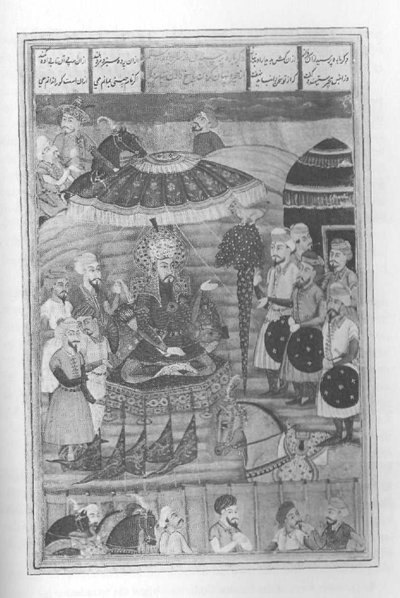

cal confrontations. He will usually run away from a fight, perhaps excusing himself by claiming that it is more "manly" to walk away. But he will feel wretched in spite of his excuses. It is not only physical fights he will avoid, however. He will tend to allow himself to be bullied emotionally and intellectually as well. When someone else is demanding or forceful with him, the boy under the power of the Coward—and unable to feel heroic about himself—will cave in. He will easily acquiesce to pressure from others; he will feel invaded and run-over, like a doormat. When he has had enough of this, however, the hidden grandiosity of the Grandstander Bully within him will erupt and launch a violent verbal and/or physical assault upon his "enemy," an assault for which the other is totally unprepared.

But having described the negative, or shadow, aspects of the Grand-stander/Coward, we nonetheless have to ask ourselves why the Hero is present in our psyches at all. Why is this a part of our personal developmental history as men? What is the evolutionary adaptation that it serves?

What the Hero does is mobilize the boy's delicate Ego structures to enable him to break with the Mother at the end of boyhood and face the difficult tasks that life is beginning to assign him. The Hero energies call upon the boy's masculine reserves, which will be refined as he matures, in order to establish his independence and his competence, for him to be able to experience his own budding abilities, to "push the outside of the envelope" and test himself against the difficult, even hostile, forces in the world. The Hero enables him to establish a beachhead against the overwhelming power of the unconscious (much of which, for men at least, is experienced as feminine, as Mother). The Hero enables the boy to begin to assert himself and define himself as distinct from all others, so that ultimately, as a distinct being, he can relate to them fully and creatively.

The Hero throws the boy up against the limits, against the seemingly intractable. It encourages him to dream the impossible dream that might just be possible after all, if he has enough courage. It empowers him to fight the unbeatable foe that, if he is not *possessed* by the Hero, he might just be able to defeat.

Once again, it is our position that all too often therapists, not to mention relatives, friends, co-workers, and people in positions of authority, attack, knowingly or unknowingly, the "shining" of the Hero in men. Ours is not an age that wants heroes. Ours is an age of envy, in which laziness and self-involvement are the rule. Anyone who tries to shine, who dares to stand above the crowd, is dragged back down by his lackluster and self-appointed "peers."

We need a great rebirth of the heroic in our world. Every sector of human society, wherever that may be on the planet, seems to be slipping into an unconscious chaos. Only the heroic consciousness, exerting all its might, will be able to stop this slide toward oblivion. Only a massive rebirth of courage in both men and women will rescue the world. Against enormous odds, the Hero picks up his sword and charges into the heart of the abyss, into the mouth of the dragon, into the castle under the power of an evil spell.

What is the end of the Hero? Almost universally, in legend and myth, he "dies," is transformed into a god, and translated into Heaven. We recall the story of Jesus' resurrection and ascension, or of Oedipus's final disappearance in a flash of light at Colonus, or Elijah's ascent into the sky in a fiery chariot.

The "death" of the Hero is the "death" of boyhood, of Boy psychology. And it is the birth of manhood and Man psychology. The "death" of the Hero in the life of a boy (or a man) really means that he has finally encountered his limitations. He has met the enemy, and the enemy is himself. He has met his own dark side, his very *un*heroic side. He has fought the dragon and been burned by it; he has fought the revolution and drunk the dregs of his own inhumanity. He has overcome the Mother and then realized his incapacity to love the Princess. The "death" of the Hero signals a boy's or man's encounter with true humility. It is the end of his heroic consciousness.

True humility, we believe, consists of two things. The first is knowing our limitations. And the second is getting the help we need.

If we are possessed by the Hero, we will fall under the negative aspect of this energy and live out—as Tom Cruise's character did—the inflated feelings and actions of the Grandstander Bully. We will walk

over others in our insensitivity and arrogance, and eventually we will self-destruct, ridiculed and cast out by others. If we are in the passive pole of the Hero's bipolar Shadow, possessed by the Coward, we will lack the motivation to achieve anything of significance for human life. But if we access the Hero energy appropriately, we will push ourselves up against our limitations. We will adventure to the frontiers of what we can be as boys, and from there, if we can make the transition, we will be prepared for our initiation into manhood.

# 4. Man Psychology

It is enormously difficult for a human being to develop to full potential. The struggle with the infantile within us exerts a tremendous "gravitational" pull against achieving that full adult potential. Nevertheless, we need to fight gravity by dint of hard labor and to build the pyramids of first boyhood and then manhood that constitute the core structures of our masculine Selves. The ancient Maya seldom destroyed earlier structures from their cities' pasts. Like them, we do not want to demolish the pyramids of boyhood, for they were and will always remain generators of power and gateways to energy resources from our primordial past. But we need to get to work laying courses of stone over those old terraces and stairs. We need to build, brick by brick, toward the goal of mature masculinity, until at last we can stand on the high platform at the top, surveying our realm as "Lord of the Four Quarters."

There are a number of techniques we can use in this construction project. Analysis of dreams, the re-entering and changing of our dreams, active imagination (in which the Ego, among other things, dialogues with the energy patterns within, thereby achieving both differentiation from and access to them), psychotherapy in a variety of forms, meditation on the positive aspects of the archetypes, prayer, magical ritual process with a spiritual elder, various forms of spiritual discipline, and other methods are all important to the difficult process of turning boys into men.

The four major forms of the mature masculine energies that we have identified are the King, the Warrior, the Magician, and the Lover. They

all overlap and, ideally, enrich one another. A good King is always also a Warrior, a Magician, and a Lover. And the same holds true for the other three.

The boy energies also overlap and inform each other, as we've seen. The Divine Child naturally gives rise to the Oedipal Child. Together they form the nucleus of whatever will be beautiful, energetic, related, warm, caring, and spiritual in the man. The boy's Ego needs the Precocious Child's perceptiveness to help it to distinguish itself from these energies. And all three give rise to the Hero, which breaks them free of the domination of the "feminine" unconscious, and establishes the boy's identity as a separate individual. The Hero prepares the boy to become a man.

The archetypes are mysterious entities or energy flows. They have been compared to a magnet beneath a sheet of paper. As iron filings are sprinkled over the top of the paper, they immediately arrange themselves into patterns along the lines of magnetic force. We can see the patterns of the filings on the paper, but we can't see the magnet beneath the paper-or, better, we can never see the magnetic force itself, only the visible evidence of its existence. The same is true of archetypes. They remain hidden. But we experience their effects-in art, in poetry, in music, in religion, in our scientific discoveries, in our patterns of behavior and of thought and feeling. All the products of human creativity and human interaction are like the iron filings. We can see something of the shapes and patterns of the archetypes through these manifestations. But we can never see the "energies" themselves. They overlap and interpenetrate one another, yet they can be distinguished from one another for purposes of clarification. Through active imagination, they can be remixed so that we can realize the desired balance among their influences in our own lives.

Jean Shinoda Bolen has usefully suggested that we think of this process, untangling and isolating the archetypes and then remixing them and blending them, as a well-run board meeting. Here, the chair asks each of the officers to speak his or her mind honestly and openly about the question at hand. A good chair always wants the full input, with reasons why, from each of the people that make up the board. Some opinions will be unpopular, some, seemingly, downright dumb. Some board members may habitually seem depreciating and destructive;

others may frequently come up with brilliant ideas. It is the advice of the latter that is usually followed, though sometimes the words of truth are really spoken by the disgruntled and negative board members. But after all opinions have been heard and the matter has been thoroughly discussed, the chair calls for a vote, and the decision is made. Often the chair must cast the deciding vote.

Our Egos are like the chair of the board. And the board members are the archetypes within us. Each needs to be heard from. Each needs to stand on its own and provide its input. But the whole person under the supervision of the Ego needs to make the final decisions in our lives.

Man psychology, as we have suggested, has perhaps always been a rare thing on our planet. It is certainly a rare thing today. The horrible physical and psychological circumstances under which most human beings have lived most places, most of the time, are staggering. Hostile environments always lead to the stunting, twisting, and mutating of an organism. Why this should be so is the stuff of which philosophy and theology are made. Let us frankly admit the enormous difficulty of our situation, for it is only when we allow ourselves to see the seriousness of any problem and to admit what it is we are up against that we can begin to take appropriate action, action that will be life-enhancing for us and for others.

There's a saying in psychology that we have to take responsibility for what we're not responsible for. This means that we are not responsible (as no infant is) for what happened to us to stunt us and to fixate us in our early years when our personalities were formed and when we got stuck at immature levels of masculinity. Yet it does us no good to join the chorus of the delinquents in *West Side Story* as they plead their case against society and leave things at that.

Ours is a psychological age rather than an institutional one. What used to be done for us by institutional structures and through ritual process, we now have to do inside ourselves, for ourselves. Ours is a culture of the individual rather than the collective.

Our Western civilization pushes us to strike out on our own, to become, as Jung said, "individuated" from each other. That which used to be more or less unconsciously shared by everyone—like the process of developing a mature masculine identity—we now must connect with consciously and individually. It is to this task that we now turn.

Decoding the Male Psyche— The Four Archetypes of the Mature Masculine

## 5. The KING

The King energy is primal in all men. It bears the same relationship to the other three mature masculine potentials as the Divine Child does to the other three immature masculine energies. It comes first in importance, and it underlies and includes the rest of the archetypes in perfect balance. The good and generative King is also a good Warrior, a positive Magician, and a great Lover. And yet, with most of us, the King comes on line last. We could say that the King is the Divine Child, but seasoned and complex, wise, and in a sense as selfless as the Divine Child is cosmically *self-involved*. The good King is wise with "the wisdom of Solomon."

Whereas the Divine Child, especially in his aspect as the High Chair Tyrant, has infantile pretensions to Godhood, the King archetype comes close to being God in his masculine form within every man. It is the primordial man, the Adam, what the philosophers call the Anthropos in each of us. Hindus call this primal masculinity in men the Atman; Jews and Christians speak of it as the *imago Dei*, the "Image of God." Freud talked about the King as the "primal father of the primal horde." And in many ways the King energy is Father energy. It is our experience, however, that although the King underlies the Father archetype, it is more extensive and more basic than the Father.

Historically, kings have always been sacred. As mortal men, however, they have been relatively unimportant. It is the kingship, or the King energy itself, that has been important. We all know the famous cry when a king dies and another is waiting to ascend the throne, "The king is dead; long live the king!" The mortal man who incarnates the King energy or bears it for a while in the service of his fellow human beings, in the service of the realm (of whatever dimensions), in the service of the cosmos, is almost an interchangeable part, a human vehicle for bringing this ordering and generative archetype into the world and into the lives of human beings.

As Sir James Frazer and others have observed, kings in the ancient world were often ritually killed when their ability to live out the King archetype began to fail. What was important was that the generative power of the energy not be tied to the fate of an aging and increasingly impotent mortal. With the raising up of the new king, the King energy was reembodied, and the King as archetype was renewed in the lives of the people of the realm. In fact, the whole world was renewed.

This pattern—this ritual killing and reviving—is what lies behind the Christian story of the death and resurrection of Christ, the Savior King. The danger for men who become *possessed* by this energy is that they too will fulfill the ancient pattern and die prematurely.

In chapter 3, we said that the "death" of the archetypes of boyhood, and especially the Hero, was the birth of the man, that the end of Boy psychology is the beginning of Man psychology. What, then, happens when the Hero—the adolescent boy—is "killed"?

The dream of one young man, right on the cusp of his making the transition from boyhood to manhood, illustrates this moment of the Hero's death and shows what form, eventually, his new masculine maturity might take. It shows the coming on line of the King energy—not to be fully realized for years to come. Here's the dream:

I am a soldier of fortune in ancient China. I've been creating a lot of trouble, hurting a lot of people, disturbing the order of the empire for my own profit and benefit. I'm a kind of outlaw, a kind of mercenary.

I'm being chased through the countryside, through a forest, by soldiers of the Chinese army, the Chinese emperor's men. We're all dressed in some kind of scale armor, with bows and arrows and probably swords. I'm running through the woods, and I see a hole in the ground, the entrance to a cave, so I rush into it to hide. Once inside, I see that it is a long tunnel. I run along the tunnel. The Chinese army sees me go into the cave, and they run after me down the tunnel.

At the end of the tunnel, I see in the far distance a pale blue light streaming down from above, from what is probably an opening in the rock. As I get closer, I see that the light is falling into a chamber, an underground chamber, and that in the chamber is a very green garden. And standing in the middle of the garden is the Chinese emperor himself in his elaborate red and gold robes. There is nowhere for me to go. The army is closing on me from behind. I am forced into the presence of the emperor himself.

There is nothing to do but to kneel before him, to submit to him. I feel great humility, as though a phase of my life is over. He looks down at me with a fatherly compassion. He's not angry with me at all, I feel from him that he has seen it all, that he has lived it all, all the adventures of life—poverty, wealth, women, wars, palace intrigues, betrayals and being betrayed, suffering and joy, everything in human life. It is out of this seasoned, very ancient, very experienced wisdom that he now treats me with compassion.

He says very gently, "You have to die. You will be executed in three hours." I know that he is right. There is a bond between us. It's as though he's been in exactly my position before; he knows about these things. With a great feeling of peace, and even happiness, I submit to my fate.

In this dream we see the heroic Boy Ego of the soldier of fortune finally meeting his limits, meeting his necessary fate, in the presence of the King. What happens to the boy is that he comes into right relationship with the primal King within and is reconciled with the "Father," as Joseph Campbell puts it.

John W. Perry, the well-known psychotherapist, discovered the King's power to heal by reorganizing the personality in the dreams and visions of schizophrenic patients. In psychotic episodes, and in other liminal states of mind, images of the sacred King would rush up from the depths of his patients' unconscious. In his book about this, *Roots of Renewal in Myth and Madness*, he describes a young male patient who kept drawing pictures of Greek columns and then associated them with a figure he called "the white king." Other case reports tell of a patient's seeing the "Queen of the Sea," and a great wedding between the patient as Queen of the Sea with the Great King, or of the pope suddenly intervening to save the visioner.

Perry realized that what his patients were describing were images that exactly paralleled the images found in ancient myths and rituals about the sacred kings. And he saw that, to the extent that his clients got in touch with these King energies, they got better. There was something about the King-in ancient times and in the dreams and visions of his suffering patients—that was immensely organizing, ordering, and creatively healing. He saw in their visions the ancient mythic battles of the great kings against the forces of chaos and the attacks of the demons, and then the glorious enthronement of the victorious kings at the center of the world. Perry realized that the King is, in fact, what he calls "the central archetype," around which the rest of the psyche is organized. He saw that it was at those moments in which his patients had "lowered levels of consciousness," when the barriers were down between their conscious identities and the powerful world of the unconscious, that creative, generative, and life-enhancing images of the King arose. People moved from craziness to greater health.

What happened with Perry's patients is parallel to what happened in the young man's dream of the Chinese emperor. The infantile Ego let go, fell into the unconscious, and met up with the King. Boy psychology vanished as Man psychology came on line and reorganized and restructured the personality.

### The Two Functions of the King in His Fullness

Two functions of King energy make this transition from Boy psychology to Man psychology possible. The first of these is ordering; the second is the providing of fertility and blessing.

The King, as Perry says, is the "central archetype." Like the Divine Child, the good King is at the Center of the World. He sits on his throne on the central mountain, or on the Primeval Hill, as the ancient Egyptians called it. And from this central place, all of creation radiates in geometrical form out to the very frontiers of the realm. "World" is defined as that part of reality that is organized and ordered by the King. What is outside the boundaries of his influence is noncreation, chaos, the demonic, and nonworld.

This function of the King energy shows up everywhere in ancient mythology and in ancient interpretations of actual history. In ancient Egyptian mythology, as James Breasted and Henri Frankfort have shown, the world arose from the formlessness and chaos of a vast ocean in the form of a central Hill, or Mound. It came into being by the decree, by the sacred "Word," of the Father god, Ptah, god of wisdom and order. Yahweh, in the Bible, creates in exactly the same way. Words, in fact, define our reality; they define our worlds. We organize our lives and our worlds by concepts, by our thoughts about them, and we can only think in terms of words. In this sense, at least, words make our reality and make our universe real.

The Primeval Hill spread as land was created, and from that central ordering, then, arose all life, the gods and goddesses, human beings, and all of their cultural achievements. And with the coming of the pharaohs, the successors of the gods, the world, defined by the sacred kings, spread out in all directions from the pharaohs' throne on the Primeval Hill. This was the account the Egyptians gave of the birth of their civilization.

In ancient Mesopotamia, one of the great founding kings of that civilization, Sargon of Akkad, carved out a kingdom, built a civilization, and called himself "He Who Rules the Four Quarters." In ancient thought, not only does the world radiate from a center, but it is geometrically organized into four quarters. It is a circle divided by a cross. The Egyptian pyramids-themselves images of the central Mound-were oriented toward the four compass points, toward "the four quarters." Ancient maps were drawn schematically with this idea. And all of the ancient Mediterranean, as well as Chinese and other Asian civilizations, had the same view. Even in the perspective of the Native Americans, who presumably had no contact with the other continents and other civilizations, this was so. The Sioux medicine man Black Elk in John Neihardt's book Black Elk Speaks talks about the world as a great "hoop," divided by two paths, a "red path" and a "black path," which intersect. Where they intersect is the central mountain of the world. It is on that mountain that the great Father God—the King energy-speaks and gives Black Elk a series of revelations for his people.

Ancient peoples located the Center in many places: Mount Sinai, Jerusalem, Hierapolis, Olympus, Rome, Tenochtitlán. But it was always the Center of a quadrated universe, an orderly, geometrical universe. The Center of that universe was always where the king—god and man—reigned, and was the locus of divine revelation, of divine organizing and creative power.

What is really interesting for us about this view of the ordering function of the King energy is that it shows up not only in ancient maps, in the sand paintings of desert Indians, in the icons of Buddhist art, and in the rose windows of Christian churches, but also just as persistently in the dreams and paintings of modern people undergoing psychoanalysis. Jung, noticing this, borrowed the name for such representations from Tibetan Buddhism and called these pictures of the organizing Center "mandalas." He noticed that when mandalas appeared in his analysands' dreams and visions, they were always healing and life-giving. They always signified renewal, and, like Perry's images of the King, they showed that the personality was reorganizing in a more centered way, becoming more structured and calmer.

What this function of the King energy does, through a mortal king, is embody for the people of the realm this ordering principle of the Divine World. The human king does this by codifying laws. He makes laws, or more accurately, he receives them from the King energy itself and then passes them on to his nation.

In the Oriental Institute Museum in Chicago there is a full-size reproduction of the great pillar of laws of the ancient Babylonian king Hammurabi (1728–1686 B.C.E.). The "pillar" is actually in the shape of a giant forefinger pointing upward, saying, in effect, "Listen! This is it! This is how things are going to be!" And where the fingernail is on this giant finger is a picture of Hammurabi standing in contemplation, scratching his long beard, listening to the great Father god Shamash—the sun, king of the gods—the supreme symbol of the light of masculine consciousness. Shamash is giving Hammurabi the laws that are inscribed below and all around the sides of the finger. The finger itself is what the ancients called, when referring to the will of God, "the finger of God." The picture of Hammurabi receiving the laws is expressing the primordial or archetypal incident—ever recurring—of the King energy

Shah Nameh (From a seventeenth-century Indian illuminated manuscript. Courtesy of Musée Condé, Chantilly, France. Photo: Giraudon/Art Resource.)

giving his human servant, the mortal king, the key to peace, calm, and order. This same timeless event is depicted in the biblical story of Moses receiving the Torah from Yahweh on the primordial mountain, Sinai.

This mysterious order, expressed in the kingdom and even in its palaces and temples (often laid out as representations of the cosmos in miniature) and in human laws and in all human societal order customs, traditions, and spoken and unspoken taboos—is the manifestation of the ordering thoughts of the Creator God. In Ancient Egyptian mythology, this was alternately thought of as the god Ptah or as a goddess called Ma'at, "Right Order." We see this idea carried forward in early Hebrew thought in the figure of Wisdom in the biblical book of Proverbs, and even in the Greek and later Christian idea of Christ as the Logos, the ordering, generative, and creative Word the Gospel of John talks about. In Hinduism, this archetypal "right order" is called Dharma. In China, it is called the Tao, the "Way."

It is the mortal king's duty not only to receive and take to his people this right order of the universe and cast it in societal form but, even more fundamentally, to embody it in his own person, to live it in his own life. The mortal king's first responsibility is to live according to Ma'at, or Dharma, or the Tao. If he does, the mythology goes, everything in the kingdom—that is, the creation, the world—will also go according to the Right Order. The kingdom will flourish. If the king does not live "in the Tao" then nothing will go right for his people, or for the kingdom as a whole. The realm will languish, the Center, which the king represents, will not hold, and the kingdom will be ripe for rebellion.

When this happened in the Middle Kingdom of ancient Egyptian history, we find the prophet Nefer-rohu describing the disastrous social and economic consequences to Egypt of the rule of illegitimate kings, kings who did not live according to Ma'at. (We recall the blight on the land of Thebes that accompanied Oedipus's impious reign.) Nefer-rohu writes:

Re [another form of the Creator God] must begin the foundation [of the earth over again]. The land is completely perished. . . . The sun disc is covered over. . . . It will not shine. . . . The rivers of Egypt are empty. . . .

Damaged indeed are those good things, those fish-ponds, [where there were] those who clean fish, overflowing with fish and fowl. Everything good is disappeared. . . . Foes have arisen in the east, and Asiatics have come down into Egypt. . . . The wild beasts of the desert will drink at the rivers of Egypt. . . . This land is helter-skelter. . . . Men will take up weapons of warfare, [so that] the land lives in confusion. Men will make arrows of metal, beg for the bread of blood, and laugh with the laughter of sickness. . . . [A] man's heart pursues himself [alone] . . . . A man sits in his corner, [turning] his back while one kills another. I show thee a son as a foe, the brother as an enemy, and a man killing his [own] father.

Then Nefer-rohu prophesies that a new king will arise who embodies the principles of Right Order. This king will restore Egypt, and set the cosmos aright:

[Then] it is that a king will come, belonging to the south, Ameni, the triumphant, his name. He is the son of a woman of the land of Nubia; he is one born in Upper Egypt. He will take the [White] Crown; he will wear the Red Crown; he will unite the Two Mighty Ones; he will satisfy the Two Lords with what they desire. The encircler-of-the-fields [will be] in his grasp. . . . Rejoice, ye people of his time! The son of a man will make his name forever and ever. They who incline toward evil and who plot rebellion have subdued their speech for fear of him. The Asiatics will fall to his sword, and the Libvans will fall to his flame. . . . There will be built the Wall of the Ruler of life, prosperity, health!-and the Asiatics will not be permitted to come down into Egypt. . . . And justice will come into its place, while wrongdoing is driven out. Rejoice, he who may behold [this]!\*

In the same way, the Chinese emperors ruled by the "Mandate of Heaven." Heaven here means, again, "right order." And when they failed to live according to the will of Heaven, then, legitimately, there would be rebellion, and a new dynasty would be established. "The king is dead; long live the king!"

First, the mortal king, operating under the mature masculine energy of the King, lived the order in his own life; only secondarily did

\* Quoted in James B. Pritchard, ed., The Ancient Near East: An Anthology of Texts and Pictures (Princeton: Princeton Univ. Press, 1958), pp. 254-257.

he enforce it. And he did so both in his realm and on the outskirts of the kingdom at the point of interface between the creation and the outlying chaos. Here we see the King as the Warrior, extending and defending order against the "Asiatics" and the "Libyans."

The mortal king did this historically as the servant and earthly embodiment of the King archetype, which maintained order in the spiritual world, or the deep and timeless world of the unconscious. Here we see the stories of the Babylonian god Marduk fighting the forces of chaos in the form of the dragon Tiamat and beating her demon army, slaying her, and creating the ordered world from her body. Or we see the Canaanite Baal slaying the twin monsters of chaos and death, Yamm and Mot. We also see this function of the King energy in the so-called enthronement psalms in the Bible, in which Yahweh (the Hebrew God Jehovah) defeats the dragon Behemoth, or Tehom, and then ascends his throne to order and create the world.

On a more immediate note, we see in modern dysfunctional families that when there is an immature, a weak, or an absent father and the King energy is not sufficiently present, the family is very often given over to disorder and chaos.

In conjunction with his ordering function, the second vital good that the King energy manifests is fertility and blessing. Ancient peoples always associated fertility—in human beings, crops, herds, and the natural world in general—with the creative ordering of things by the gods. It seems that in prepatriarchal times, the earth as Mother was seen as the primary source of fertility. But as patriarchal cultures rose to ascendancy, the emphasis shifted from the feminine as the source of fertility to the masculine. This was not a simple shift, and the emphasis never shifted completely. The ancient myths, true to actual biology, recognized that it was the union of male and female that was truly generative, at least on the physical plane. On the cultural plane, however, in the creation of civilization and technology, and in the mastery of the natural world, the masculine generative energies were most prominent.

The sacred king in ancient times became the primary expression for many peoples of the life-force, the libido, of the cosmos. Our Jewish, Christian, and Moslem God today is never seen as being in creative partnership with a Goddess. He is viewed as male, and as the sole source of creativity and generativity. He is the sole source of fertility and blessing. Many of our modern beliefs come from the beliefs of the ancient patriarchies.

The sacred king's function of providing fertility and blessing shows up in many myths and in the stories of great kings. In the spiritual world, we see the great Father gods engaging prolifically in sexual relationships with goddesses, lesser deities, and mortal women. The Egyptian Amun-Ra had his harem in the sky, and Zeus's exploits\_are well known.

But it was not just sexual acts producing both divine and human children that showed the King energy's capacity to fertilize. This capacity to be generative was also the result of his creative ordering itself. The Canaanite Baal, for instance, after he defeated the dragon of the chaotic sea, and because he loved the earth, ordered the chaotic waters into rainfall and rivers and streams. This ordering act made it possible for the first time for plants to flourish, and then animals. And it made the bounty of agriculture and herding possible for human beings, his special beneficiaries.

In the Egyptian "Hymn to Aton" (the Sun), it was Aton who ordered the world so that it could prosper and be fertile. He put the Nile in Egypt so that birds could rise from their nests in the reeds, singing joyfully for the life Aton had given them, so that herds could grow and calves could flick their tails in happiness and contentment. Aton put a "Nile in the sky" for other peoples, so that they too could experience the abundance of life. And Aton so ordered the world that every race and every tongue would have the blessing of life and fecundity, each in its own way, according to Aton's design.

As the mortal king went, so did the realm, both its order and fertility. If the king was lusty and vigorous sexually, could service his often many wives and concubines and produce many children, the land would be vital. If he stayed healthy and strong physically, and alert and alive mentally, the crops would grow; the cattle would reproduce; the merchants would prosper; and many babies would be born to his people. The rains would come and, in Egypt, the annual fertilizing Nile floods.

In the Bible, we see the same idea expressed in the stories of the Hebrew kings and patriarchs. Two things were required of them by

Yahweh: first, that they walk in his ways, the Hebrew equivalent of being in the Tao; and second, that they "be fruitful and multiply," that they have many wives and many children. We see with the patriarchs Abraham, Isaac, and Jacob that if one wife could not produce children, she would find another wife or a concubine for her husband so that he could continue his fertility function.

We see King David taking many a woman of his realm, and having children through her. The point is that as these men prospered physically and psychologically, so did their tribes and their realms. The mortal king, so goes the mythology, was the embodiment of the King energy. The land, his kingdom, was the embodiment of the feminine energies. He was, in fact, symbolically wedded to the land.

Always, the king's culminating ordering/generative act was to marry the land in the form of his primary queen. It was only in creative partnership with her that he could assure every kind of bounty for his kingdom. It was the royal couple's duty to pass their creative energies on to the kingdom in the form of children. The kingdom would mirror the royal generativity, which, let us remember, was at the Center. As the Center was, so would be the rest of creation.

When a king became sick or weak or impotent, the kingdom languished. The rains did not come. The crops did not grow. The cattle did not reproduce. The merchants lost their trade. Drought would assault the land, and the people would perish.

So the king was the earthly conduit from the Divine World—the world of the King energy—to this world. He was the mediator between the mortal and the divine, like Hammurabi standing before Shamash. He was the central artery, we might say, that allowed the blood of the life-force to flow into the human world. Because he was at the Center, in a certain sense everything in the kingdom (because it owed its existence to him) was his—all the crops, all the cattle, all the people, all the women. That was in theory, however. The mortal king David ran afoul of this principle in his liaison with the beautiful Bathsheba. But this moves us into the discussion of the Shadow King, which we'll turn to in a moment.

It was not only fertility in an immediately physical sense or generativity and creativity in a general sense that came out of the second function of the King energy through the efficacy of ancient kings; it was also blessing. Blessing is a psychological, or spiritual, event. The good king always mirrored and affirmed others who deserved it. He did this by seeing them-in a literal sense, in his audiences at the palace, and in the psychological sense of noticing them, knowing them, in their true worth. The good king delighted in noticing and promoting good men to positions of responsibility in his kingdom. He held audience, primarily, not to be seen (although this was important to the extent that he carried the people's own projected inner King energy), but to see, admire, and delight in his subjects, to reward them and to bestow honors upon them.

There is a beautiful ancient Egyptian painting of the Pharaoh Akhenaton standing in his royal balcony, splendidly embraced by the rays of his Father god, Aton, the sun, throwing rings of gold down to his best followers, his most competent and loyal men. By the light of the masculine sun-consciousness, he knows his men. He recognizes them, and he is generative toward them. He bestows upon them his blessing. Being blessed has tremendous psychological consequences for us. There are even studies that show that our bodies actually change chemically when we feel valued, praised, and blessed.

Young men today are starving for blessing from older men, starving for blessing from the King energy. This is why they cannot, as we say, "get it together." They shouldn't have to. They need to be blessed. They need to be seen by the King, because if they are, something inside will come together for them. That is the effect of blessing; it heals and makes whole. That's what happens when we are seen and valued and concretely rewarded (with gold, perhaps, dropped from the pharaoh's hand) for our legitimate talents and abilities.

Of course, many ancient kings, like many men in "kingly" positions today, fell far short of the ideal image of the good King. Yet this central archetype lives on independently of any one of us and seeks, through us, to come into our lives in order to consolidate, create, and bless.

What can we say are the characteristics of the good King? Based on ancient myths and legends, what are the qualities of this mature masculine energy?

The King archetype in its fullness possesses the qualities of order, of reasonable and rational patterning, of integration and integrity in the

masculine psyche. It stabilizes chaotic emotion and out-of-control behaviors. It gives stability and centeredness. It brings calm. And in its "fertilizing" and centeredness, it mediates vitality, life-force, and joy. It brings maintenance and balance. It defends our own sense of inner order, our own integrity of being and of purpose, our own central calmness about who we are, and our essential unassailability and certainty in our masculine identity. It looks upon the world with a firm but kindly eye. It sees others in all their weakness and in all their talent and worth. It honors them and promotes them. It guides them and nurtures them toward their own fullness of being. It is not envious, because it is secure, as the King, in its own worth. It rewards and encourages creativity in us and in others.

In its central incorporation and expression of the Warrior, it represents aggressive might when that is what is needed when order is threatened. It also has the power of inner authority. It knows and discerns (its Magician aspect) and acts out of this deep knowingness. It delights in us and in others (its Lover aspect) and shows this delight through words of authentic praise and concrete actions that enhance our lives.

This is the energy that expresses itself through a man when he takes the necessary financial and psychological steps to ensure that his wife and children prosper. This is the energy that encourages his wife when she decides she wants to go back to school to become a lawyer. This is the energy that expresses itself through a father when he takes time off from work to attend his son's piano recital. This is the energy that, through the boss, confronts the rebellious subordinates at the office without firing them. This is the energy that expresses itself through the assembly line foreman when he is able to work with the recovering alcoholics and drug abusers in his charge to support their sobriety and to give them empowering masculine guidance and nurturing.

This is the energy that expresses itself through you when you are able to keep your cool when everybody else in the meeting is losing theirs. This is the voice of calm and reassurance, the encouraging word in a time of chaos and struggle. This is the clear decision, after careful deliberation, that cuts through the mess in the family, at work, in the nation, in the world. This is the energy that seeks peace and stability, orderly growth and nurturing for all people—and not only for all peo-

ple, but for the environment, the natural world. The King cares for the whole realm and is the steward of nature as well as of human society.

This is the energy, manifested in ancient myths, of the "shepherd of his people" and "the gardener" and husbandman of the plants and animals in the kingdom. This is the voice that affirms, clearly and calmly and with authority, the human rights of all. This is the energy that minimizes punishment and maximizes praise. This is the voice from the Center, the Primeval Hill within every man.

## The Shadow King: The Tyrant and the Weakling

Though most of us have experienced some of this energy of the mature masculine in our lives—perhaps within ourselves in moments when we felt very well integrated, calm, and centered, and from time to time from our father, a kindly uncle or grandfather, a co-worker, a boss, a teacher, a minister—most of us also have to confess that overall we have experienced very little of the King energy in its fullness. We may have felt it in bits and pieces, but the sad fact is that this positive energy is disastrously lacking in the lives of most men. Mostly what we have experienced is what we are calling the Shadow King.

As in the case of all of the archetypes, the King displays an activepassive bipolar shadow structure. We call the active pole of the Shadow King the Tyrant and the passive pole the Weakling.

We can see the Tyrant acting in the Christian story of the birth of Jesus. Soon after the Christ child is born, King Herod discovers the fact that the infant has been born and is in the world, the world that he, King Herod, controls. He sends his soldiers to Bethlehem looking for the new king—the new life—to kill it. Because Jesus is a Divine Child, he gets away in time. But Herod's soldiers kill every male child left in the town. Whenever the new is born, the Herod within us (and in our outer lives) will attack. The tyrant hates, fears, and envies new life, because that new life, he senses, is a threat to his slim grasp on his own kingship. The tyrant king is not in the Center and does not feel calm and generative. He is not creative, only destructive. If he were secure in his own generativity and in his own inner order—his Self structures—he would react with delight at the birth of new life in his realm. If Herod

had been such a man, he would have realized that the time had come for him to step aside so that the archetype could be embodied in the new king Jesus Christ.

Another biblical story, the story of Saul, has a similar theme. Saul is another mortal king who became possessed by the Tyrant. His reaction to the newly anointed David is the same as Herod's to Jesus. He reacts with fear and rage and seeks to kill David. Though the prophet Samuel has told Saul that Yahweh no longer wants him to be king—that is, to embody the King energy for the realm-Saul's Ego has become identified with the King and refuses to relinquish the throne. Human tyrants are those in kingly positions (whether in the home, the office, the White House, or the Kremlin) who are identified with the King energy and fail to realize that they are not it.

Another example, from antiquity, is that of the Roman emperor Caligula. Although the previous emperors had held enormous power over the people and the Senate of Rome and, through their office, over the entire Mediterranean world, and although they had been turned into gods after their deaths, Caligula broke new ground when he declared himself a god while still on earth. The details of his madness and of his abuse and sadism toward all those around him are fascinating. Robert Graves's book I, Claudius and the television series based on the book give a chilling account of the development of the Shadow King as Tyrant in the person of Caligula.

The Tyrant exploits and abuses others. He is ruthless, merciless, and without feeling when he is pursuing what he thinks is his own selfinterest. His degradation of others knows no bounds. He hates all beauty, all innocence, all strength, all talent, all life energy. He does so because, as we've said, he lacks inner structure, and he is afraidterrified, really-of his own hidden weakness and his underlying lack of potency.

It is the Shadow King as Tyrant in the father who makes war on his sons' (and his daughters') joy and strength, their abilities and vitality. He fears their freshness, their newness of being, and the life-force surging through them, and he seeks to kill it. He does this with open verbal assaults and deprecation of their interests, hopes, and talents; or he does it, alternately, by ignoring their accomplishments, turning his

King Arthur (Illustration by Trevor Stubley from The Book of Merlyn by T. H. White, © 1977. Reproduced by permission of the University of Texas Press, Austin.)

back on their disappointments, and registering boredom and lack of interest when, for instance, they come home from school and present him with a piece of artwork or a good grade on a test.

His attacks may not be limited to verbal or psychological abuse; they may include physical abuse. Spankings may turn into beatings. And there may be sexual assaults as well. The father possessed by the Tyrant may sexually exploit his daughters' or even his sons' weakness and vulnerability.

A young woman came for counseling because she was having a lot of trouble in her marriage. What she described, soon after entering therapy, was an invasion of her home by the Tyrant King in this sexually malignant aspect. At about the age of twelve, her father had left her, her mother, and her sister and moved in with another woman. That woman's husband had then moved in with them. This man never liked his new "wife," and he was quick to spot his new stepdaughter's beauty and vulnerability. He began demanding that she sleep with him, at first just lying beside him in bed at night. Then he began demanding that she masturbate him, so that he ejaculated into tissues that he kept by the bed. Eventually, he forced her to have sex with him, on the threat that if she didn't, he would leave them, and they would have nowhere to turn financially. The young woman's mother never made a move to stop this horrendous abuse of her daughter and busied herself in the mornings cleaning under the mattress where the soiled tissues from the night before had been stuffed.

In the story of King David and Bathsheba, Bathsheba was the wife of another man, Uriah the Hittite. One day David was walking on the roof of his palace when he spotted Bathsheba bathing. He was so aroused by this sight that he sent for her and forced her to have sex with him. In theory, remember, all the women of the realm were the king's. But they belonged to the *archetype* of the King, not to the mortal king. David unconsciously identified himself with the King energy and not only took Bathsheba but also had her husband, Uriah, killed. Fortunately for the kingdom, David had a conscience in the form of Nathan the prophet, who came to him and indicted him. David, much to his credit, accepted the truth of the indictment and repented.

The Tyrant King manifests in all of us at some time or another when we feel pushed to the limit, when we are exhausted, when we are getting inflated. But we can see it operating most of the time in certain personality configurations, most notably in the so-called narcissistic personality disorder. These people really feel that they are the center of the universe (although they aren't centered themselves) and that others exist to serve them. Instead of mirroring *others*, they insatiably seek mirroring *from* them. Instead of seeing others, they seek to be seen by them.

We can also observe the Tyrant King operating in certain ways of life, even in certain "professions." The drug lords, the pimps, the mafia bosses are all examples; they exist to further their own status, and what they think is their own well-being, at the expense of others. But we see this same self-interest in societally sanctioned positions as well. An interviewer should enter into a dialogue with you about your experience, your training, your hopes for yourself and the company you are seeking to serve. Instead, he spends the whole interview talking about himself and his achievements, his power, his salary, and the virtues of his company, and never asks you about yourself.

Many people in corporate America today are not at all interested in the companies they work for. Many are just "treading water," looking for a way out and up. Here we find the executives who are more interested in furthering their own careers than in being good stewards of the "realms" placed under their authority. There is no devotion or real loyalty to the company, only to themselves. This is the CEO who negotiates, for his own financial benefit, to sell his company, to see it dismembered and rendered impotent, who is willing to see his friends and loyal employees fired as excess baggage in the now popular "leveraged buy-out."

The man possessed by the Tyrant is very sensitive to criticism and, though putting on a threatening front, will at the slightest remark feel weak and deflated. He won't show you this, however. What you will see, unless you know what to look for, is rage. But under the rage is a sense of worthlessness, of vulnerability and weakness, for behind the Tyrant lies the other pole of the King's bipolar shadow system, the Weakling. If he can't be *identified* with the King energy, he feels he is nothing.

The hidden presence of this passive pole explains the hunger for mirroring—for "Adore me!" "Worship me!" "See how important I am!" -that we feel from so many of our superiors and friends. This explains their angry outbursts and their attacks on those they see as weak, that is, those upon whom they project their own inner Weakling. General Patton, for all his virtues, evidently had an underlying fear of his own weakness and cowardice. In the movie Patton this is shown when he is visiting a field hospital during World War II. He's going from bed to bed congratulating wounded men and giving them medals (something the King in his fullness does). But then he comes to the bed of a man who is suffering from "shell shock." Patton asks him what his problem is, and the soldier tells him his nerves are shot. Instead of reacting with the compassion of the life-giving King who knows what his men are up against, Patton flies into a rage and slaps the soldier across the face, calls him a coward, humiliates and abuses him, and sends him from the hospital to the front lines. Though he does not know it, what he has seen is the face of his own hidden fear and weakness projected onto another. He has glimpsed the Weakling within.

The man possessed by the Weakling lacks centeredness, calmness, and security within himself, and this also leads him into paranoia. We see this in Herod, Saul, and Caligula as all of them, unable to sleep at night, pace the palace, tormented by fears of disloyalty from their subordinates—in Saul's case, even from his children—and disapproval from God, the True King. The man possessed by the bipolar Shadow King has much to fear, *in fact*, because his oppressive behaviors, often including cruelty, beg for an in-kind response from others. We laugh at the saying, "Just because you're paranoid doesn't mean they're not out to get you." They may be. A defensive, hostile "get them before they get you" paranoia is destructive of one's own sense of calmness and orderliness, works to destroy one's own character and that of others, and invites retaliation.

A minister entered analysis a short time after a crisis had started in his church. A group of ne'er-do-well dissidents, a band of psychological and spiritual outlaws, had formed, and for their own envious reasons, they had set out to destroy this minister. The leader was a man who heard God talking to him audibly in the night and who had received a

dream that told him the minister was planning to kill him for working against him. Paranoia is catching. The paranoia of the instigator of this "palace coup" so harassed this pastor day and night with phone calls, hate letters containing outright threats, outbursts in the middle of the sermons, and speeches at church meetings listing the minister's supposed failures that the minister, not consolidated in his relationship to his own King energy, gradually slipped under the power of the Tyrant/Weakling. He became increasingly tyrannical and dictatorial about church policy, arrogated more and more power to himself in church governance, and began to use shady tactics against his "enemies" in order to drive them out of the church. At the same time, he was disturbed by terrifying nightmares that, night after night, revealed to him his own underlying fears and weaknesses. Mutual paranoia raised its dark bloom, and both the minister and the congregation ended in a world of confusion and subterfuge, a world utterly removed from the spiritual values the minister had sought so lovingly to teachanother victory for the Shadow King.

We can readily see the Tyrant's relationship to the High Chair Tyrant, arising as he does out of this infantile pattern. Grandiosity is normal, in a certain way, in the Divine Child. It is appropriate for the Divine Child, like the baby Jesus, to want and need to be adored, even by kings. What parents need to do, and this is very difficult, is give the Divine Child in their own child just the right amount of adoration and affirmation, so that they can let their human child down off the "high chair" easily, gradually into the real world, where gods cannot live as mortal humans. The parents need to help their human baby boy learn gradually not to identify with the Divine Child. The boy may resist being dethroned, but the parents must persevere, both affirming him and "taking him down a peg" at a time.

If they adore him too much and don't help the baby boy's Ego form outside the archetype, then he may never get down from his high chair. Inflated with the power of the High Chair Tyrant, he will simply cross into adulthood thinking he is "Caesar." If we challenge a person like this, and say to him, "My God, you think you're Caesar!" he may very well say, "Yeah? What about it?" This is one way the Shadow King gets formed in men.

The other way the Shadow King is formed is when the parents have abused the baby boy, and attacked his grandiosity and gloriousness from the beginning. The grandiosity of the Divine Child/High Chair Tyrant then gets split off and dropped into the boy's unconscious for safekeeping. The boy may, as a consequence, come under the power of the Weakling Prince. Later, when he is an "adult" and functioning primarily under the dominance of the Weakling, under the enormous pressures of the adult world, his repressed grandiosity may explode to the surface, completely raw and primitive, completely unmodulated and very powerful. This is the man who seemed coolheaded and rational and "nice" but who, once he's been promoted, suddenly becomes "a different person," a Little Hitler. This is the man for whom the saying "Power corrupts; absolute power corrupts absolutely" is entirely accurate.

### Accessing the King

The first task in accessing the King energy for would-be human "kings" is to disidentify our Egos from it. We need to achieve what psychologists call cognitive distance from the King in both his integrated fullness and his split bipolar shadow forms. Realistic greatness in adult life, as opposed to inflation and grandiosity, involves recognizing our proper relationship to this and the other mature masculine energies. That proper relationship is like that of a planet to the star it is orbiting. The planet is not the center of the star system; the star is. The planet's job is to keep the proper orbital distance from the life-giving, but also potentially death-dealing, star so as to enhance its own life and wellbeing. The planet derives its life from the star, so it has a transpersonal object in the star for "adoration." Or, to use another image, the Ego of the mature man needs to think of itself-no matter what status or power it has temporarily achieved—as the servant of a transpersonal Will, or Cause. It needs to think of itself as a steward of the King energies, not for the benefit of itself, but for the benefit of those within its "realm," whatever that may be.

There are two ways to look at the difference between the "active" and "passive" poles in the bipolar shadow system of the archetypes. As

we have seen, one way is to view the archetypal structures as triangular or triune. The other way is to talk about the Ego's identification with or disidentification from the archetype in its fullness. In the case of identification, the result is Ego inflation, accompanied by fixation at infantile levels of development. In the case of extreme disidentification, the Ego experiences itself as deprived of access to the archetype. It is, in actuality, caught in the passive pole of the King's dysfunctional Shadow. The Ego feels starved for King energy. This sense of deprivation and lack of "ownership" of the sources of and motives for power are always features of the passive poles of the archetypes.

The Shadow King as Tyrant, because he arises, according to this perspective, when the Ego is identified with the King energy itself, has no transpersonal commitment. *He* is his own priority. Because a man's Ego has not been able to maintain its proper orbit, it has fallen into the sun of the archetype, or drifted so close that it has drawn off—as we see in double-star systems—enormous amounts of ignited gasses and become bloated with them. The whole psyche destabilizes. The planet pretends to be a star. The true Center of the system is lost. This is what we are calling the "usurpation syndrome." The Ego usurps the King's place and power. This is the mythological rebellion in heaven, described in so many myths, when an upstart god tries to seize the throne of the High God. (We recall the myth of Satan's attempted overthrow of God.)

The other problem in accessing this energy, we're suggesting, arises when we have lost effective touch with the life-giving King altogether (mistakenly, it turns out). In this case, we may fall into the category of the so-called dependent personality disorder, a condition in which we project the King energy within (which we do not experience as within us) onto some external person. We experience ourselves as impotent, as incapable of acting, incapable of feeling calm and stable, without the presence and the loving attention of that other person who is carrying our King energy projection. This happens in family systems when husbands become too attentive to their wives' moods and fear to take initiative because of the attacking anger their actions may bring. It happens, too, with children when their parents do not allow them to develop sufficient independence of will and taste and purpose and the children remain under their wing.

In our work situations, this happens when we become too dependent upon the power and whims of the boss, or when we feel that we don't dare sneeze around our co-workers. It also happens on the larger scale of nations, when the people, regarding themselves as peasants, turn over all their own inner King energy to "der Führer." This "abdication syndrome," the hallmark of the Weakling, is just as disastrous as the usurpation syndrome.

An example of the disastrous consequences of the abdication syndrome on a large scale is an incident that occurred on the plain of Otumba, near what is now Mexico City, during Cortés's conquest of Mexico. Cortés and his men had fled Tenochtitlán (Mexico City) in the middle of the night six days before under massive attack from the Mexican armies. As the seventh day dawned, the exhausted and fearful remains of Cortes's army looked down the plain of Otumba to see a vast host of Mexican warriors massed against them. The doom of the Spanish seemed certain. However, in the ensuing battle, Cortés spotted the banner of the Mexican commander. In desperation, knowing that their lives depended on it, Cortés charged forward, cutting a swath of carnage through the enemy soldiers. When he finally reached the Mexican commander, he killed him with one blow. Immediately, to the amazement of the Spanish, the Mexicans turned in panic and fled the field. The Spanish chased them down and slaughtered many of them. What had happened to so miraculously turn the tide of battle was that the Mexican warriors had seen their commander killed. They had invested this man with the focused power of the King energy, and when he was killed, they believed that archetypal energy had deserted them. Their underlying sense of disempowerment rose to the surface with the death of their leader, and they surrendered to impotence and chaos. If only the Mexican warriors had realized that the King energy was within them, Mexico might never have been conquered.

When we are out of touch with our own inner King and give the power over our lives to others, we may be courting catastrophe on a scale larger than the personal. Those we make our kings may lead us into lost battles, abuse in our families, mass murder, the horrors of a Nazi Germany, or a Jonestown. Or they may simply abandon us to our own underlying weakness.

But when we are accessing the King energy correctly, as servants of our own inner King, we will manifest in our own lives the qualities of the good and rightful King, the King in his fullness. Our soldiers of fortune will drop to their knees, appropriately, before the Chinese Emperor within. We will feel our anxiety level drop. We will feel centered, and calm, and hear ourselves speak from an inner authority. We will have the capacity to mirror and to bless ourselves and others. We will have the capacity to care for others deeply and genuinely. We will "recognize" others; we will behold them as the full persons they really are. We will have a sense of being a centered participant in creating a more just, calm, and creative world. We will have a transpersonal devotion not only to our families, our friends, our companies, our causes, our religions, but also to the world. We will have some kind of spirituality, and we will know the truth of the central commandment around which all of human life seems to be based: "Thou shalt love the Lord thy God [read, "the King"] with all thy heart, with all thy soul. and with all thy might. And thy neighbor as thyself."

## 6. The WARRIOR

We live in a time when people are generally uncomfortable with the Warrior form of masculine energy—and for some good reasons. Women especially are uncomfortable with it, because they have often been the most direct victims of it in its shadow form. Around the planet, warfare in our century has reached such monstrous and pervasive proportions that aggressive energy itself is looked upon with deep suspicion and fear. This is the age in the West of the "soft masculine," and it is a time in which radical feminists raise loud and hostile voices against the Warrior energy. In the liberal churches, committees are removing such "warlike" hymns as "Onward Christian Soldiers" and "The Battle Hymn of the Republic" from the hymnals.

What is interesting to notice, however, is that those who would cut off masculine aggressiveness at its root, in their zeal, themselves fall under the power of this archetype. We can't just take a vote and vote the Warrior out. Like all archetypes, it lives on in spite of our conscious attitudes toward it. And like all *repressed* archetypes, it goes underground, eventually to resurface in the form of emotional and physical violence, like a volcano that has lain dormant for centuries with the pressure gradually building up in the magma chamber. If the Warrior is an instinctual energy form, then it is here to stay. And it pays to face it.

Jane Goodall, who lived with chimpanzee tribes for years in Africa (chimpanzees are genetically 98 percent what we are) first reported basically loving, peaceful, and good-willed animals. This report was a big hit in the sixties, when millions of people in the West were seeking

to understand why warfare is such an apparently attractive human pastime to find an alternative way of settling larger-scale disputes. A few years after her initial report, however, Ms. Goodall released new evidence indicating that there was more going on than she had first thought. She discovered warfare, infanticide, child abuse, kidnaping, theft, and murder among her "peaceful" chimpanzees. Robert Ardrey, in two controversial books, *African Genesis* and *The Territorial Imperative*, claimed in the most straightforward way that human beings are governed by instincts, the same instincts that govern the feelings and behaviors of other animals—not the least of which is the urge to fight. In addition, the most current studies in the field of primate ethology suggest that the full range of human behaviors are present in our nearest primate relatives, at least in outline.

What is this phenomenon of business executives and insurance salesmen going off into the woods on the weekends to play war games, to hide among the trees and organize assaults with paint guns, to practice survival, to play at being on the edge of danger, of death, to strategize, to "kill" each other? What is the hidden energy form behind the city gangs organized along paramilitary lines? What accounts for the popularity of Rambo, of Arnold Schwarzenegger, of war movies like *Apocalypse Now, Platoon, Full-Metal Jacket*, and many, many more? We can deplore the violence in these movies, as well as on our television screens, but, obviously, the Warrior still remains very much alive within us.

All we have to do is glance over the history of our species, a history which has been *defined* in large part by war. We see the great Warrior traditions in nearly every civilization. In our century, the whole globe has been convulsed by two world wars. A third and final one, despite the recent East-West thaw, still hangs over our heads. Something is going on here. Some psychologists see human aggressiveness emerging out of infantile rage, the child's natural reaction to what Alice Miller has called "poisonous pedagogy," the abuse of baby boys (as well as baby girls) on a massive scale.

We believe there is much truth to this view, especially in light of the prevalence of what we will be calling the Shadow Warrior. But we believe that the Warrior should not be identified with human rage in

any simple way—quite the opposite. We also believe that this primarily masculine energy form (there are feminine Warrior myths and traditions too) persists because the Warrior is a basic building block of masculine psychology, almost certainly rooted in our genes.

When we examine the Warrior traditions closely, we can see what they have *accomplished* in history. For example, the ancient Egyptians were for centuries a very peaceful, basically gentle people. They were safe in their isolated Nile Valley from any potential enemies; these enemies were held at bay by the surrounding desert and by the Mediterranean Sea to the north. They were able to build a remarkably stable society. They believed in the harmony of all things, in a cosmos ordered by Ma'at. Then around 1800 B.C.E. they were invaded through the Nile delta by bands of fierce Semitic tribes, the Hyksos. These Hyksos warriors had horses and chariots—in those days, efficient and devastating war machines. The Egyptians, unaccustomed to such aggressiveness, were pushovers. The Hyksos eventually took over most of Egypt and ruled it with an iron hand.

In the sixteenth century B.C.E. the hardened Egyptians eventually fought back. New pharaohs arose from the south who united their native King energy with a newfound Warrior energy. They drove northward with tremendous ferocity. Not only did they crush the Hyksos power and take Egypt back into Egyptian hands, but they continued northward into Palestine and Asia and built a vast empire. In the process, they spread Egyptian civilization-its art, religion, and ideasover a huge area. By their conquests, the great pharaohs Thutmose III and Ramses II not only secured Egypt again, but brought the best of Egyptian culture to a larger world. It is because of their discovery of the Warrior within themselves that Egyptian morality and ethics, as well as such fundamental religious ideas as judgment after death and a paradise beyond the grave in which righteous souls would become one with God, became a part of our own Western system of ethics and spirituality. A similar story can be told about the civilizations in Mesopotamia, which also, through the energizing of the Warrior, carried important human knowledge and insights into future civilizations.

In India, a Warrior class, the *kshatriya*, conquered and stabilized the Indian subcontinent and set up the conditions for India to become

the spiritual center of the world. Their cousins to the north in Persia—the Zoroastrian warrior-kings—spread the religion of Zoroaster throughout the Near East. This religion had a profound impact on the emergence of modern Judaism and Christianity and on many of the values and the basic worldview that inform and shape even our post-religious modern world. And through Western civilization, as it has come to be known, Zoroaster's teachings in modified form now sweep across the planet and affect village life and personal morality as far away as the South Seas.

The biblical Hebrews were originally a warrior people and followers of a warrior God, the God of the Hebrew scriptures, Yahweh. Under the warrior-king David, the benefits of this new religion, including its advanced ethical system based on the Warrior's virtues, were consolidated. Through Christianity, which drew heavily on its Hebrew heritage, many of these Hebrew ideas and values eventually were carried by the European warrior classes to the four corners of the world.

The Roman emperor-warriors, like the learned philosopher and moralist Marcus Aurelius (161–180 c.E.), preserved Mediterranean civilization long enough for the Germanic tribes to become semicivilized before they finally succeeded in invading the Empire and rewriting all of Western history, a history that from the fifteenth century on increasingly has become the history of the world.

Let's not forget the tiny band of Spartans—the Greek warriors par excellence—who at Thermopylae in 480 B.C.E. defeated the Persian invasion of Europe, and saved the budding European democratic ideals.

In North America, Native American men lived and died with the Warrior energy informing even the smallest of their acts, living their lives nobly and with courage and with the capacity to endure great pain and hardship, defending their people against an overwhelming foe (the invading white people), and leaping into battle with the cry, "Today is a good day to die!"

Perhaps we need to look with an unbiased eye at the great twentieth-century warriors, among them, the generals Patton and MacArthur, great strategists, men of great courage, and men devoted to causes greater than their own personal survival. And then we may need to revalue the great Japanese samurai tradition and the ascetic, disciplined, utterly loyal men who built the nation of Japan, ensured the survival of its culture, and are today in business suits conquering the planet.

The Warrior energy, then, no matter what else it may be, is indeed universally present in us men and in the civilizations we create, defend, and extend. It is a vital ingredient in our world-building and plays an important role in extending the benefits of the highest human virtues and cultural achievements to all of humanity.

It is also true that this Warrior energy often goes awry. When this happens, the results are devastating. But we still have to ask ourselves why it is so present within us. What is the Warrior's function in the evolution of human life, and what is his purpose in the psyches of individual men? What are the Warrior's positive qualities? And how can they help us men in our personal lives and in our work?

#### The Warrior in His Fullness

The characteristics of the Warrior in his fullness amount to a total way of life, what the samurai called a *do* (pronounced "dough"). These characteristics constitute the Warrior's Dharma, Ma'at, or Tao, a spiritual or psychological path through life.

We have already mentioned aggressiveness as one of the Warrior's characteristics. Aggressiveness is a stance toward life that rouses, energizes, and motivates. It pushes us to take the offensive and to move out of a defensive or "holding" position about life's tasks and problems. The samurai advice was always to "leap" into battle with the full potential of ki, or "vital energy," at your disposal. The Japanese warrior tradition claimed that there is only one position in which to face the battle of life: frontally. And it also proclaimed that there was only one direction: forward.

In the famous opening scene of *Patton*, the general, in full battle gear, pearl-handled revolvers on his hips, is giving a motivational speech to his army. Patton warns his troops that he is not interested in their holding their position in battle. He says, "I don't want to get any messages saying that we are holding our position. . . . We are advancing