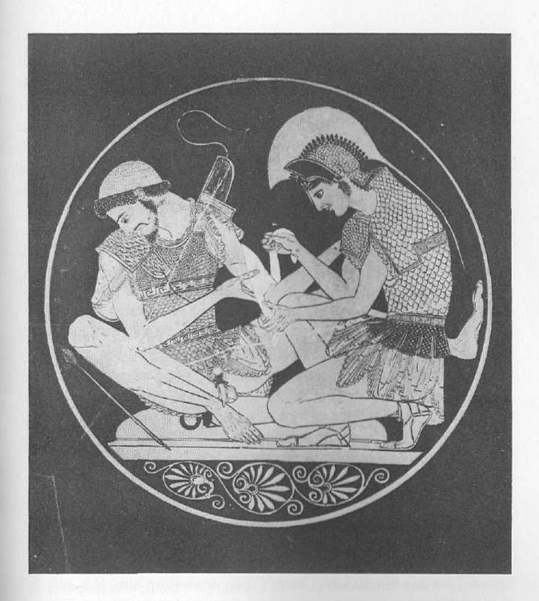
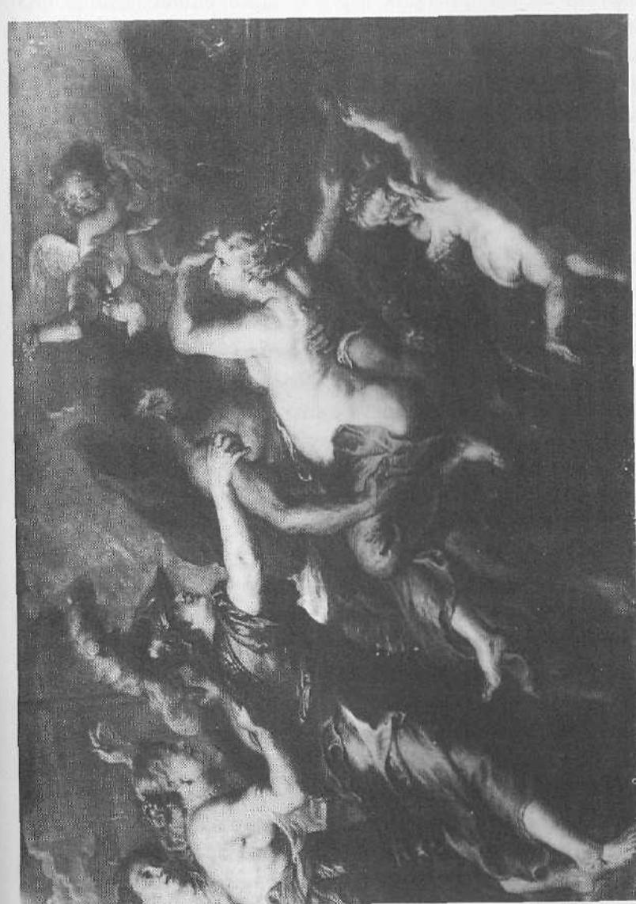

constantly. . . . We are not interested in holding onto anything—except the enemy! We're going to hold onto him by the nose, and we're going to kick him in the ass! We're going to kick the hell out of him all the time, and we're going to go through him like crap through a goose!" Proper aggressiveness, in the right circumstances—circumstances strategically advantageous to the goal at hand—is already half the battle.

How does the Warrior know what aggressiveness is appropriate under the circumstances? He knows through clarity of thinking, through discernment. The Warrior is always alert. He is always awake. He is never sleeping through life. He knows how to focus his mind and his body. He is what the samurai called "mindful." He is a "hunter" in the Native American tradition. As Don Juan, the Yaqui Indian warrior-sorcerer in Carlos Castañeda's *Journey to Ixtlan*, says, a warrior knows what he wants, and he knows how to get it. As a function of his clarity of mind he is a strategist and a tactician. He can evaluate his circumstances accurately and then adapt himself to the "situation on the ground," as we say.

An example of this is the phenomenon of guerrilla warfare, an ancient tradition but one that has come into increasing use since the eighteenth century. The rebellious colonists adopted this technique in the American Revolutionary War. The Communists in China and later in Vietnam, under the guidance of the master strategist Ho Chi Minh, used it with stunning success to defeat the more cumbersome military operations of his enemies. Most recently, the Afghan resistance fighters used this strategy to drive the Soviet army out of their country. The Warrior knows when he has the force to defeat his opponent by conventional means and when he must adopt an unconventional strategy. He accurately assesses his own strength and skill. If he finds that a frontal assault will not work, he deflects his opponent's assault, spots the weakness in his flank, then "leaps" into battle. Here is a difference between the Warrior and the Hero. The Hero, as we've said, does not know his limitations; he is romantic about his invulnerability. The warrior, however, through his clarity of thinking realistically assesses his capacities and his limitations in any given situation.

In the Bible, King David, up against the superior force of the armies of Saul, at first avoided direct confrontation with Saul's troops, allowing

Achilles and Patroclus (Internal medallion of cup illustration by Greek Sosias Painter, ca. 500 B.C.E. Courtesy of Antikenmuseum Berlin, Staatliche Museen Preuffischer Kulturbesitz. Photo: Ute Jung.)

Saul to wear himself out pursuing him. David and his ragtag band were guerrillas, living off the land and moving fast. Then David, evaluating his situation clearly, fled Saul's kingdom and went over to the Philistine king. From this position, he had the force of thousands of Philistine soldiers behind him. He had put himself into position to checkmate Saul. Then, again through his accurate assessment of the situation at the time, David reentered Saul's kingdom, gathered his own troops, and waited for Saul's collapse. Sometimes, the maxim "Forward, always forward!" means shifting tactics. It means a flexibility of strategy that comes from razor-sharp evaluation.

Modern fencing uses this kind of flexibility. Not only does the fencer train his body, he trains his mind as well. He learns to think with lightning speed, to look for the unguarded points in his opponent's stances and lunges; then he parries, attacks, and scores his hits. A young college man reported that after he took up fencing his classroom performance improved. He was able to spot, with lightning-swift clarity, the major themes in a complex lecture, evaluate the weaknesses in the supporting arguments, challenge statements with a sharpness of vision and a self-confidence he'd never known before, and force his professors and fellow students to either talk sense or drop their arguments. He knew then what he wanted to learn. And he knew how to get it.

The Warrior traditions all affirm that, in addition to training, what enables a Warrior to reach clarity of thought is living with the awareness of his own imminent death. The Warrior knows the shortness of life and how fragile it is. A man under the guidance of the Warrior knows how few his days are. Rather than depressing him, this awareness leads him to an outpouring of life-force and to an intense experience of his life that is unknown to others. Every act counts. Each deed is done as if it were the last. The samurai swordsmen were taught to live their lives as if they were already dead. Castañeda's Don Juan taught that there is "no time" for anything but meaningful acts if we live with death as "our eternal companion."

There is no time for hesitation. This sense of the imminence of death energizes the man accessing the Warrior energy to take decisive action. This means that he engages life. He never withdraws from it. He doesn't

"think too much," because thinking too much can lead to doubt, and doubt to hesitation, and hesitation to inaction. Inaction can lead to losing the battle. The man who is a Warrior avoids self-consciousness, as we usually define it. His actions become second nature. They become unconscious reflex actions. But they are actions he has trained for through the exercise of enormous self-discipline. This is how Marines are made. A good Marine is one who can make split-second decisions and then act decisively.

Part of what goes into acting decisively in any life situation, along with aggressiveness, clarity of thinking, the awareness of one's own death, is training. The Warrior energy is concerned with skill, power, and accuracy, and with control, both inner and outer, psychological and physical. The Warrior energy is concerned with training men to be "all that they can be"—in their thoughts, feelings, speech, and actions. Unlike the Hero's actions, the Warrior's actions are never overdone, never dramatic for the sake of drama; the Warrior never acts to reassure himself that he is as potent as he hopes he is. The Warrior never spends more energy than he absolutely has to. And he doesn't talk too much. Yul Brenner's character in the movie The Magnificent Seven is a study in trained self-control. He says little, moves with the physical control of a predator, attacks only the enemy, and has absolute mastery over the technology of his trade. That is another aspect of the Warrior's interest in skill, his mastery of the technology that enables him to reach his goal. He has developed skill with the "weapons" he uses to implement his decisions.

His control is, first of all, over his mind and his attitudes; if these are right, the body will follow. A man accessing the Warrior archetype has "a positive mental attitude," as they say in sales training. This means that he has an unconquerable spirit, that he has great courage, that he is fearless, that he takes responsibility for his actions, and that he has self-discipline. Discipline means that he has the rigor to develop control and mastery over his mind and over his body, and that he has the capacity to withstand pain, both psychological and physical. He is willing to suffer to achieve what he wants to achieve. "No pain, no gain," we say. Whether you are literally a hunter, crouched for hours in the same position in the chill early morning of the Kalahari waiting for

The Warrior

your prey to come within range, or whether you're a triathlon trainee, a medical school student, an executive enduring the misguided attacks of your board members, or a husband trying to work out difficulties with your wife, you know that discipline of your mind and perhaps your body is essential.

The Warrior energy also shows what we can call a transpersonal commitment. His loyalty is to something—a cause, a god, a people, a task, a nation—larger than individuals, though that transpersonal loyalty may be focused through some important person, like a king. In the Arthurian stories, Lancelot, though fiercely devoted to Arthur and to Guinevere, is ultimately committed to the ideal of chivalry and to the God who lies behind such things as noble quests, "might for right," and the lifting up of the oppressed. Of course, because of his love for Guinevere, Lancelot unwittingly acts to destroy the object of his transpersonal commitment, Camelot. But he does so because he has encountered the paradoxically personal and transpersonal goal of romantic love. By then, he has already lost his access to the Warrior energies and has ceased being a knight.

This transpersonal commitment reveals a number of other characteristics of the Warrior energy. First, it makes all personal relationships relative, that is, it makes them less central than the transpersonal commitment. Thus the psyche of the man who is adequately accessing the Warrior is organized around his central commitment. This commitment eliminates a great deal of human pettiness. Living in the light of lofty ideals and spiritual realities such as God, democracy, communism, freedom, or any other worthy transpersonal commitment, so alters the focus of a man's life that petty squabbling and personal Ego concerns no longer matter much.

There is a story about a samurai attached to the household of a great lord. His lord had been murdered by a man from a rival house, and the samurai was sworn to avenge his lord's death. After tracking the assassin for some time, after great personal sacrifice and hardship, and after braving many dangers, the samurai found the murderer. He drew his sword to kill the man. But in that instant the assassin spit in his face. The samurai stepped back, sheathed his sword, and turned and walked away. Why?

He walked away because he was angry that he'd been spat on. He would have killed the assassin, in that moment, out of his own personal anger, not out of his commitment to the ideal his lord represented. His execution of the man would have been out of his Ego and his own feelings, not out of the Warrior within. So in order to be true to his warrior calling, he had to walk away and let the murderer live.

The Warrior's loyalty, then, and his sense of duty are to something beyond and other than himself and his own concerns. The Hero's loyalty, as we have seen, is really to himself—to impressing himself with himself and to impressing others. In this connection, too, the man accessing the Warrior is ascetic. He lives a life exactly the opposite of most human lives. He lives not to gratify his personal needs and wishes or his physical appetites but to hone himself into an efficient spiritual machine, trained to bear the unbearable in the service of the transpersonal goal. We know the legends of the founders of the great faiths Christianity and Buddhism. Jesus had to resist the temptations Satan pictured to him in the wilderness, and the Buddha had to endure his three temptations under the Bo Tree. These men were spiritual warriors.

Spiritual warriors abound in human history. The religion of Islam as a whole is built on Warrior energy. Mohammed was a warrior. His followers are, to this day, still drawing on Warrior energy as they wage *jihad* against the powers of evil as they define them. The God of Islam, even though he is addressed as "the Merciful" and "the Compassionate" is a Warrior God.

We see this same Warrior energy manifested in the Jesuit Order in Christianity, which for centuries taught self-negation for the sake of carrying God's message into the most hostile and dangerous areas of the world. The man who is a warrior is devoted to his cause, his God, his civilization, even unto death.

This devotion to the transpersonal ideal or goal even to the point of personal annihilation leads a man to another of the Warrior's characteristics. He is emotionally distant as long as he is in the Warrior. This does not mean that the man accessing the Warrior in his fullness is cruel, just that he does not make his decisions and implement them out of emotional relatedness to anyone or anything except his ideal. He is, as Don Juan says, "unavailable," or "inaccessible." As he says, "To be

87

inaccessible means that you touch the world around you sparingly," with emotional detachment. This attitude is part of the clarity of the Warrior's thinking too. He looks at his tasks, his decisions, and his actions dispassionately and unemotionally. Samurai training involved the following kind of psychological exercise. Whenever, the teaching went, you feel yourself frightened or despairing, don't say to yourself, "I am afraid," or "I am despairing." Say, "There is someone who is afraid," or "There is someone who is despairing. Now, what can he do about this?" This detached way of experiencing a threatening situation objectifies the situation and allows for a clearer and more strategically advantageous view of it. The warrior is then able to act with less regard for his personal feelings; he will act more forcefully, swiftly, and efficiently with himself out of the way.

Often, in life, we need to "step back," we say, from a situation in order to gain perspective, so that we can act. The Warrior needs room to swing his sword. He needs separation from his opponents in the outer world and from his own inner opponents in the form of negative emotions. Boxers in the ring are separated by the referee when they get too close to each other and engage each other in body-locks.

The Warrior is often a destroyer. But the positive Warrior energy destroys only what needs to be destroyed in order for something new and fresh, more alive and more virtuous to appear. Many things in our world need destroying-corruption, tyranny, oppression, injustice, obsolete and despotic systems of government, corporate hierarchies that get in the way of the company's performance, unfulfilling life-styles and job situations, bad marriages. And in the very act of destroying, often the Warrior energy is building new civilizations, new commercial, artistic, and spiritual ventures for humankind, new relationships.

When the Warrior energy is connected with the other mature masculine energies something truly splendid emerges. When the Warrior is connected with the King, he is consciously stewarding the "realm," and his decisive actions, clarity of thinking, discipline, and courage are, in fact, creative and generative. At this moment in history we need only to think of Mikhail Gorbachev, warrior and king, struggling against the inertia of the Soviet system, standing in the Center, making war on the old and inefficient, generating the new and more vigorous, shepherding his people into a new era they themselves would not have the courage to face without his leadership, without his access to these two mature masculine energies.

The Warrior's interface with the Magician archetype is what enables him to achieve such mastery and control over himself and his "weapons." It is what allows him to channel and direct power to accomplish his goals.

His admixture with the Lover energy gives the Warrior compassion and a sense of connectedness with all things. The Lover is the masculine energy that brings him back into relatedness with human beings. in all their frailty and vulnerability. The Lover makes the man under the influence of the Warrior compassionate at the same time that he is doing his duty. Here we have the images, so dramatically captured for us on television, of the American GIs in Vietnam, after having bombed and strafed a Viet Cong village, carrying the children out on their hips and administering first aid to their wounded enemies. There's a powerful scene in the movie Full-Metal Jacket, in which several GIs have cornered and fatally wounded a Viet Cong sniper-a woman, as it turns out—who has killed several of their buddies. One of the characters feels compassion for his moments-ago enemy. She is writhing in agony, saying her prayers, preparing for death, and begging him to shoot her to put her out of her misery. The GI is torn between letting her die an agonizing death and helping her by finishing her off. In the end he shoots her, not out of anger but out of compassion.

Alliance with the Lover produces other humane influences in the Warrior energy. Marcus Aurelius was a philosopher. Winston Churchill was a painter. The Japanese artist-warrior Mishima was a poet. Even General Patton was a poet; he recited one of his eulogies to General Bradley at the site of the ancient North African battlefield upon which two thousand years earlier the Romans had defeated the Carthaginians. Patton claimed in his mystical poem that he had been there then, and had taken part in the battle.

When, however, the Warrior is operating on his own, unrelated to these other archetypes, the results for the mortal man accessing even the positive Warrior (the Warrior in his fullness) can be disastrous. As we have said, the Warrior in his pure form is emotionally detached; his 88

transpersonal loyalty radically relativizes the importance of his human relationships. This is apparent in the Warrior's attitude toward sex. Women, for the Warrior, are not for relating to, for being intimate with. They are for fun. We've all heard the marching chant, "This is my rifle and this is my gun. This is for fighting, and this is for fun." This attitude explains the prevalence of prostitutes around military camps. It also explains the horrific tradition of the raping of conquered women.

Even if he has a family, the human warrior's devotion to other duties often leads to marital problems. The story of the lonely and rejected serviceman's wife is one we've seen time and time again in the movies. We need only recall Gordo Cooper's estrangement from his wife, Trudy, as portrayed in the movie *The Right Stuff*.

This same thing occurs outside the military as well, in the relationships and families of men whose professions call for a great deal of transpersonal devotion and long hours of disciplined work and self-sacrifice. Ministers, doctors, lawyers, politicians, dedicated salespeople, and many others often have emotionally devastating personal lives. Their wives and girlfriends often feel alienated and rejected, competing hopelessly with the man's "true love," his work. In addition, these men, true to the Warrior's sexual attitudes, often have affairs with their nurses, staffers, receptionists, secretaries, and other women who admire from a safe (sometimes not so safe) distance their masculine Warrior proficiency and dedication.

## The Shadow Warrior: The Sadist and the Masochist

The Warrior energy's detachment from human relationships leads to real problems, as we're suggesting. These problems become enormously hurtful and destructive to a man when he is caught in the Warrior's bipolar Shadow. In the movie *The Great Santini*, Robert Duval plays a Marine fighter pilot who runs his family like a miniature Marine Corps. Most of his remarks and behavior toward his wife and children are depreciating, critical, commanding, and designed to put distance between him and the family members, who keep trying to relate to him lovingly. The destructiveness of this way of "relating" eventually becomes so obvious to everyone, especially to the older son,

that there can no longer be any hiding from the fact that Santini's sometimes violent behavior results from his own inability to be tender and genuinely intimate. The "Great Santini," under the power of the Sadist, constantly has his emotional "sword" out, swinging at everyone—his daughters, who need to be treated like girls, not Marines; his oldest son, who needs his guidance and nurturing; and even his wife. There is a terrible scene in the kitchen when everything finally erupts; Santini physically attacks his wife, and then the kids attack him. Though detachment in itself is not necessarily bad, as we've said, it does leave the door open to the "demon" of cruelty. Because he is so vulnerable in this area of relatedness, the man under the influence of the Warrior needs urgently to have his mind and his feelings under control—not repressed, but under control. Otherwise, cruelty will sneak in the back door when he's not looking.

There are two kinds of cruelty, cruelty without passion and cruelty with passion. An example of the first kind is a practice the Nazis used in training the SS officer corps. The candidates for the corps would raise puppies, caring for them in every way, tending them when they were sick, feeding and grooming them, playing with them. Then, at an arbitrary moment decided upon by the trainer, these men were ordered to kill their puppies, and to do so with no sign of feeling. This training in unfeeling sadism evidently worked well, because these same men became the killing machines that manned the death camps—systematically, and without emotion, torturing and murdering millions of human beings while still thinking of themselves as "good fellows."

A contemporary image of the Warrior turned passionless killing machine is, of course, Darth Vader, from the *Star Wars* saga. It is alarming how many boys and adolescents identify with him. In this same connection, it is also alarming how many of these young men become members of survivalist and neo-Nazi groups.

Sometimes, though, the Sadist's cruelty is passionate. In mythology, we hear of avenging gods, and of the "wrath of God." In India, we see Shiva dancing the dance of universal destruction. In the Bible, Yahweh orders the fiery destruction of whole civilizations. Early in the Old Testament, we see this angry and vengeful God reducing the planet to mud through a great deluge, killing off nearly every living thing.

Peter Paul Rubens: Rape of Persephone, 1636-1638. (©The Prado Museum, Madrid. Photo; ARXIU MAS.)

The Warrior as avenging spirit comes into us when we are very frightened and very angry. A kind of bloodlust, as it is called, comes over men in the stressful situation of actual combat, as well as in other stressful life situations. There is a scene in the movie Apocalypse Now in which the crew of the American gunboat, in a sampan boarding incident, panics and murders everyone on the sampan. Only after their fear has subsided do they realize that the people they have just murdered in their "battle frenzy" were innocent villagers going to market. A similar scene is presented in the movie Platoon, when the GIs open fire on a helpless Vietnamese village. This kind of savage outburst has haunted Americans ever since the incident at My Lai in which Lieutenant Calley, apparently terrified and angry, ordered the murder of every man, woman, and child in the village. That the sadistic Warrior actually loves such carnage and cruelty is made explicit again in Patton, when General Patton looks out over the smoking remains and the charred corpses of a great tank battle between the American and German forces and sighs, "God, I do love it so!"

Along with this passion for destruction and cruelty goes a hatred of the "weak," of the helpless and vulnerable (really the Sadist's own hidden Masochist). We've already mentioned the slapping incident in Patton's career. We see this same kind of sadism displayed in boot camp in the name of supposedly necessary "ritual humiliation" designed to deprive recruits of their individuality and put them under the power of a transpersonal devotion. Far too often, the drill sergeant's motives are the motives of the sadistic Warrior seeking to humiliate and violate the men put in his charge. And what can we make of the revolting practice of the Turkish army in World War I, when, after taking an Arab village, the soldiers delighted in cutting open pregnant women with their bayonets, ripping out their unborn babies, and hanging them around their necks?

It may seem at first unlikely, but the sadistic Warrior's cruelty is directly related to what is wrong with the Hero energy; there are similarities between the Shadow Warrior and the Hero. The Shadow Warrior carries into adulthood the adolescent insecurity, violent emotionalism, and the desperation of the Hero as he seeks to make a stand against the overwhelming power of the feminine, which always tends

93

to evoke the masochistic, or cowardly, pole of the Hero's dysfunctional Shadow. The man under the influence of the Shadow Warrior's bipolarity, unsure of his legitimate phallic power, is still battling against what he experiences as the inordinately powerful feminine and against everything supposedly "soft" and relational. Even in adulthood, he still feels terrified that he will be swallowed up by it. His desperate fear of this leads him to wanton brutality.

We don't have far to look to see this destructive Warrior operating in our own lives. Sadly, we must acknowledge it in the workplace whenever a boss puts down, harasses, unjustly fires, or in many other ways mistreats his subordinates. We must also acknowledge the Sadist in our homes, in the appalling statistics of wife beating and child abuse.

Although we may all become vulnerable to the Sadistic Warrior at some time or another, there is a particular personality type that has this energy "in spades," as we say. This is the compulsive personality disorder. Compulsive personalities are workaholics, constantly with their noses to the grindstone. They have a tremendous capacity to endure pain, and they often manage to get an enormous amount of work done. But what is driving their nonstop engines is deep anxiety, the Hero's desperation. They have a very slim grasp on a sense of their own worthwhileness. They don't know what it is they really want, what they are missing and would like to have. They spend their lives "attacking" everything and everyone—their jobs, the life-tasks before them, themselves, and others. In the process, they are eaten alive by the Sadistic Warrior and soon reach "burnout."

We all know these people. They are the managers who stay at the office long after everyone else has gone home. And when they do finally go home, they seldom have a good night's sleep. These are the ministers, social workers, and therapists, the doctors and lawyers, who work literally day and night trying to plug the physical and psychological holes in other people, sacrificing their own lives for the sake of "saving" others. In the process, they really do a lot of harm-both to themselves and to those others who can't measure up to their impossible standards. They can't, of course, measure up to their own standards, so they mercilessly abuse themselves. If you have to admit to yourself that you really don't take care of yourself, that you don't care

for your mental and physical well-being, then very probably the Shadow Warrior has got you.

As we've already suggested, men in some professions are especially endangered by dysfunctional Warrior energy. The military is an obvious example. What may not be so obvious is that revolutionaries and activists of all kinds may also fall into the sadistic pole of the Shadow Warrior. The old saying that we become what we hate applies here. It is a sad truth that leaders of revolutions—political, social, economic, the little revolutions within the corporation or the voluntary organization—once they have ousted the tyrants and oppressors (often by violence and terrorism) become themselves the new tyrants and the new oppressors. It was often said in the 1960s that the leaders of the peace movement were just as tyrannical and just as violent as those they fought against.

Salespeople and teachers, along with members of the many other professions already cited, can easily fall prey to compulsive, self-driven workaholic patterns. Eventually, they will snap. A car salesman entered analysis after years in the business as the top salesman, month after month, not only in his dealership but in the whole area. Every month, with enormous self-discipline and determination, he fought and scrapped to reach the top of the heap. Then one day something collapsed inside him. He had been sensing a gradual inner wearing down and a growing fatigue. And he had often talked about feeling "burned out." Then one morning he got up and realized that he was shaking all over and feeling terrified about going to work. Pretty soon he was not sleeping. He began having the overwhelming urge to cry at the most inappropriate times. He forced himself to go on for another several months. But finally the day arrived when everything at work-the showroom floor, the lot, his fellow workers, the customers-all seemed strangely unreal. He called his doctor and admitted himself to the hospital. The Sadistic Warrior had overpowered him. It had eaten him alive. Shortly after this, his wife left him, claiming with some apparent justification that he had been inattentive to her. He began therapy. In the course of his therapy he discovered the self-destructive power of his compulsiveness and how it worked to alienate him from others. And he resolved to turn over a new leaf.

Any profession that puts a great deal of pressure on a person to perform at his best all the time leaves us vulnerable to the shadow system of the Warrior. If we are not secure enough in our own inner structure, we will rely on our performance in the outer world to bolster our self-confidence. And because the need for this bolstering is so great, our behavior will gravitate toward the compulsive. The man who becomes obsessed with "succeeding" has already failed. He is desperately trying to repress the Masochist within him, yet he is already displaying masochistic and self-punishing behaviors.

The Masochist is the passive pole of the Warrior's Shadow, that "pushover" and "whipped puppy" that lies just beneath the Sadist's rageful displays. Men are right to fear the Coward within them, even if they don't have the sense to fear their macho exteriors. The Masochist projects Warrior energy onto others and causes a man to experience himself as powerless. The man possessed by the Masochist is unable to defend himself psychologically; he allows others (and himself) to push him around, to exceed the limits of what he can tolerate and still keep his self-respect, not to mention his psychological and physical health. All of us, no matter what our walk of life, can fall under the power of the Warrior's bipolar Shadow in any area of our lives. It may be that we don't know when to quit an impossible relationship, a circle of friends, or a frustrating job. We all know the saying "Quit while you're ahead," or "Learn to cut your losses." The compulsive personality, no matter what the danger signs, no matter how impossible the dream and unbeatable the foe, digs in and works harder, trying to get blood from a turnip and watching his gold turn to ashes in the end. If we are under the power of the Masochist, we will take far too much abuse for far too long and then explode in a sadistic outburst of verbal and even physical violence. This kind of oscillation between the active and passive poles of archetypal Shadows is characteristic of these dysfunctional systems.

## Accessing the Warrior

If we are possessed by the active pole of the Warrior's Shadow, we will experience him in his sadistic form. We will abuse ourselves and others. If we feel that we are not in touch with the Warrior, however, we

will be possessed by his passive pole. We will be cowardly masochists. We will dream but not be able to act decisively to make our dreams come true. We will lack vigor and be depressed. We will lack the capacity to endure the pain necessary for the accomplishment of any worthwhile goal. If we are in school, we won't get our assignments done; we won't get our papers written. If we are in sales and we are assigned a new territory, we'll sit and stare at the map and the list of all the contacts we need to make and not be able to pick up the phone and start calling. We will look at the task ahead and be defeated before we start. We won't be able to "leap into battle." If we are in politics, instead of being able to face the issues and the public concerns "frontally," we'll duck and dive, seeking a way out of direct confrontation. If we are underpaid on the job and figure there's money enough and we are good enough to rate a raise, we'll start down the hall to the boss's door, with fear and trembling, pause in indecision before it, and turn and walk away. As we do with all of the archetypes described in this book, we all need to ask ourselves not if we are possessed by one or both poles of their shadow systems, but in what ways we are failing to access properly the masculine energy potentials available to us.

If we are accessing the Warrior appropriately, we will be energetic, decisive, courageous, enduring, persevering, and loyal to some greater good beyond our own personal gain. At the same time, we need to be leavening the Warrior with the energies of the other mature masculine forms: the King, the Magician, and the Lover. If we are accessing the Warrior in the right way, we will, at the same time that we are "detached," be warm, compassionate, appreciative, and generative. We will care for ourselves and others. We will fight good fights in order to make the world a better and more fulfilling place for everyone and everything. Our war making will be for the creation of the new, the just, and the free.

## 7. The MAGICIAN

There's a wonderful scene in the movie *The Right Stuff* in which "Gordo" Cooper reaches a tracking station in Australia's outback, from which he's going to monitor John Glenn's first orbital flight. As he pulls up to the station and steps out of his Land Rover, he meets a band of aborigines camping there. A young man steps forward. Gordo asks him, "Who are you guys?" The aborigine replies, "We're aborigines. Who are you?" Gordo says, "I'm an astronaut. I fly up there, among the moon and the stars." The young aborigine replies, "Oh, you too? See that bloke over there?" And he points to a wizened old man sitting under the shadow of an umbrella, his eyes squinting into the distance, as if he's staring into a reality others do not see. The young aborigine explains, "He knows too. He flies too. He knows."

Later that night, while Glenn is orbiting overhead, sparks flying from his deteriorating heat shield, the aborigines build a huge bonfire, swing their bullroarers, and waft the sparks from the fire skyward to join—so the movie editing shows it—the sparks from Glenn's capsule. By sympathetic magic, the channeling of hidden energies, the aborigine Magician helps give Glenn strength and aids him on his way.

We often mistakenly think that we are very different from our ancient ancestors, with our great knowledge and our amazing technology. But the origins of our knowledge and our technology lie in the minds of men like the old aborigine. He, and all those like him in tribal and ancient societies were accessing the Magician energy. And it is the Magician

energy that drives our own modern civilization. Shamans, medicine men, wizards, witch doctors, brujos, inventors, scientists, doctors, lawyers, technicians—all these are accessing the same masculine energy pattern, no matter what age or culture they live in. Merlin, in the Arthurian stories, builds a Camelot of which our technology, psychology, and sociology still dream—regulated weather, an orderly and egalitarian society, the blessings of love and mutuality between people, and the recognized need to go questing for a supreme goal (in this case, the Holy Grail). Obe Wan Kanobe, in the *Star Wars* adventures, seeks to direct a renewal of his galaxy by a combination of his secret knowledge about "the Force" and the application of advanced technology.

The energies of the Magician archetype, wherever and whenever we encounter them, are twofold. The Magician is the knower and he is the master of technology. Furthermore, the man who is guided by the power of the Magician is able to fulfill these Magician functions in part by his use of ritual initiatory process. He is the "ritual elder" who guides the processes of transformation, both within and without.

The human magician is always an initiate himself, and one of his tasks is to initiate others. But of what is he an initiate? The Magician is an initiate of secret and hidden knowledge of all kinds. And this is the important point. All knowledge that takes special training to acquire is the province of the Magician energy. Whether you are an apprentice training to become a master electrician and unraveling the mysteries of high voltage; or a medical student, grinding away night and day, studying the secrets of the human body and using the available technologies to help your patients; or a would-be stockbroker or a student of high finance; or a trainee in one of the psychoanalytic schools, you are in exactly the same position as the apprentice shaman or witch doctor in tribal societies. You are spending large amounts of time, energy, and money in order to be initiated into rarefied realms of secret power. You are undergoing an ordeal testing your capacities to become a master of this power. And, as is true in all initiations, there is no guarantee of success.

The Magician is a universal archetype that has operated in the masculine psyche throughout history. It can be accessed today by modern men in their work and in their personal lives.

## Historical Background

It is thought by some anthropologists that in the very ancient past the masculine energies of the King, the Warrior, the Magician, and the Lover were once inseparable and that one man-the "chief"manifested all the functions of these archetypes in a holistic way. Since all four of these energies are in the masculine Self, and balanced there, it may be that the chief was the only one in the tribe who experienced himself as a whole man. Be that as it may, in the aboriginal societies that still exist today, these masculine energies are already somewhat distinct. There is the king, or chief. There are the chief's warriors. And there is the magician—the holy man, the witch doctor, the shaman. Whatever his title, his specialty is knowing something that others don't know. He knows, for instance, the secrets of the movements of the stars, the phases of the moon, the north-south swings of the sun. He knows when to plant and when to harvest, or when the herds will arrive next spring. He can predict the weather. He has knowledge of medicinal herbs and poisons. He understands the hidden dynamics of the human psyche and so can manipulate other human beings, for good or ill. He is the one who can effectively bless and curse. He understands the links between the unseen world of the spirits—the Divine World—and the world of human beings and nature. It is to him that people go with their questions, problems, pains, and diseases of the body and the mind. He is confessor and priest. He is the one who can think through the issues that are not obvious to other people. He is a seer and a prophet in the sense not only of predicting the future but also of seeing deeply.

This secret knowledge, of course, gives the magician an enormous amount of power. And because he has knowledge of the dynamics of energy flows and patterns in nature, in human individuals and societies, and among the gods—the deep unconscious forces—he is a master at containing and channeling power.

It was the magicians along the Tigris and Euphrates rivers, and along the Nile in Egypt, who created civilization as we know it. It was they who invented the secrets of written language, who discovered mathematics and engineering, astronomy, and law. The pharaohs had