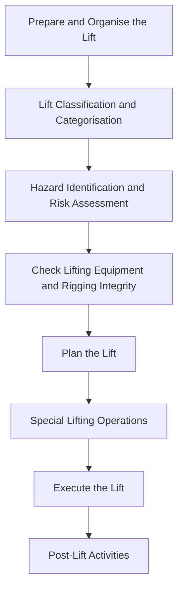

```mermaid
flowchart TD

    A[Prepare and Organise the Lift] --> B[Lift Classification and Categorisation]
    B --> C[Hazard Identification and Risk Assessment]
    C --> D[Check Lifting Equipment and Rigging Integrity]
    D --> E[Plan the Lift]
    E --> F[Special Lifting Operations]
    F --> G[Execute the Lift]
    G --> H[Post-Lift Activities]
```
