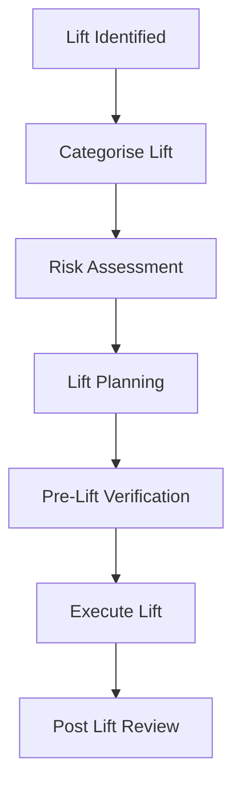

```mermaid
flowchart TD

A[Lift Identified] --> B[Categorise Lift]
B --> C[Risk Assessment]
C --> D[Lift Planning]
D --> E[Pre-Lift Verification]
E --> F[Execute Lift]
F --> G[Post Lift Review]
```
