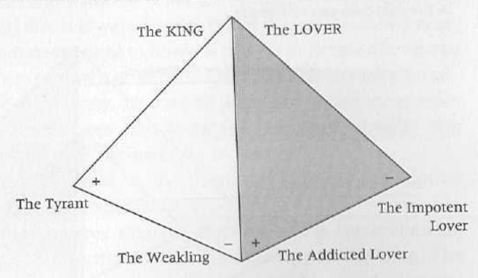
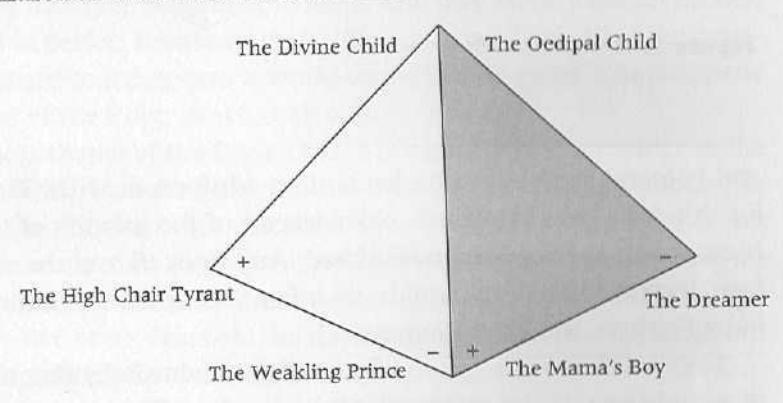

From Boy Psychology to Man Psychology

## 1. The Crisis in Masculine Ritual Process

We hear it said of some man that "he just can't get himself together." What this means, on a deep level, is that so-and-so is not experiencing, and cannot experience, his deep cohesive structures. He is fragmented; various parts of his personality are split off from each other and leading fairly independent and often chaotic lives. A man who "cannot get it together" is a man who has probably not had the opportunity to undergo ritual initiation into the deep structures of manhood. He remains a boy—not because he wants to, but because no one has shown him the way to transform his boy energies into man energies. No one has led him into direct and healing experiences of the inner world of the masculine potentials.

When we visit the caves of our distant Cro-Magnon ancestors in France, and descend into the dark of those otherworldly, and innerworldly, sanctuaries and light our lamps, we jump back in startled awe and wonder at the mysterious, hidden wellsprings of masculine might we see depicted there. We feel something deep move within us. Here, in silent song, the magic animals—bison, antelope, and mammoth—leap and thunder in pristine beauty and force across the high, vaulted ceilings and the undulating walls, moving purposefully into the shadows of the folds of the rock, then springing at us again in the light of our lamps. And here, painted with them, are the handprints of men, of the artist-hunters, the ancient warriors and providers, who met here and performed their primeval rituals.

Anthropologists are almost universally agreed that these cave sanctuaries were created, in part at least, by men for men and specifically for the ritual initiation of boys into the mysterious world of male responsibility and masculine spirituality.

But ritual process for the making of men out of boys is not limited to our conjectures about these ancient caves. As many scholars have shown, most notable among them Mircea Eliade and Victor Turner, ritual initiatory process still survives in tribal cultures to this day, in Africa, South America, islands in the South Pacific, and many other places. It survived until very recent times among the Plains Indians of North America. The study of ritual process by the specialist may tend toward dry reading. But we may see it enacted colorfully in a number of contemporary movies. Movies are like ancient folktales and myths. They are stories we tell ourselves about ourselves—about our lives and their meaning. In fact, initiatory process for both men and women is one of the great hidden themes of many of our movies.

A good, explicit example of this can be found in the movie The Emerald Forest. Here, a white boy has been captured and raised by Brazilian Indians. One day, he's playing in the river with a beautiful girl. The chief has noticed his interest in the girl for some time. This awakening of sexual interest in the boy is a signal to the wise chief. He appears on the riverbank with his wife and some of the tribal elders and surprises Tomme (Tommy) at play with the girl. The chief booms out, "Tomme, your time has come to die!" Everyone seems profoundly shaken. The chief's wife, playing the part of all women, of all mothers, asks, "Must he die?" The chief threateningly replies, "Yes!" Then, we see a firelit nighttime scene in which Tomme is seemingly tortured by the older men in the tribe; and forced into the forest vines, he is being eaten alive by jungle ants. He writhes in agony, his body mutilated in the jaws of the hungry ants. We fear the worst.

Finally, the sun comes up, though, and Tomme, still breathing, is taken down to the river by the men and bathed, the clinging ants washed from his body. The chief then raises his voice and says, "The boy is dead and the man is born!" And with that, he is given his first spiritual experience, induced by a drug blown through a long pipe into his nose. He hallucinates and in his hallucination discovers his animal

soul (an eagle) and soars above the world in new and expanded consciousness, seeing, as if from a God's-eye view, the totality of his jungle world. Then he is allowed to marry. Tomme is a man. And, as he takes on a man's responsibilities and identity, he is moved first into the position of a brave in the tribe and then into the position of chief.

It can be said that life's perhaps most fundamental dynamic is the attempt to move from a lower form of experience and consciousness to a higher (or deeper) level of consciousness, from a diffuse identity to a more consolidated and structured identity. All of human life at least attempts to move forward along these lines. We seek initiation into adulthood, into adult responsibilities and duties toward ourselves and others, into adult joys and adult rights, and into adult spirituality. Tribal societies had highly specific notions about adulthood, both masculine and feminine, and how to get to it. And they had ritual processes like the one in The Emerald Forest to enable their children to achieve what we could call calm, secure maturity.

Our own culture has pseudo-rituals instead. There are many pseudo-initiations for men in our culture. Conscription into the military is one. The fantasy is that the humiliation and forced nonidentity of boot camp will "make a man out of you." The gangs of our major cities are another manifestation of pseudo-initiation and so are the prison systems, which, in large measure, are run by gangs.

We call these phenomena pseudo-events for two reasons. For one thing, with the possible exception of military initiation, these processes, though sometimes highly ritualized (especially within city gangs), more often than not initiate the boy into a kind of masculinity that is skewed, stunted, and false. It is a patriarchal "manhood," one that is abusive of others, and often of self. Sometimes a ritual murder is required of the would-be initiate. Usually the abuse of drugs is involved in the gang culture. The boy may become an acting-out adolescent in these systems and achieve a level of development roughly parallel to the level expressed by the society as a whole in its boyish values, though in a contra-cultural form. But these pseudo-initiations will not produce men, because real men are not wantonly violent or hostile. Boy psychology, which we'll look at in more detail in chapter 3, is charged with the struggle for dominance of others, in some form or another. And it is often caught up in the wounding of self, as well as others. It is sadomasochistic. Man psychology is always the opposite. It is nurturing and generative, not wounding and destructive.

In order for Man psychology to come into being for any particular man, there needs to be a death. Death—symbolic, psychological, or spiritual—is always a vital part of any initiatory ritual. In psychological terms, the boy Ego must "die." The old ways of being and doing and thinking and feeling must ritually "die," before the new man can emerge. Pseudo-initiation, though placing some curbs on the boy Ego, often amplifies the Ego's striving for power and control in a new form, an adolescent form regulated by other adolescents. Effective, transformative initiation absolutely slays the Ego and its desires in its old form to resurrect it with a new, subordinate relationship to a previously unknown power or center. Submission to the power of the mature masculine energies always brings forth a new masculine personality that is marked by calm, compassion, clarity of vision, and generativity.

A second factor makes most initiations in our culture pseudo-initiations. In most cases, there simply is not a contained ritual process. Ritual process is contained by two things. The first is sacred space and the second is a ritual elder, a "wise old man" or a "wise old woman" who is completely trustworthy for the initiate and can lead the initiate through the process and deliver him (or her) intact and enhanced on the other side.

Mircea Eliade researched the role of sacred space extensively. He concluded that space that has been ritually hallowed is essential to initiations of every kind. In tribal societies this space can be a specially constructed hut or house in which the boys awaiting their initiation are held. It can be a cave. Or it can be the vast wilderness into which the would-be initiate is driven in order to die or to find his manhood. The sacred space can be the "magic circle" of magicians. Or, as in more advanced civilizations, it can be an inner room in the precincts of a great temple. This space must be sealed from the influence of the outside world, especially, in the case of boys, from the influence of women. Often, the initiates are put through terrifying emotional and excruciatingly painful physical trials. They learn to submit to the pain of life, to the ritual elders, and to the masculine traditions and myths of

the society. They are taught all the secret wisdom of men. And they are released from the sacred space only when they have successfully completed the ordeal and been reborn as men.

The second essential ingredient for a successful initiatory process is the presence of a ritual elder. In *The Emerald Forest* this is the chief and the other elders of the tribe. The ritual elder is the man who knows the secret wisdom, who knows the ways of the tribe and the closely guarded men's myths. He is the one who lives out of a vision of mature masculinity.

With a scarcity in our culture of mature men, it goes without saying that ritual elders are in desperately short supply. Thus, pseudo-initiations remain skewed toward the reinforcement of Boy psychology rather than allowing for movement toward Man psychology, even if some sort of ritual process exists, and even if a kind of sacred space has been set up on the city streets or on the cell block.

The crisis in mature masculinity is very much upon us. Lacking adequate models of mature men, and lacking the societal cohesion and institutional structures for actualizing ritual process, it's "every man for himself." And most of us fall by the wayside, with no idea what it was that was the goal of our gender-drive or what went wrong in our strivings. We just know we are anxious, on the verge of feeling impotent, helpless, frustrated, put down, unloved and unappreciated, often ashamed of being masculine. We just know that our creativity was attacked, that our initiative was met with hostility, that we were ignored, belittled, and left holding the empty bag of our lost selfesteem. We cave in to a dog-eat-dog world, trying to keep our work and our relationships afloat, losing energy, or missing the mark. Many of us seek the generative, affirming, and empowering father (though most of us don't know it), the father who, for most of us, never existed in our actual lives and won't appear, no matter how hard we try to make him appear.

However, as students of human mythology, and as Jungians, we believe there is good news. It's this good news for men (as well as women) that we want to share. And it is to this that we now turn.

## 2. Masculine Potentials

Those of us who have been influenced by the thinking of the great Swiss psychologist Carl Jung have great reason to hope that the external deficiencies we have encountered in the world as would-be men (the absent father, the immature father, the lack of meaningful ritual process, the scarcity of ritual elders) can be corrected. And we have not only hope but actual experience as clinicians and as individuals of inner resources not imagined by psychology before Jung. It is our experience that deep within every man are blueprints, what we can also call "hard wiring," for the calm and positive mature masculine. Jungians refer to these masculine potentials as archetypes, or "primordial images."

Jung and his successors have found that on the level of the deep unconscious the psyche of every person is grounded in what Jung called the "collective unconscious," made up of instinctual patterns and energy configurations probably inherited genetically throughout the generations of our species. These archetypes provide the very foundations of our behaviors—our thinking, our feeling, and our characteristic human reactions. They are the image makers that artists and poets and religious prophets are so close to. Jung related them directly to the instincts in other animals.

Most of us are familiar with the fact that baby ducks soon after they are hatched attach themselves to whomever or whatever is walking by at the time. This phenomenon is called imprinting. It means that the newly hatched duckling is wired for "mother," or "caretaker." It doesn't have to learn—from the outside, as it were—what a caretaker is. The archetype for caretaker comes on line shortly after the duckling comes into this world. Unfortunately, however, the "mother" the duckling meets in those first moments may not be adequate to the task of taking care of it. Nonetheless, although those in the outer world may not live up to the instinctual expectation (they may not even be ducks!), the archetype for caretaker forms the duckling's behavior.

In a similar way, human beings are wired for "mother" and "father" and many other human relationships, as well as all forms of the human experience of the world. And though those in the outer world may not live up to the archetypal expectation, the archetype is nonetheless present. It is constant and universal in all of us. We, like the duckling that mistakes a cat for its mother, mistake our actual parents for the ideal patterns and potentials within us.

Archetypal patterns gone awry, skewed into the negative by disastrous encounters with living people in the outer world—that is, in most cases, by inadequate or hostile parents—manifest in our lives as crippling psychological problems. If our parents were, as the psychologist D. W. Winnicott says, "good enough," then we are enabled to experience and access the inner blueprints for human relations in a positive way. Sadly, many of us, perhaps the majority, did not receive good enough parenting.

The existence of the archetypes is well documented by mountains of clinical evidence from the dreams and daydreams of patients, and from careful observation of entrenched patterns of human behavior. It is also documented by in-depth studies of mythology the world over. Again and again we see the same essential figures appearing in folklore and mythology. And these just happen to appear also in the dreams of people who have no knowledge of these fields. The dying-resurrecting young God, for example, is found in the myths of such diverse people as Christians, Moslem Persians, ancient Sumerians, and modern Native Americans, as well as in the dreams of those undergoing psychotherapy. The evidence is great that there are underlying patterns that determine human cognitive and emotional life.

These blueprints appear to be great in number, and they manifest themselves as both male and female. There are archetypes that pattern the thoughts and feelings and relationships of women, and there are archetypes that pattern the thoughts and feelings and relationships of men. In addition, Jungians have found that in every man there is a feminine subpersonality called the Anima, made up of the feminine archetypes. And in every woman there is a masculine subpersonality called the Animus, made up of the masculine archetypes. All human beings can access the archetypes, to a greater or lesser degree. We do this, in fact, in our interrelating with one another.

This whole field is being actively discussed and continually revised as our knowledge about the inner instinctual human world moves forward. We are just beginning to sort out in a systematic way the inner human world that has always manifested itself to us in myth, ritual, dreams, and visions. The field of archetypal psychology is in its infancy. We want to show men how they can access these positive archetypal potentials for their own benefit and for the benefit of all those around them, maybe even for the planet.

# 3. Boy Psychology

The drug dealer, the ducking and diving political leader, the wife beater, the chronically "crabby" boss, the "hot shot" junior executive, the unfaithful husband, the company "yes man," the indifferent graduate school adviser, the "holier than thou" minister, the gang member, the father who can never find the time to attend his daughter's school programs, the coach who ridicules his star athletes, the therapist who unconsciously attacks his clients' "shining" and seeks a kind of gray normalcy for them, the yuppie—all these men have something in common. They are all boys pretending to be men. They got that way honestly, because nobody showed them what a mature man is like. Their kind of "manhood" is a pretense to manhood that goes largely undetected as such by most of us. We are continually mistaking this man's controlling, threatening, and hostile behaviors for strength. In reality, he is showing an underlying extreme vulnerability and weakness, the vulnerability of the wounded boy.

The devastating fact is that most men are fixated at an immature level of development. These early developmental levels are governed by the inner blueprints appropriate to boyhood. When they are allowed to rule what should be adulthood, when the archetypes of boyhood are not built upon and transcended by the Ego's appropriate accessing of the archetypes of mature masculinity, they cause us to act out of our hidden (to us, but seldom to others) boyishness.

We often talk with affection about boyishness in our culture. The truth is that the boy in each of us—when he is in his appropriate place

in our lives—is the source of playfulness, of pleasure, of fun, of energy, of a kind of open-mindedness, that is ready for adventure and for the future. But there is another kind of boyishness that remains infantile in our interactions within ourselves and with others when manhood is required.

### The Structure of the Archetypes

Each of the archetypal energy potentials in the male psyche—in both its immature and its mature forms—has a triune, or three-part, structure (see fig. 1).

At the top of the triangle is the archetype in its fullness. At the bottom of the triangle the archetype is experienced in what we call a bipolar dysfunctional, or shadow, form. In both its immature and mature forms (that is, in both Boy psychology and Man psychology terms), this bipolar dysfunction can be thought of as immature in that it represents a psychological condition that is not integrated or cohesive. Lack of cohesion in the psyche is always a symptom of inadequate development. As the personality of the boy and then the man matures into its appropriate stage of development, the poles of these shadow forms become integrated and unified.

Some boys seem more "mature" than others; they are accessing, no doubt unconsciously, the archetypes of boyhood more fully than are their peers. These boys have achieved a level of integration and inner unity that others have not. Other boys may seem more "immature," even taking into account the natural immaturity of boyhood. For example, it is right for a boy to feel the heroic within himself, to see himself as a hero. But many boys cannot do this and become caught in the bipolar shadow forms of the Hero—the Grandstander Bully or the Coward.

Different archetypes come on line at different developmental stages. The first archetype of the immature masculine to "power up" is the Divine Child. The Precocious Child and the Oedipal Child are next; the last stage of boyhood is governed by the Hero. Human development does not always proceed so neatly, of course; there are mixtures of the archetypal influences all along the way.

Interestingly, each of the archetypes of Boy psychology gives rise in a complex way to each of the archetypes of mature masculinity: the boy is father to the man. Thus, the Divine Child, modulated and enriched by life's experiences, becomes the King; the Precocious Child becomes the Magician; the Oedipal Child becomes the Lover; and the Hero becomes the Warrior.

The four archetypes of boyhood, each with a triangular structure, can be put together to form a pyramid (see fig. 2) that depicts the structure of the boy's emerging identity, his immature masculine Self. The same is true of the structure of the mature masculine Self.

As we have suggested, the adult man does not lose his boyishness, and the archetypes that form boyhood's foundation do not go away. Since archetypes cannot disappear, the mature man transcends the masculine powers of boyhood, building upon them rather than demolishing them. The resulting structure of the mature masculine Self, therefore, is a pyramid over a pyramid (see fig. 3). Though images should not be taken too literally, we are arguing that pyramids are universal symbols of the human Self.\*

#### The Divine Child

The first, the most primal, of the immature masculine energies is the Divine Child. We are all familiar with the Christian story of the birth of the baby Jesus. He is a mystery. He comes from the Divine Realm, born of a virgin woman. Miraculous things and events attend him: the star, the worshiping shepherds, the wise men from Persia. Surrounded by his worshipers, he occupies the central place not only in the stable but in the universe. Even the animals, in popular Christmas songs, attend him. In the pictures, he radiates light, haloed by the soft, glistening straw he lies upon. Because he is God, he is almighty. At the same time,

\* We theorize that the Self-structure in women is also pyramidal in form, and that when the pyramids of the masculine Self and the feminine Self are placed end to end, they form an octahedron, an image that graphically represents the Jungian Self, which embraces both masculine and feminine qualities. See C. G. Jung's Aion, translated by R. F. C. Hull, Bollingen Series XX (Princeton: Princeton Univ. Press, 1959). We have gone beyond Jung in decoding the "double quaternio."

Figure 1. The Archetypes of the Immature and the Mature Masculine

### THE PYRAMIDAL STRUCTURE OF THE MATURE MASCULINE SELF

 

### THE PYRAMIDAL STRUCTURE OF THE IMMATURE MASCULINE SELF

 

Figure 2.

he is totally vulnerable and helpless. No sooner is he born than the evil King Herod sniffs him out and seeks to kill him. He must be protected and spirited away to Egypt until he can be strong enough to begin his life's work and until the forces that would destroy him have spent their energy.

What is not often realized is that this myth does not stand alone. The religions of the world are rich with stories of the miraculous Baby THE PYRAMIDAL STRUCTURE OF THE MATURE MASCULINE SELF

THE PYRAMIDAL STRUCTURE OF THE IMMATURE MASCULINE SELF

Boy. The Christian story itself is modeled in part on the story of the birth of the great Persian prophet Zoroaster, complete with miracles in nature, magi, and threats on his life. In Judaism, there is the story of the baby Moses born to be the deliverer of his people, to be the Great Teacher and the Mediator between God and human beings. He was raised as a prince of Egypt. And yet, in his first days, his life was threatened by an edict from the pharaoh, and he was placed, helpless
