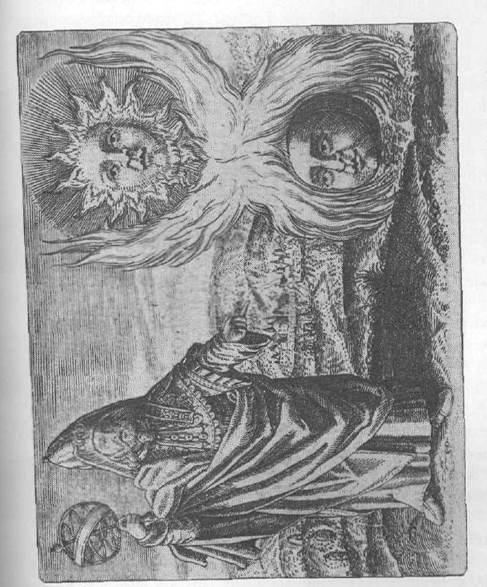
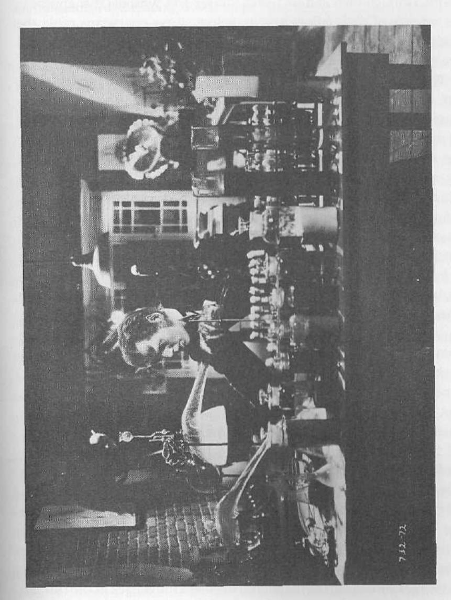
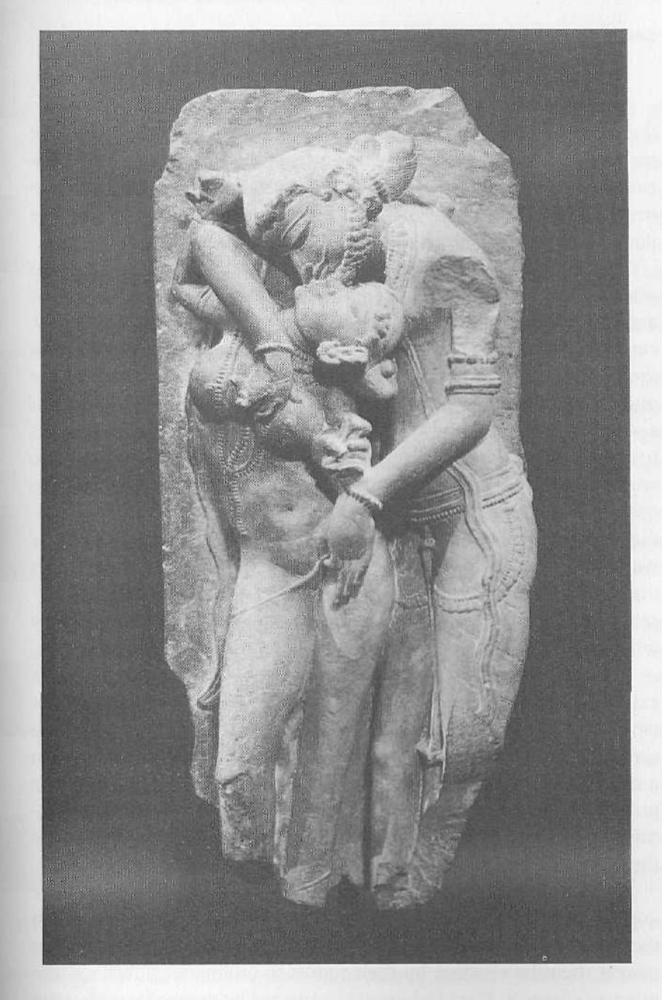
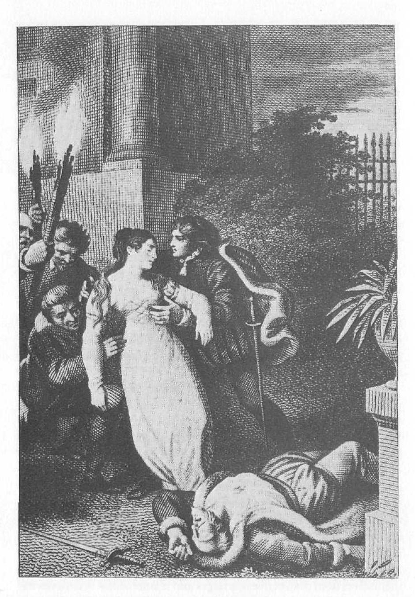

what the Bible calls wizards at their courts to advise them about all these things. The legendary Egyptian magician Imhotep (ca. 2800 B.C.E.) is credited with important discoveries in medicine, engineering, and other sciences. He designed and built the first great pyramid, the so-called Stepped Pyramid of Pharaoh Djoser. He was the Einstein and the Jonas Salk of his day.

One aspect of the magician's knowing, of his seeing into the depths not only of nature but of human beings was his capacity to deflate the arrogance, especially of kings, but also of any important public official. The Magician archetype in a man is his "bullshit detector"; it sees through denial and exercises discernment. He sees evil for what and where it is when it masquerades as goodness, as it so often does. In ancient times when a king became possessed by his angry feelings and wanted to punish a village that had refused to pay its taxes, the magician, with measured and reasoned thinking or with the stabbing blows of logic, would reawaken the king's conscience and good sense by releasing him from his tempestuous mood. The court magician, in effect, was the king's psychotherapist.

The prophet Nathan, King David's magician, performed this psychotherapeutic service for him on more than one occasion. But especially dramatic is the Bathsheba incident, which we've already referred to. After David had had his way with Bathsheba and had had her husband, Uriah, killed, Nathan came quietly into David's throne room and stood before him. Nathan then told David a story. He said that in a certain city there were two men, a rich man and a poor man. The poor man had only one little lamb. The rich man had many sheep. One day a traveler came to visit the rich man, and the rich man was obliged to give him a sumptuous feast. Instead of slaughtering one of his own sheep, he went to the poor man and took his one little lamb, killed it, and made the feast with it. King David, bursting with anger, proclaimed that whoever had done this thing deserved to die. Nathan answered, "You are the man." David repented. In the future, he was less inflated.

Merlin, King Arthur's magician, functioned much the same way for him. Merlin helped Arthur think things through and, in the process, sometimes deflated Arthur's arrogance. In the musical *Camelot*, and T. H. White's magnificent *The Once and Future King*, upon which the play is based, Merlin frequently guides Arthur and, in effect, continually works to initiate him into appropriate ways of accessing the King energy. The result is that Arthur grows into fuller and fuller masculine maturity at the same time that he becomes a better king.

In late antiquity, coming out of the ancient Greek mystery religions and given new life by early Christianity, there was a movement called Gnosticism. *Gnosis* was the Greek word for "knowing" on a deep psychological or spiritual level. The Gnostics were knowers of the inner depths of the human psyche and the hidden dynamics of the universe. They were really proto-depth psychologists. They taught their initiates how to discover their own unconscious motives and drives, how to thread their way through the treacherous darkness of human delusions, and how, finally, to reach oneness with the Center that lies deep within. This Gnostic movement, concentrating as it did on insight and self-knowledge, was unpopular with the vast majority of early Christians, and it was persecuted out of existence by the Catholic church. Acquiring knowledge of whatever kind, but especially of the hidden workings of the psyche, is difficult and painful work that most of us have never wanted to do.

But in spite of the persecution of the magician class of early Christians, the Magician archetype could not, of course, be cast out; none of the instinctual energies of the psyche can be. This tradition of secret knowledge resurfaced in the Middle Ages in Europe as "alchemy." Most of us know that alchemy was on one level the attempt to make gold from common materials. On that level it was doomed to fail. But what most of us don't realize is that alchemy was also a spiritual technique for helping the alchemists themselves achieve insight, self-awareness, and personal transformation—that is, initiation into greater maturity.

In very large part, it was alchemy that gave birth to the modern sciences—certainly to the sciences of chemistry and physics. It is interesting to realize that our modern science, like the work of the ancient magicians, is also divided into two aspects. The first, "theoretical science," is the *knowing* aspect of the Magician energy. The second, "applied science," is the *technological* aspect of the Magician energy, the applied knowledge of how to contain and channel power.

Ours is, we believe, the age of the Magician, because it is a technological age. It is an age of the Magician at least in his materialistic concern with understanding and having power over nature. But in terms of nonmaterialistic, psychological, or spiritual initiatory process, the Magician energy seems to be in short supply. We have already noted the absence of ritual elders who can initiate men into the deeper and more mature levels of masculine identity. Though technical schools and trade unions, professional associations, and many other institutions that express the Magician energy in the purely material world flourish and provide initiatory processes for those who seek to become "masters" in this sense, the Magician energy is not doing so well in the area of personal growth and transformation. Ours is an age, as we've said, of personal and gender identity chaos. And chaos is always the result of inadequate accessing of the Magician in some vital area of life.

Two sciences—subatomic physics and depth psychology—still do the work of the ancient magicians in a holistic way that brings together the material and the psychological sides of the Magician energy. Each seeks to know and then to at least partially control the very wellsprings of the same hidden energies the ancients probed so profoundly.

Modern subatomic physics, it has been said, looks very much like Eastern mysticism as it approaches the intuited insights of Hinduism and Taoism. This new physics is discovering a microworld beneath our seemingly solid macroworld of sense perceptions. That unseen world of subatomic particles is very different from the macroworld we normally experience. In this hidden world beneath the surface of things, reality becomes very strange indeed. Particles and waves, so radically different in their properties in the macroworld, in the microworld are the same thing. A "particle" can appear to be in two separate places at the same time, without ever having divided. Matter loses its "solidity" and seems to be like gathered nodes of energy, concentrated in localized spots for more or less brief periods of time. Energy itself seems to arise out of an even more deeply concealed grid-like patterning of the void of space, which can no longer be viewed as "nothing." Particles arise from this underlying energy field like waves on the ocean, only to subside-or "decay"-again into the nothingness from which they came. Questions arise about time: what it is, what direction it's going.

Does it ever reverse? Do certain kinds of subatomic particles travel backward in time, and then reverse their direction to move in our time again? What is the origin of the universe, and its final fate? In the light of these new discoveries and questions, old questions resurface. What is the nature of being and of nonbeing? Are there, in fact, the other dimensions that mathematics predicts? In what ways might they be equivalent to what the ancient religions called other "planes" or "worlds"? Physicists have entered the realm of truly hidden and secret knowledge. And they are moving in a world of thought that looks very much like the world of the ancient magician.

The same is true of depth psychology. Jung, as he was making his first maps of the unconscious, was struck by the similarities between what he was discovering about the energy flows and the archetypal patterns in the human psyche and the quantum physics of, among others, Max Planck. Jung realized that he had stumbled onto a vast world that modern people had largely neglected, a world of living images and symbols that rose and fell like the waves of energy that seemed to account for our material universe. These archetypal realities, hidden in the deep void of the collective unconscious, seemed to be the building blocks of our thoughts and feelings and of our habitual patterns of behaviors and reactions, our macroworld of personality. For Jung, this collective unconscious looked very much like the unseen energy fields of the subatomic physicists, and to Jung both of these looked a lot like the mysterious underlying "pleroma" described by the Gnostics.

The conclusion of both modern physics and depth psychology is that things are not what they seem. What we experience as normal reality—about ourselves and nature—is only the tip of an iceberg that arises out of an unfathomable abyss. Knowledge of this hidden realm is the province of the Magician, and it is through the Magician energy that we will come to understand our lives with a degree of profundity not dreamed of for at least a thousand years of Western history.

There are indications that Jung thought of himself as a Magician. When asked once if he believed in God, he replied, in true Gnostic fashion, "I don't believe in God; I know." Some of his earliest followers have said that he imparted secrets to them that they could not reveal except to those initiated into the highest, or deepest, levels of psychic awareness.

This isn't mumbo jumbo. Every analyst knows that he or she must be careful how much to reveal to an analysand at any given time. The power of the unconscious energies is so great that if they are not controlled, contained, and channeled, if they are not accessed at just the right moment and in just the right dose, they may blow the Ego structure to bits. Too much power without the proper "transformers" and the right amount of "insulation" to contain it will overload the analysand's circuits and destroy him. The revelation of secret information must be measured out, because there are reasons for its having been hidden from the Ego in the first place.

There is another area in our modern world in which the psychological and spiritual knowledge and energy-channeling of the Magician archetype are being revived. This is the area of the so-called occult. There are many ritual magicians, from all walks of life—bankers, computer operators, housewives, chemical engineers, and many others—who do their "daylight" work like other people and then retire to their real work, mostly at night, in which they seek initiation into "higher planes." They contact what they call "entities" who teach them how to see more deeply and how to use the power that becomes available to them for good and for ill. These people—exactly like the ancient magicians—are concerned with knowledge of secret wisdom and powers and of the technological issues of containment (often through the insulating effects of "magic circles" and words of invocation and banishment) and of channeling (often through the use of the well-known "magic wand").

For all ritual process and for all deep knowing and controlling of energies of any kind, the issue of "sacred" space arises. Sacred space is the container of raw power—the "step-down transformer" that insulates and then channels the energies that are drawn into it. It is the reactor shield in the nuclear power plant. It is the sanctuary of the church. It is the hymns and the standard prayers, the invocations and blessings, used to invoke the Divine Power, and then to shield the believers from its raw intensity while at the same time providing them access to it.

There is a fascinating story in the Bible about this issue of containment and sacred space. King David and his army have recaptured the Ark of the Covenant—a sort of portable "generating station" for the

power of Yahweh—from the Philistines. They are transporting it back to Jerusalem when the oxen pulling the cart with the Ark on it stumble. The Ark starts to go over. A soldier, walking beside the cart, instinctively reaches up and touches the Ark to steady it. He's immediately killed, because only the priests, the magicians, trained in the knowledge of how to handle the "reactor core" of the power of God, can touch it. They know the secret of insulation; they know how to contain and channel Yahweh's power on earth. The unfortunate soldier, for all his good intentions, did not.

In the movie *Raiders of the Lost Ark* we see a modern-day treatment of the generating power of the Ark theme. Here, Indiana Jones is racing the Nazis to find the Ark and then to use the enormous power of this ancient "technology." The Nazis get to it first. There is a wonderful scene in which the Nazi commander, robed in the appropriate ceremonial garb, is reciting the ritual invocations to activate the Ark's power. He's flipping the "on" switch. But he's evidently not a magician. Because once he's got the Ark going, he doesn't know how to contain the forces he has let loose. He can't find the "off" switch. The power of Yahweh gets loose, and, absent the magician as knower and technician, it atomizes the Nazi army.

A similar theme appears in a sequence in Walt Disney's *Fantasia*. Mickey Mouse, the sorcerer's apprentice, has been left with the job of mopping the workroom of his master—the sorcerer (magician). Rather than do the work in the conventional way, with elbow grease, he decides to use magic power. He activates the mop and bucket, and at first all goes well. But then the power he has released gets out of hand. He's only an apprentice, after all, and he doesn't know how to contain the energy he has set in motion. The mops and buckets begin to multiply. The scene becomes frantic, as unfortunate Mickey can't find the right words to stop this explosion of power. The mops and buckets keep dumping water into the room, until the apprentice is awash in a rising tide and threatened with drowning. Only the master's return saves the day.

With subatomic physics, all too often we have discovered belatedly that our knowledge and technology of containment have been inadequate. The Soviet disaster at Chernobyl is the most dramatic and the most unfortunate example.

The same thing has occurred in psychotherapy. Often, a therapist who has not been properly initiated and is not sufficiently adept himself—and is still an "apprentice" in some vital ways—sets off forces in the analysand that neither of them can contain. This issue of containment is one that has arisen time and time again in the context of group therapy, especially in the "encounter groups" of the sixties and seventies. Too often, neither the group participants nor the group leader had any real understanding of the forces that could be released. The leader had neither the knowledge nor the technological proficiency in psychological dynamics to control the process. The group would, as a result, turn negative, and "meltdown," first of individuals and then of the entire group, would occur.

The same thing happens at rock concerts, from time to time. The musicians invoke aggressive and volatile emotions in the audience, and then, if they are not accessing the Magician well enough, they are unable to contain and channel the energy. The audience becomes violent and may rampage through the concert hall and even out onto the streets in an orgy of destruction.

## The Magician in His Fullness

What does all this mean for us men pursuing our own quests for personal happiness and for the life-enhancement of our loved ones, our companies, our causes, our peoples, our nations, and the world? What functions does the Magician energy of the mature masculine perform in our daily lives?

The Magician energy is the archetype of awareness and of insight, primarily, but also of knowledge of anything that is not immediately apparent or commonsensical. It is the archetype that governs what is called in psychology "the observing Ego."

While it is sometimes assumed in depth psychology that the Ego is secondary in importance to the unconscious, the Ego is in fact vital to our survival. It is only when it is possessed by, identified with, and inflated by another energy form—an archetype or a "complex" (an archetypal fragment, like the Tyrant)—that it malfunctions. Its proper role is to stand back and observe, to scan the horizon, to monitor the

data coming in from both the outside and the inside and then, out of its wisdom—its knowledge of power, within and without, and its technical skill in channeling—make the necessary life decisions.

When the observing Ego is aligned with the masculine Self along an "Ego-Self axis," it is initiated into the secret wisdom of this Self. It is, in one sense, a servant of the masculine Self. But in another sense, it is the leader and the channeler of this Self's power. It is, then, a vital player in the personality as a whole.

The observing Ego is detached from the ordinary flow of daily events, feelings, and experiences. In a sense, it doesn't live life. It watches life, and it pushes the right buttons at the right times to access energy flows when they are needed. It is like the hydroelectric dam operator who watches his gauges and his computer screens for building pressures on the dam's surfaces and then decides whether or not to release water through the sluices.

The Magician archetype, in concert with the observing Ego, keeps us insulated from the overwhelming power of the other archetypes. It is the mathematician and the engineer in each of us that regulates the life functions of the psyche as a whole. It knows the enormous force of the psyche's inner dynamics and how to channel them for maximum benefit. It knows the unbelievable force of the "sun" within, and it knows how to channel that sun's energy for maximum benefit. The Magician pattern regulates the internal energy flows of the various archetypes for the benefit of our individual lives.

Many human magicians, in whatever profession or in whatever walk of life (occult practitioners as well), are consciously using their knowledge and technical proficiency for the benefit of others as well as themselves. Doctors, lawyers, priests, CEOs, plumbers and electricians, research scientists, psychologists, and many others are, when they are accessing the Magician energy appropriately, working to turn raw power to the advantage of others. This is true of the witch doctor and the shaman with their rattles, amulets, herbs, and incantations. And it is equally true of the medical research technicians who are looking for cures for our most deadly diseases.

The Magician energy is present in the Warrior archetype in the form of his clarity of thinking, which we've already discussed in some detail.

The Magician alone does not have the capacity to act. That is the Warrior's specialty. But he does have the capacity to think. Whenever we are faced with what seems like an impossible decision in our daily lives—who to promote in the company when there are difficult and complex political considerations to be taken into account, how to deal with our son's lack of motivation in school, how to design a particular home so as to meet both the clients' specifications and the city codes, how much to reveal to an analysand about the meaning of his dreams when we see him headed for a crisis, even how to budget in tight financial circumstances—whenever we do these things, make these decisions, with careful and insightful deliberation, we are accessing the Magician.

The Magician, then, is the archetype of thoughtfulness and reflection. And, because of that, it is also the energy of introversion. What we mean by introversion is not shyness or timidity but rather the capacity to detach from the inner and outer storms and to connect with deep inner truths and resources. Introverts, in this sense, live much more out of their centers than other people do. The Magician energy, in aiding the formation of the Ego–Self axis, is immovable in its stability, centeredness, and emotional detachment. It is not easily pushed and pulled around.

The Magician often comes on line in a crisis. A middle-aged man reported to us what happened to him in a recent car accident. It was winter, and he was coming down a hill. There was a car ahead of him stopped at a stop sign at the bottom of the hill. Suddenly, in the middle of his normal braking procedures, he hit a patch of ice. His brakes locked and his car took off down the hill like a rocket. He felt panic as he slid straight for the rear bumper of the other car. Then something remarkable happened: a shift of consciousness. All of a sudden, everything seemed to move in slow motion. The man felt calm and steady. He now had the "time" to sort through what few options he had. It was as if a computer took over, some other kind of intelligence within him. And a "voice" from within told him to release the brake pedal, pump it a few times, and steer as best he could to the right. That way, he would hit the car below him at an angle, minimizing the impact, and more or less harmlessly come to a stop in the soft, snowy embankment at the side of the road. The man executed these maneuvers successfully.

Hermes Trismegistus, Sophic Sulphur and Mercury (Engraving from Symbola Aureae Mensae, courtesy of the British Library, London.)

What we think he was reporting was sudden access to the Magician energy, an energy whose detached "knowledge" of various possible outcomes and understanding of lines of force (of containment and channeling) could help him, through technical proficiency, make the best of a bad situation.

If we think for a moment about all the areas of our lives in which clear, careful thinking based on inner wisdom and technical proficiency would help, then we realize our need to properly access the Magician.

Often, in difficult situations like this one people are drawn into some kind of space and time frame that can be called "sacred," because it is so different from the space and time we normally experience. The driver in our example suddenly found himself in an inner space and time (the slow-motion effect he described) far different from his panic and fear. This "sacred" space is something men who are guided by the Magician know well. These men may actually put themselves into that "space" deliberately, much like ritual magicians who draw their magic circles and recite their incantations. They enter this space by listening to certain musical pieces, by tending to a hobby, by taking long walks in the woods, by meditating on certain themes and mental pictures, and by many other methods. When they enter this sacred space within they can be in touch with the Magician; they can emerge from the inner space seeing what they need to do about a problem and knowing how to do it.

We believe that the many ways in which the Magician has appeared in history and in which he appears among men today are mere fragments of a once-whole image. That primordial Magician in men has manifested itself most fully in what anthropologists refer to as the shaman. The shaman in traditional societies was the healer, the one who restored life, who found lost souls, and who discovered the hidden causes of misfortune. He was the one who restored wholeness and fullness of being to both individuals and communities. Indeed, the Magician energy today still has the same ultimate aim. The Magician, and the shaman as his fullest human vessel, aims at fullness of being for all things, through the compassionate application of knowledge and technology.

## The Shadow Magician: The Manipulator and the Denying "Innocent" One

As positive as the Magician archetype is, like all the other forms of the mature masculine energy potentials, it too has a shadow side. If ours is an age of the Magician, then it is also an age of the bipolar Shadow Magician. We need only to think about the mushrooming problem of toxic wastes poisoning and blighting our planet's environment. The "mops and buckets" of the sorcerer's apprentice are proliferating as the ozone layer yawns open, as the oceans throw back our trash, as wildlife perishes (many species to complete extinction), as the Brazilian rain forests come down, not only destroying the ecology of Brazil but threatening the globe's capacity to produce enough oxygen to sustain most life forms. It was the Shadow Magician that handed us in the darkest days of World War II, not only the technology of the death camps, but also the doomsday weapon that still hangs over all our heads. Mastery over nature, a proper function of the Magician, is running amuck, and with incalculable results that we are already beginning to feel. Behind the propaganda ministries, the controlled press briefings, the censored news, and the artificially orchestrated political rallies lies the face of the Magician as Manipulator.

The active pole of the Shadow Magician is, in a special sense, a "power Shadow." A man under this Shadow doesn't guide others, as a Magician does; he directs them in ways they cannot see. His interest is not in initiating others by graduated degrees—degrees that they can integrate and handle—into better, happier, and more fulfilled lives. Rather, the Manipulator maneuvers people by withholding from them information they may need for their own well-being. He charges heavily for the little information he does give, which is usually just enough to demonstrate his superiority and his great learning. The Shadow Magician is not only detached, he is also cruel.

Regrettably, a good example of this can be found in our graduate schools. A number of graduate students—bright, gifted, and hardworking—have told us of Shadow Magician experiences with their professors. Rather than accessing the Magician appropriately and thus serving as guides for these young people's initiation into the eseoteric

realm of advanced studies, these men habitually attacked their students, seeking to crush their enthusiasm. Unfortunately, this scenario is repeated all too frequently in educational institutions on all levels—from kindergarten to medical school, from high school to trade school.

Many men involved in modern medicine demonstrate this power Shadow too. It is well known that the best money in medicine is made by the specialist, who is an initiate into rarefied fields of knowledge. There are, no doubt, many medical specialists who are genuinely interested in their patients' well-being. But many of these men will not tell their patients important details about what is wrong with them. Especially in the field of oncology, doctors routinely withhold vital information that would allow their patients to prepare themselves and their families for the treatment ordeal to come as well as for the possibility of death. Furthermore, the soaring costs of medicine—especially of exotic equipment and procedures—testify to the greed not only for power (the power that secret knowledge brings its possessor) but also for material wealth that men possessed by the Manipulator fall victim to. These men are using their secret knowledge for their own purposes first and only secondarily, if at all, for the benefit of others.

The growing complexity of law and the coded language of legal proceedings and documents—whatever else they may be intended for—clearly proclaim to the general public, "We in the legal profession have access to hidden knowledge that can make or break you. And after we've charged you an outrageous fee for our services, you may, or may not, benefit from our magic."

Too often, as well, in the consulting room, the therapist will withhold information that the client needs in order to get better and will subtly, or not so subtly, communicate to the client, "I am the keeper of great wisdom and secret knowledge, a wisdom and a knowledge you need in order to become well. I have it. Try to get it from me. And by the way, leave your check with my secretary on the way out."

This withholding and secretiveness for the purpose of self-aggrandizement are also to be seen on "Madison Avenue." The whole-sale manipulation of the public psyche by the advertisers to feed the greed and status-seeking of the companies they work for, even to the point of outright lying, displays a cynical detachment from the realm of

The mad scientist (From Werewolf of London. Photo courtesy of Culver Pictures, Inc.)

genuine relatedness that is every bit as destructive and self-serving as anything done by the propaganda ministries of totalitarian governments. Through their skillful use of images and symbols that appeal to the wounds of their fellow human beings, these charlatans rattle the beads and shake the feathers of the black magic practitioner, the evil sorcerer, the voodoo witch doctor.

The man under the power of the Manipulator not only hurts others with his cynical detachment from the world of human values and his subliminal technologies of manipulation, he also hurts himself. This is the man who thinks too much, who stands back from his life and never lives it. He is caught in a web of pros and cons about his decisions and lost in a labyrinth of reflective meanderings from which he cannot extricate himself. He is afraid to live, to "leap into battle." He can only sit on his rock and think. The years pass. He wonders where the time has gone. And he ends by regretting a life of sterility. He is a voyeur, an armchair adventurer. In the world of academia, he is a hairsplitter. In his fear of making the wrong decision, he makes none. In his fear of living, he also cannot participate in the joy and pleasure that other people experience in their lived lives. If he is withholding from others, and not sharing what he knows, he eventually feels isolated and lonely. To the extent that he has hurt others with his knowledge and his technologyin whatever field and in whatever way-by cutting himself off from living relatedness with other human beings, he has cut off his own soul.

A number of years ago there was a *Twilight Zone* story about a man possessed by the Shadow Magician in this way. This man loved to read, and believed himself to be superior to his fellow human beings. He rebuffed others' attempts to get to know him and to get him to share his rather considerable knowledge. Then one day there was a nuclear war, and this man was the last human being left alive on the earth. Rather than being devastated about this development, he was elated, and he hurried to the nearest library. There he found the building in ruins and thousands of books scattered on the ground. In great joy, he bent over to look at the first heap of them, and dropped his glasses in the rubble. The lenses shattered.

Whenever we are detached, unrelated, and withholding when what we know could help others, whenever we use our knowledge as a weapon to belittle and control others or to bolster our status or wealth at others' expense, we are identified with the Shadow Magician as Manipulator. We are doing black magic, damaging ourselves as well as those who could benefit from our wisdom.

The passive pole of the Magician's Shadow is what we are calling the Naive, or "Innocent" One. The "Innocent" One is a carryover from childhood into adulthood of the passive pole of the Precocious Child's Shadow-the Dummy. The "Innocent" One as well. He wants the power and status that traditionally come to the man who is a magician, at least in the societally sanctioned fields. But he doesn't want to take the responsibilities that belong to a true magician. He does not want to share and to teach. He does not want the task of helping others in the careful, step-by-step way that is a necessary part of every initiation. He does not want to be a steward of sacred space. He doesn't want to know himself, and he certainly doesn't want to make the great effort necessary to become skilled at containing and channeling power in constructive ways. He wants to learn just enough to derail those who are making worthwhile efforts. While he is protesting the innocence of his hidden power motives, the man possessed by the "Innocent" One, "too good" to make any real efforts himself, blocks others and seeks their downfall. Whereas the Trickster plays his tricks in part for the sake of revealing the truth, the "Innocent" One hides truth for the sake of achieving and maintaining his own precarious status. While the Trickster aims at the necessary deflation of our grandiosity, the Shadow Magician, as both Manipulator and "Innocent" One, works at deflating us when such deflation is not only unnecessary but harmful as well.

The "Innocent" One's underlying motivations come from envy of those who act, who live, who want to share. Because he is envious of life, he is also afraid that people will discover his lack of life energy and throw him off his very wobbly pedestal. His detachment and his "impressive behavior," his deflating remarks, his hostility toward questions, even his accumulated expertise, are all designed to cover his real inner desolation and hide his actual lifelessness and irresponsibility from the world.

The man possessed by the "Innocent" One commits both sins of commission and sins of omission but hides his hostile motives behind

an impenetrable wall of feigned naïveté. Such men are slippery and illusive. They do not allow us to engage them frontally with our Warrior energy. They parry our attempts to confront them, thus keeping us off balance by seducing us into an endless process of questioning our own intuitions about their behavior. If we challenge their "innocence," they will often react with a show of tear-jerking bewilderment and leave us to stew in our own juices. We may even feel ashamed of ourselves for having attributed base motives to them and conclude that we must be paranoid. But we will not be able to escape the uneasy feeling that we have been manipulated. And, in that feeling, we will have detected the *active* pole of the Magician's Shadow behind the smoke-screen of "innocence."

#### Accessing the Magician

If we are possessed by the Manipulator, we will be in the grip of the Magician's power Shadow. If we feel that we are out of touch with the Magician in his fullness, we will be caught in the dishonest and denying passive pole of his Shadow. In this case, we will not have much sense of our own inner structure, of our own calmness and clearheadedness. We won't have a sense of inner security, and we won't feel that we can trust our thinking processes. We won't be able to detach from our emotions and our problems. We're likely to experience inner chaos and to be vulnerable to outside pressures that will push and pull us in many different directions. We will act in a passive-aggressive way toward others, but claim to be innocent of any ill intentions.

One of the hardest things to do as a counselor or therapist is to get clients to separate their Egos from their emotions without at the same time repressing the emotions. There is a really good psychological exercise for doing this that can help; it's called *focusing*, originated by Eugene Gendlin. We ask our clients, when they sense the onset of strong emotions—strong fear, envy, anger, despair—to sit down in an "observation" chair and as the feelings come up imagine placing them in a stack in the middle of the room. Each one should be placed on the stack carefully, and we can sit back and watch the feeling—its color, its shape, and the nuances of its emotional tones. We ask our clients to

watch their feelings—not judging them or putting them down but, rather, observing them. "Oh, there you are again! That's what you look like!" If the feelings are in the middle of the room, where the Ego can see them, they are not being repressed. Then, when the force of the feelings has passed, we ask our clients to banish them.

What this exercise does is help the client strengthen his connection with the Magician energy. It is the Magician that watches and thinks. It is the Magician that enables the Ego to place the feelings in an orderly stack. The emotional energies, thus contained, eventually lose their power. Finally, the strengthened Ego may be able to take this raw emotive energy and transform it into useful and life-enhancing forms of Self-expression.

Another exercise helped a young man access his Magician energy. This young man was terrorized almost nightly by dreams about tornadoes coming at him. The huge, black funnel clouds would come right up to him as he cringed under a tree in the backyard of his childhood home. He had no idea what this meant. During the course of his therapy he came to realize that his unconscious, through these tornado dreams, was picturing his childhood rage to him. His parents had been alcoholics, and he had been made responsible for running the household and taking care of them. Not only that, but he had been sexually abused repeatedly by one of his uncles. His childhood rage was enormous, and it was now showing itself in all its ferocity in his dreams. These uncontainable storms rampaging through this young man's inner countryside were tearing up his professional and personal life. He was deeply depressed.

Because the young man was something of an artist, his therapist suggested to him that he draw a picture of the tornadoes. He then was to draw a picture of the tornadoes in a lead-shielded container, so that his rage would just whirl around and around like the magnetic coil in an electric generator. Next, he was to draw power lines and transformers coming out of the container and going to the streetlights, the houses, and the factories—whatever needed this energy.

As soon as he did this, the young man's life began to change. He found the strength to quit his job. He had always wanted to work in children's theater. Suddenly, almost out of the blue, job offers for this

kind of work started coming in. The tremendous energy of his raw childhood rage, now contained and channeled into the "lights" and "factories" of his present life, was acting as a power station for his new way of living. The "black magic" of his wild and chaotic anger was now the "white magic" of "electricity," "illuminating" his life.

What the therapist had done by suggesting the drawing was to enable his client to draw upon the Magician in his fullness in order to contain and to channel primal emotions. If we are accessing the Magician appropriately we will be adding to our professional and personal lives a dimension of clearsightedness, of deep understanding and reflection about ourselves and others, and technical skill in our outer work and in our inner handling of psychological forces. As we access the Magician, we need to regulate this energy with the other three archetypes of mature masculinity patterns. None of them, as we've suggested, works well alone; we need to mix with the Magician the King's concern for generativity and generosity, the Warrior's ability to act decisively and with courage, and the Lover's deep and convinced connectedness to all things. We will then be using our knowledge, our containment, and our channeling of energy flows for human benefit and, perhaps, for the enhancement of the whole planet.

## 8. The LOVER

The Elephanta Caves, on an island in the Arabian Sea just off the coast of Bombay, India, are a spectacular sight even from a distance. These are the original "Temples of Doom" of *Indiana Jones* fame. They are set in a steep, heavily forested mountainside, the trees coming down to the water's edge. Monkeys scamper through the underbrush and swing, howling and screeching, through the tree tops.

Once you are inside, these temple-complex caverns open up into dusky, mysterious splendor. And there, by the light of hundreds of glimmering candles, towering in the gloom, carved out of the living rock, is a huge representation of the great phallus of the Indian god Shiva, the Creator and Destroyer of the world. This image is so powerful, so charged with life-force for the faithful, that day and night the cave-temple hums with the comings and goings of thousands of pilgrims and echoes with their songs and chants. The worshiper is caught in a mood of utter fascination by this graphic portrayal of the divine masculine and responds with a hushed "yes" of recognition.

The ancient Greeks had a god, Priapus, whose phallus was so large he had to carry it ahead of him in a wheelbarrow. The Egyptians honored the god Osiris in the form of the *djed* pillar. In their traditional fertility festivals, the Japanese still dance with huge artificial phalluses that are intended to evoke the procreative powers of nature.

The erect penis is, of course, a sexual symbol. But it is also a symbol of the life-force itself. For ancient peoples, blood was the carrier of

spirit, energy, the soul. And when the blood stood the penis erect, it was incarnating spirit into flesh. The life-force—always divine—was entering the profane world of matter and of human life. The result of this union of the human and the divine, of the world and God, was always creative and energizing. From this union new life and new forms, new combinations of opportunities and possibilities, were born.

There are many forms of love. The ancient Greeks spoke of *agape*, nonerotic love, what the Bible calls "brotherly love." They spoke of *eros* both in the narrow sense of phallic or sexual love and in the wider sense of love as the bonding and uniting urge of all things. The Romans spoke of *amor*, the complete union of one body and soul with another body and soul. These forms, and all other forms of love (for the most part varieties of these), are the living expression of the Lover energy in human life.

Jungians often use the name of the Greek god Eros to talk about the Lover energy. They also use the Latin term *libido*. By these terms they mean not just sexual appetites but a general appetite for life.

We believe that the Lover, by whatever name, is the primal energy pattern of what we could call vividness, aliveness, and passion. It lives through the great primal hungers of our species for sex, food, well-being, reproduction, creative adaptation to life's hardships, and ultimately a sense of meaning, without which human beings cannot go on with their lives. The Lover's drive is to satisfy those hungers.

The Lover archetype is primary to the psyche also because it is the energy of sensitivity to the outer environment. It expresses what Jungians call the "sensation function," the function of the psyche that is trained in on all the details of sensory experience, the function that notices colors and forms, sounds, tactile sensations, and smells. The Lover also monitors the changing textures of the inner psychological world as it responds to incoming sensory impressions. We can easily see the survival value of this energy potential for our distant, rodentlike ancestors, who struggled for survival in a dangerous world.

Whatever the primeval background, how does the Lover show up in men today? How does he help us to survive and even to flourish? What are the Lover's characteristics?

#### The Lover in His Fullness

The Lover is the archetype of play and of "display," of healthy embodiment, of being in the world of sensuous pleasure and in one's own body without shame. Thus, the Lover is deeply sensual—sensually aware and sensitive to the physical world in all its splendor. The Lover is related and connected to them all, drawn into them through his sensitivity. His sensitivity leads him to feel compassionately and empathetically united with them. For the man accessing the Lover, all things are bound to each other in mysterious ways. He sees, as we say, "the world in a grain of sand." This is the consciousness that knew long before the invention of holography that we live, in fact, in a "holographic" universe—one in which every part reflects every other in immediate and sympathetic union. It isn't just that the Lover energy sees the world in a grain of sand. He feels that this is so.

A young boy entered psychotherapy at the insistence of his parents, because, as they said, he was very "strange." He was, they said, spending too much time alone. What this boy reported, when asked about his supposed "strangeness," was that he would go on long walks in the forest until he found a secluded spot. He would sit down on the ground and watch the ants and other insects making their tortuous ways through the blades of grass, the fallen leaves, and the other tiny plants of the forest floor. Then, he said, he would begin to feel what the world is like for the ants. He would imagine himself as an ant. He could *feel* the sensations of the ant as it climbed over the pebbles (to him, huge rocks) and swayed precariously on the ends of leaves.

Perhaps even more remarkable, the boy reported that he could feel what it was like to be the lichen on the trees and the cool, damp moss on the fallen logs. He experienced the hunger, and the joy, the suffering and the satisfaction, of the whole animal and plant world.

This boy was, in our view, accessing the Lover in a powerful way. He was instinctively *empathizing* with the world of things around him. Perhaps he *was* really feeling, as he believed he was, the actual experiences of those things.

We believe that the man accessing the Lover is open to a "collective

unconscious," perhaps even vaster than that which Jung proposed. Jung's collective unconscious is the "unconscious" of human beings as an entire species and contains, as Jung said, the unconscious memories of all that has ever happened in the lives of all the people that have ever lived. But if, as Jung suggested, the collective unconscious appears to be limitless, why stop here? What if the collective unconscious is vast enough to include the impressions and sensations of all living things? Perhaps, indeed, it includes what some scientists are now calling "primary awareness" even in plants.

This idea that there is a universal consciousness is reflected in Obe Wan Kanobe of the *Star Wars* series, who is deeply sensitive to and empathic toward the whole of his galaxy and feels any subtle changes in "the Force." Eastern philosophers have said that we are like waves on the surface of this vast sea. The Lover energy has immediate and intimate contact with this underlying "oceanic" connectedness.

Along with sensitivity to all inner and outer things comes passion. The Lover's connectedness is not primarily intellectual. It is through feeling. The primal hungers are felt passionately in all of us, at least beneath the surface. But the Lover knows this with a deep knowing. Being close to the unconscious means being close to the "fire"—to the fires of life and, on the biological level, to the fires of the life-engendering metabolic processes. Love, as we all know, is "hot," often "too hot to handle."

The man under the influence of the Lover wants to touch and be touched. He wants to touch everything physically and emotionally, and he wants to be touched by everything. He recognizes no boundaries. He wants to live out the connectedness he feels with the world inside, in the context of his powerful feelings, and outside, in the context of his relationships with other people. Ultimately, he wants to experience the world of sensual experience in its totality.

He has what is known as an aesthetic consciousness. He experiences everything, no matter what it is, aesthetically. All of life is art to him and evokes subtly nuanced feelings. The nomads of the Kalahari are Lovers. They are aesthetically attuned to everything in their environment. They see hundreds of colors in their desert world, subtle nuances of light and shadow and shades of what to us are simply browns or tans.

Lovers (Mithuna) (India: Madhya Pradesh, Khajuraho style, eleventh century C.E., courtesy of Cleveland Museum of Art, Leonard C. Hanna, Jr. Fund, CMA 82.64.)

The Lover energy, arising as it does out of the Oedipal Child, is also the source of spirituality—especially of what we call mysticism. In the mystical tradition, which underlies and is present in all the world's religions, the Lover energy, through the mystics, intuits the ultimate Oneness of all that is and actively seeks to experience that Oneness in daily life, while it still dwells in a mortal, finite man.

The same boy who could imagine himself as an ant also reported what we could see as the beginnings of mystical experience in his account of a peculiar feeling he had on certain occasions at a YMCA camp one summer. Once a week, the campers would be roused from their beds late at night and trekked along obscure forest paths in the pitch blackness to a central clearing, there to watch a reenactment of ancient Native American songs and dances. This boy said that often, as he was snaking his way along behind the other boys from his cabin, he would have the almost uncontrollable urge to open his arms wide to the darkness and to fly into it, feeling the trees tear through his "spiritual body" with no pain, just a feeling of ecstasy. He said he felt like he wanted to be "one" with the mystery of the dark unknown and with the threatening yet strangely reassuring night forest. These kinds of sensations are exactly what the mystics of the world's religions describe when they talk about their urge to become One with the Mystery.

For the man accessing the Lover, ultimately everything in life is experienced this way. While feeling the pain and the poignancy of the world, he feels great joy as well. He feels joy and delight in all the sensory experiences of life. He may know, for example, the joy of opening a cigar humidor and smelling the exotic aromas of the tobaccos. He may also be sensitive to music. He may feel exquisitely the eerie thrumming of the Indian sitar, the swelling of a great symphony, or the ascetic thunk of an Arab clay drum.

Writing may be a sensuous experience for him. When we have asked writers why so many of them feel that they have to smoke when they sit down to their typewriters, they have told us that smoking relaxes them by opening up their senses to impressions, feelings, the nuances of words. They feel deeply connected by doing this with what they call "the earth," or "the world." Inside and outside come together in one continuous whole, and they are able to create.

Languages—the different sounds and the subtle meanings of words—will be approached through the Lover's emotional appreciation. Other people may learn languages in a mechanical way, but men accessing the Lover learn them by feeling them.

Even highly abstract thoughts, like those of philosophy, theology, or the sciences, are felt through the senses. Alfred North Whitehead, the great twentieth-century philosopher and mathematician, makes this clear in his writings, at once technical and deeply feeling-toned, even sensual. And a professor in higher mathematics reported being able to feel, as he put it, what the "fourth dimension" is like.

The man profoundly in touch with the Lover energy experiences his work, and the people on the job with him, through this aesthetic consciousness. He can "read" people like a book. He is often excruciatingly sensitive to their shifts in mood and can feel their hidden motives. This can be a very painful experience indeed.

The Lover is not, then, only the archetype of the joy of life. In his capacity to feel at one with others and with the world, he must also feel their pain. Other people may be able to avoid pain, but the man in touch with the Lover must endure it. He feels the painfulness of being alive—both for himself and for others. Here, we have the image of Jesus weeping—for his city, Jerusalem, for his disciples, for all of humanity—and taking the sorrows of the world upon himself as the "man of sorrows, one acquainted with grief," as the Bible says.

We all know that love brings both pain and joy. Our realization that this is profoundly and unalterably true is archetypally based. Paul, in his famous "Hymn to Love," which proclaims the characteristics of authentic love, says that "love bears all things" and "endures all things." And so it does. The troubadours of the late Middle Ages in Europe sang of the exquisite "pain of love" that simply is an inescapable part of its power.

The man under the influence of the Lover does not want to stop at socially created boundaries. He stands against the artificiality of such things. His life is often unconventional and "messy"—the artist's studio, the creative scholar's study, the "go for it" boss's desk. Consequently, because he is opposed to "law," in this broad sense, we see enacted in his life of confrontation with the conventional the old ten-

sion between sensuality and morality, between love and duty, between, as Joseph Campbell poetically describes it, "amor and Roma"—"amor" standing for passionate experience and "Roma" standing for duty and responsibility to law and order.

The Lover energy is thus utterly opposed—at least at first glance—to the other energies of the mature masculine. His interests are the opposite of the Warrior's, the Magician's, and the King's concerns for boundaries, containment, order, and discipline. What is true within each man's psyche is true in the panorama of history and cultures as well.

#### **Cultural Background**

In the history of our religions and the cultures that flow from them, we can see this pattern of tension between the Lover and the other archetypes of the mature masculine. Christianity, Judaism, and Islam—what are called moral, or ethical, religions—have all persecuted the Lover. Christianity has taught more or less consistently that the world—the very object of the Lover's devotion—is evil, that the Lord of this world is Satan, and that it is he who is the source of the sensuous pleasures (the foremost of which is sex) that Christians must avoid. The Church has often stood opposed to artists, innovators, and creators. In the late Roman period, when the Church first gained power, one of the first things it did was close the theaters. Soon after, it closed the brothels and forbade the displaying of pornographic art. There was no room for the Lover, not, at least, in his erotic expression.

Following the ancient Hebrew practice, the Church also persecuted psychics and mediums, people who along with artists and others live very close to the image-making unconscious, and, hence, to the Lover. Here is a source of the witch burnings of the Middle Ages. Some of the witches, as far as the Church was concerned, were not only psychic—that is, deeply intuitive and sensitive to impressions from the inner world of nuanced feelings—but they were also nature worshipers. Because the Church labeled the world of nature evil, the witches were believed to be worshipers of Satan, the Lover.

To this day, many Christians are still scandalized by the one truly erotic book in the Bible: the Song of Solomon. It is a series of love poems

(based on ancient Canaanite fertility rituals) and it is pornographic in the best sense of the word. It describes the amor—the physical and spiritual bonding—between a man and a woman. The only way that these moralistic Christians can accept the Song of Solomon is by interpreting it as an allegory of "Christ's love for the Church."

Archetypes cannot be banished or wished away. The Lover crept back into Christianity in the form of Christian mysticism, through romantic and sentimental pictures of a "sweet Jesus, meek and mild," and through the hymnal. If we think for a moment about the erotic undertones in hymns such as "In the Garden," "Love Lifted Me," and "Jesus, Lover of My Soul," to mention just a few, we can see the Lover coloring an essentially ascetic and moralistic religion with his irrepressible passion,

The love between the Father and the Son in the doctrine of the Trinity is often described in terms little short of libidinous. And the doctrine of the incarnation itself proclaims God's "historical" impregnation of a human woman and, through their union, God's permanent and intimate intercourse with all human beings. It is the presence of the Lover in Christian mystical experience and theological thought that underlies the Church's ambivalent, but nonetheless sacramental, view of the material universe.

But for all of this, the Christian church overall has remained hostile to the Lover. The Lover has fared little better in Judaism. In Orthodox Judaism, the Lover, projected onto women, is still depreciated. The traditional Jewish prayer books still include, as part of the preliminary morning service, the sentence "Blessed art thou, Lord our God, King of the universe, who hast not made me a woman." And in Judaism, so the story goes, Eve was the one who first sinned. This slander against women, and by implication, against the Lover with whom she has been linked, sets the stage for the Jewish (and later the Christian and Moslem) notion of the woman as "seductress" who works to distract pious men from their pursuit of "holiness."

In Islam women have been notoriously depreciated and oppressed. Islam is a religion of Warrior energy asceticism. But even here the Lover has not been banished. The Moslem paradise after death is shown as Lover territory. Here all that the Moslem saint has forsworn and

repressed in his earthly life is restored to him in the form of an endless banquet at which he is attended by beautiful women, "black-eyed houris."

Hinduism is different; it is not a moralistic or ethical religion in the same sense that the Western religions are. Its spirituality is much more aesthetic and mystical. At the same time that Hinduism celebrates the Oneness of all things (in Brahman) and the human oneness with God (in Atman) it also rejoices in the world of forms and delights in the realm of the senses.

The Hindu worshiper has many gods and goddesses to experience, many exotic shapes and colors, half-animal and half-human, plants, and even stones, all of them the manifold and sensuously luxuriating forms of the One who stands behind them, pouring his infinite love and passion into them. Hinduism celebrates the erotic aspect of the Lover, divinely incarnated in the world in its sacred love poetry (the *Kama Sutra*, for instance) and in the arousing forms of some of its temple sculptures. If you think that the King/Warrior/Magician and the Lover are fundamentally opposed, a visit to the Hindu temple at Konarak will correct this impression. At Konarak, gods and goddesses, men and women, are shown luxuriating in every conceivable sexual position, in an ecstasy of union with each other, with the universe, and with God.

In this connection, a man in his early thirties, feeling stifled and sterile in both his work and his personal life, came in for analysis. He was an accountant, and he was feeling increasingly detached from his daily ciphering and figuring. He felt hemmed in by the codes of behavior that can be a part of any number of such "straight" professions, as he described them. He felt cut off from, as he said, "the muck and mire of real life." It became clear that he was not in touch with the Lover within.

Then he had a dream, which he called "The Dream of the Indian Girl." In the dream, he found himself in India, a place he had never thought much about before. He was walking through a rat-infested slum. What struck him first were the colors—blues, oranges, whites, reds, and maroons. Then it was the smells—exotic spices and perfumes along with the stench of human waste and decaying garbage. He climbed a rickety staircase to a second-floor apartment, and there he

saw a dirty, but radiantly beautiful dusky Indian girl, dressed in rags. They made love on a stained and dirty mattress on the floor.

When he woke up, he felt a sense of excitement, refreshment, and joy he had never known before. He described his feeling as a kind of "spirituality." In the dream, he had felt the presence of "God" as an exotic, sensuous Being, one who enjoyed the love-making right along with him. This was a revelation to him, and he began to access, with great benefit to himself and his sexual partners, the mature masculine energies of the Lover.

What ways of life manifest the Lover most clearly? There are two primary ones—the artist (broadly defined) and the psychic. Painters, musicians, poets, sculptors, and writers are often "mainlining" the Lover. The artist is well known to be sensitive and sensual. To see this, we need only look at the light-charged figures of Gauguin, the flashing colors of the Impressionists, the nudes of Goya, the sculptures of Henry Moore. We need only hear the moody mysticism of Mahler's symphonies, the "cool" jazz of the group Hiroshima, or the sensuous, undulating poems of Wallace Stevens. Artists' personal lives are typically, perhaps stereotypically, stormy, messy, and labyrinthine—full of ups and downs, failed marriages, and often substance abuse. They live very close to the fiery power of the creative unconscious.

In a similar way, genuine psychics also live in a world of sensations and "vibrations," of deeply felt intuitions. Their conscious awareness, like that of the artist, is extraordinarily open to invasion from other people's thoughts and feelings and from the murky realm of the collective unconscious. They seem to move in a world behind or beneath the world of daylight common sense. From this hidden world they receive, often in the form of almost audible words, gusts of strong feelings, unaccounted-for smells, sensations of heat and cold not accessible to others, images of great horror and beauty, and clues about what is really going on with people. They may even receive impressions about the future. All those men who are successfully "reading" cards, tea leaves, and palms are accessing the Lover, who binds all things together under the surface, who even binds the future with the present.

The businessman who has "hunches" is also accessing the Lover. So are we all when we have premonitions and intuitions about people, sit-

uations, or our own future. In those moments, the underlying unity of things is revealed to us, even in mundane ways, and we are drawn into the Lover energy, which connects us with realities of which we are not normally aware.

Any artistic or creative endeavor and almost every profession, from farming to stockbroking, from house painting to computer software designing, is drawing upon the energies of the Lover for creativity.

So are connoisseurs, those men who really appreciate fine foods, wines, tobaccos, coins, primitive artifacts, and a host of other material objects. So are the so-called buffs. Steam train buffs have a sensuous, even erotic, affinity for these great, shining black "phalluses." The carlover looking for just the right Corvette, the used-car appraiser who delights in touching and smelling the cars, in looking for the beauty and the defects beneath the rust and the soiled interiors, the "fan" of a particular literary genre or rock group—all these are accessing the Lover. The connoisseur of rich coffees, of chocolates; the antique dealer who cherishes a Ming vase, turning it over and over in his hands—the Lover is expressing himself through them all. The minister whose sermons are animated by images and stories, who is, as the Native Americans said, "thinking with his heart" instead of only with his head, is accessing the Lover. The Lover is singing through his sermons. All of us, when we stop doing and just let ourselves be and feel without the pressure to perform, when we "stop to smell the roses," are feeling the Lover

Of course, we feel him strongly in our love lives. In our culture, this is the main avenue most of us have for getting in touch with the Lover. Many men literally live for the thrill of "falling in love"—that is, falling into the power of the Lover. In this ecstatic consciousness, which comes to even the most hard-boiled of us, we delight in our beloved and cherish her in all her beauty of body and soul. Through our emotional and physical union with her, we are transported into a Divine World of ecstasy and pleasure, on the one hand, and pain and sorrow, on the other. We join with the troubadours in exclaiming, "I know the pangs of love!" The whole world looks and feels different to us, more alive, more vivid, more meaningful, for better and for worse. This is the work of the Lover.

Before we move on to a discussion of the shadow side of the Lover, we want to take note of the old issue of monogamy versus polygamy and promiscuity. Monogamy arises out of the "amor" form of love, in which one man and one woman give themselves to each other alone—body and soul. It shows up in the mythological world in stories about the love between the Egyptian god Osiris and his wife, Isis, and the Canaanite god Baal's love for his wife, Anath.

In Hindu mythology, there is the undying love between Shiva and Parvati. And in the Bible we see the long-suffering love of Yahweh for Israel, his "bride." Monogamy is still our ideal today, at least in the West. But the Lover also expresses himself through polygamy, serial monogamy, or promiscuity. In mythology, this is shown in the Hindu Krishna's love for the gopis, the female cowherds. He loves each of them fully, with all his infinite capacity to love, so that each feels absolutely special and valued. In Greek mythology, Zeus has many beloveds, in both the divine and the human worlds. In human history, the Lover in this guise has manifested in the kingly harems, viewed from the monogamous perspective with such horror and, at the same time, such fascination. The Egyptian pharaoh Ramses II is believed to have had over one hundred wives, not to mention innumerable concubines. The biblical kings David and Solomon had large harems of delectable women, and, as we see in The King and I, so did the King of Siam, Some wealthy Moslem men to this day maintain a number of wives and concubines. The Lover manifests in all of these social arrangements.

#### The Shadow Lover: The Addicted and the Impotent Lover

A man living in either pole of the Lover's Shadow, like a man living in any of the shadow forms of the masculine energies, is *possessed* by the very energy that could be a source of life and well-being for him, if accessed appropriately. As long as he is possessed by the Shadow Lover, however, the energy works to his destruction and to the destruction of others around him.

The most forceful and urgent question a man identified with the Addicted Lover asks is: "Why should I put any limits on my sensual and

sexual experience of this vast world, a world that holds unending pleasures for me?"

How does the Addict possess a man? The primary and most deeply disturbing characteristic of the Shadow Lover as Addict is his lostness, which shows up in a number of ways. A man possessed by the Shadow Lover becomes literally lost in an ocean of the senses, not just "in sunsets," or "in reverie." The slightest impressions from the outer world are enough to pull him off center. He gets drawn into the loneliness of a train whistle in the night, into the emotional devastation of a fight at the office, into the blandishments of the women he encounters on the street. Pulled first one way and then another, he is not the master of his own fate. He becomes the victim of his own sensitivity. He becomes enmeshed in the world of sights, sounds, smells, and tactile sensations. We can think here of the painter Van Gogh, who got lost in his paint and canvases and in the violent dynamism of the nighttime stars he depicted.

There is the case of an excruciatingly sensitive man who could not tolerate the least bit of light in his room at night, who went literally crazy because of noises from the other apartments in his building, and who, at the same time, was a brilliant would-be composer. He couldn't keep melodies and lyrics from running through his thoughts. He heard them audibly. In a desperate attempt to keep his life minimally structured, he wrote hundreds of memoranda to himself and stuck them up all around his apartment—on the mirrors, over his bed, on the coffee table, on the door frames. In a frenzy, he ran from one note to another, trying frantically to meet every obligation. His life was a chaos of oversensitivity. He was lost in his own senses.

Another man was studying Hebrew at night school. Possessed by the Addicted Lover, he approached the language sensuously, delighting in every one of the strange characters and feeling profoundly every sound and the subtle nuances of the words. Eventually, he reached a point at which he was totally absorbed by his feelings, and he couldn't continue to learn. He couldn't achieve the detachment necessary to memorize. He lost the energy to take in even one more word. And though he had started at the top of his class, he soon fell to the bottom.

He was not controlling and mastering the language; it was controlling him. He became an addict to Hebrew, a victim of the feelings he found in it. He became lost.

One man had a love for vintage cars that exceeded his income. He was lured on and on—"lost" in their glistening beauty, oblivious to the drain on his finances until the day "harsh reality" came knocking, and he discovered he was bankrupt. Then he had to sell his beloved cars just to keep himself afloat.

There is a story of an artist who took the last money in the house, the money his wife needed to buy their two babies formula for the next week, and spent it on grease pencils and pastels for the art project he was working on. He loved his wife and children. But, as he said, he felt absolutely compelled to express his art. He got lost in it; finally, he lost his family.

There are stories of so-called addictive personalities—people who can't stop eating, or drinking, or smoking, or using drugs. A young man who was a heavy cigarette smoker was warned by his doctor to quit or he was liable to get lung cancer. (He was showing the preliminary warning signs.) Though he wanted to live, he simply could not quit; he enjoyed the sensual satisfaction of the cigarettes so much. He did die, smoking to the end, lost in the chemical and emotional addiction of tobacco.

This lostness shows up, too, in the way that the Addict lives for the pleasure of the moment only and locks us into a web of immobility from which we cannot escape. This is what the theologian Reinhold Niebuhr talked about as "the sin of sensuality." And it's what the Hindus talk about as *maya*—the dance of illusion, the intoxicating (addictive) dance of sensuous things that enchants and enthralls the mind, catching us up in the cycles of pleasure and pain.

What happens when we are caught in the fires of love, roasting in the agony and the ecstasy of our own longings, is that we are unable to disincarnate, to step back, to act. We are unable to, as we say, "come to ourselves." We are unable to detach and to gain distance from our feelings. Many are the lives that are ruined because people cannot extricate themselves from destructive marriages and relationships. Whenever we

Don Juan (Courtesy of The Bettman Archive.)

feel ourselves caught in an addictive relationship, we had better beware, because the chances are very good that we have become victims of the Shadow Lover.

In his lostness—within and without—the victim of the active pole of the Shadow Lover is eternally restless. This is the man who is always searching for something. He doesn't know what it is he's looking for, but he's the cowboy at the end of the movie riding off alone into the sunset seeking some other excitement, some other adventure, unable to settle down. He has an insatiable hunger to experience some vague something that is just over the next hill. He is compelled to extend the frontiers not of knowledge (for that would be liberating for him) but of his sensuality, no matter what the cost to the mortal man who badly needs, as all mortal men do, merely human happiness. This is James Bond and Indiana Jones, loving and leaving to love again, and leave again.

Here's where we see the Don Juan syndrome, and where we can touch base with the monogamy/promiscuity issue again. Monogamy (though not in a simple way) can be seen as the product of a man's own deep rootedness and centeredness. He is bounded, not by external rules but by his own inner structures, his own sense of his masculine wellbeing and calm, and his own inner joy. But the man moving from one woman to another, compulsively searching for he knows not what, is a man whose inner structures have not yet solidified. Because he himself is fragmented within, and not centered, he is pushed and pulled around by the illusory wholeness he thinks is out there in the world of feminine forms and sensual experiences.

For the Addict, the world presents itself as tantalizing fragments of a lost whole. Caught in the foreground, he can't see the underlying background. Caught in the "myriads of forms," as the Hindus say, he can't find the Oneness that would bring him calm and stability. Living on the finite side of the prism, he can only experience light in its dazzling but fractured rainbow hues.

This is another way of talking about what ancient religions called idolatry. The addicted Lover unconsciously invests the finite fragments of his experience with the power of the Unity, which he can never experience. This shows up, again, in the interesting phenomenon of

137

pornography collections. Men under the fragmenting energy of the Addict will often amass huge collections of photographs of nude women and then arrange them in categories like "breasts." "legs." and so on. Then, they will lay the "breasts" out side-by-side and delight in comparing them. And they will do the same with "legs" and other bits and pieces of the female anatomy. They marvel at the beauty of the parts, but they can't experience a woman as a whole being physically or psychologically, and certainly not as a unity of body and soul, a complete person with whom they could have an intimate, human relationship.

There is an unconscious inflation in this idolatry, for the mortal man in this frame of mind is experiencing these images in the infinite sensuality of the God who made them in all their variety, and who delights in the fragments of his creation as well as in the whole. This man, captured by the Addicted Lover, is unconsciously identifying himself with God as Lover.

The restlessness of the man under the power of the Addict is an expression of his search for a way out of the spider's web. The man who is possessed by the web of maya is twisting and turning, frantically struggling to find a way out of the world. "Stop the world. I want to get off!" But instead of taking the only way out there is, he struggles and deepens his predicament. He is thrashing in quicksand and just sinking deeper.

This happens because what he thinks is the way out is really the way deeper in. What the Addict is seeking (though he doesn't know it) is the ultimate and continuous "orgasm," the ultimate and continuous "high." This is why he rides from village to village and from adventure to adventure. This is why he goes from one woman to another. Each time his woman confronts him with her mortality, her finitude, her weakness and limitations, hence shattering his dream of this time finding the orgasm without end-in other words, when the excitement of the illusion of perfect union with her (with the world, with God) becomes tarnished—he saddles his horse and rides out looking for renewal of his ecstasy. He needs his "fix" of masculine joy. He really does. He just doesn't know where to look for it. He ends by looking for his "spirituality" in a line of cocaine.

Psychologists talk about the problems that stem from a man's possession by the Addict as "boundary issues." For the man possessed by the Addict, there are no boundaries. As we've said, the Lover does not want to be limited. And, when we are possessed by him, we cannot stand to be limited.

A man possessed by the Addicted Lover is really a man possessed by the unconscious—his own personal unconscious and the collective unconscious. He is overwhelmed by it as if by the sea. One man dreamed repeatedly of running through the streets of Chicago, hiding behind the skyscrapers from a huge, miles-high wave from Lake Michigan that was racing shoreward and threatening to inundate the Sear's Tower. His sleep was disturbed every night, not only by this dream, but also by a "flood" of dreams. He had, as it turned out, insufficient boundaries between his conscious Ego and the overpowering force of the unconscious.

The fact that the unconscious appeared to him as a tidal wave from the lake (recall the sorcerer's apprentice!) is very much in keeping with the universal image of the unconscious as the chaotic "deep" of the Bible, as the primeval ocean of the ancient creation myths from which the masculine world of structure emerged. This oceanic chaos-the unconscious-is, as we have seen, imaged in many mythologies as feminine. It is Mother, and it represents the Baby Boy's claustrophobic sense of merger with her. The tidal wave dreamer was, in reality, being threatened by the overwhelming force of his unresolved Mother issues. What he needed to do was develop his masculine Ego structures outside the "feminine" unconscious. He needed to go back to the Hero stage of masculine development and slay the dragon of his overconnectedness with his mortal mother and with the Mother—the "God, All-Mother, Mighty."

This is exactly what the Addict prevents us from doing. It stands opposed to boundaries. But boundaries, constructed with heroic effort, are what a man possessed by the Addict needs most. He doesn't need more oneness with all things. He's already got too much of that. What he needs is distance and detachment.

We can see, then, how the Shadow Lover as Addict is a carryover from childhood into adulthood of the absorption into the Mother of the Mama's Boy. The man under the power of the Addict is still within the Mother, and he's struggling to get out. There's a fascinating scene in the movie *Mishima* in which the young Mishima is tantalized to the point of obsession with the image of a Golden Temple (the Mother, the unconscious). It is so beautiful to him that it is painful. It becomes so painful that in order to break free of it he must burn it. He must destroy the alluring and enchanting "feminine" beauty that would keep him from his manhood. And he does so.

This need to detach from and to contain the chaotic power of the "feminine" unconscious may also go a long way toward accounting for our masculine sexual perversions, especially those perversions that show up in "bondage" and in the violent sexual humiliation of women. We can see these repulsive acts as attempts, like Mishima's, to "tie down," to repudiate in order to disempower the overwhelming power of the unconscious in our lives.

If the Mama's Boy's desire is to touch what it is forbidden to touch—that is, the Mother—and to cross boundaries that he regards as being artificial—ultimately, the incest taboo—the Addict, arising as he does out of the Mama's Boy, must learn about the usefulness of boundaries the hard way. He must learn that his lack of masculine structure, his lack of discipline, his resulting affairs, and his authority problems will inevitably get him into trouble. He will be fired from his jobs, and his wife, who loves him dearly, will eventually leave him.

What happens if we feel that we are out of touch with the Lover in his fullness? We are then possessed by the Impotent Lover. We will experience our lives in an unfeeling way. We will "feel" the sterility and flatness the accountant reported. We will describe symptoms that psychologists call "flattened affect"—lack of enthusiasm, lack of vividness, lack of aliveness. We will feel bored and listless. We may have trouble getting up in the morning and trouble going to sleep at night. We may find ourselves speaking in a monotone. We may find ourselves increasingly alienated from our family, our co-workers, and our friends. We may feel hungry but lack an appetite. Everything may begin to feel like the passage in the biblical book of Ecclesiastes that declares, "All is vanity, and a striving after wind," and, "There is nothing new under the sun." In short, we will become depressed.

People who are habitually possessed by the Impotent Lover are *chronically* depressed. They feel a lack of connection with others, and they feel cut off from themselves. We see this in therapy often. The therapist will be able to tell from the expression on the client's face or from his body language that some feeling is trying to express itself. But if we ask the client what he is feeling, he will have absolutely no idea. He may say something like, "I don't know. I just feel there's this kind of fog. Everything is just hazy." This often happens when the client is getting too close to really "hot" material. What happens then is that a shield goes up between the conscious Ego and the feeling. That shield is depression.

This disconnection can reach serious proportions known to psychology as "dissociative phenomena," a condition in which (among other things) the client may start speaking about himself in the third person. Instead of saying, "I feel" this or that, he will say, "John feels this." He may have a sense of himself as unreal. His life may seem like a movie that he is watching. These men are seriously, and dangerously, possessed by the Impotent Lover.

But we all know that when we're depressed that we just don't have the motivation to do the things we either want to do or have to do. This frequently happens to the elderly. Their physical problems, isolation, and lack of useful work plunge them into depression. The zest for life is gone. The Lover seems nowhere to be found. Pretty soon these older men stop fixing meals for themselves. They feel that there is nothing to live for. The Bible says that "without a vision, the people perish." It is specifically without the imaging and visioning of the Lover that people perish.

But it isn't just the lack of a vision that signifies the oppressive power of the Impotent Lover in a man's life. It is also the absence of an erect and eager penis. This man's sex life has gone stale; he is sexually inactive. Such sexual inactivity may stem from any number of factors—boredom and lack of ecstasy with his mate, smoldering anger about his relationship, tension and stress on the job, money worries, or the sense of being emasculated by the feminine or by the other men in his life. In conjunction with the Impotent Lover, this man is either regressed into a presexual Boy or he is mainlining either the Warrior or the Magician,

141

Magician to help him back off from the ensnaring effect of his emotions, in order to reflect, to get a more objective perspective on things, to disconnect—enough at least to see the big picture and to experience the reality beneath the seeming.

or a combination of the three. His sexual and sensual sensitivity has been overwhelmed by other concerns. As his sexual partner becomes more demanding, he withdraws even further into the passive pole of the Lover's Shadow. At this point, the opposite pole of the archetypal Shadow may "rescue" him by propelling him into the Addict's quest for the perfect satisfaction of his sexuality beyond the mundane world of his primary relationship.

Tragically, the unrelenting attacks on our vitality and on our "shining" begin early in our lives. Many of us may have so repressed the Lover in us that it has become very hard for us to feel passionate about anything in our lives. The trouble with most of us is not that we feel too much passion, but that we don't feel our passion much at all. We don't feel our joy. We don't feel able to be alive and to live our lives the way we wanted to live them when we began. We may even think that feelings and, in particular, *our* feelings, are annoying encumbrances and inappropriate for a man. But let us not surrender our lives! Let us find the spontaneity and joy of life inside ourselves. Then not only will we live our lives more abundantly, but we will enable others to live, perhaps for the first time in *their* lives.

#### Accessing the Lover

If we are appropriately accessing the Lover, but keeping our Ego structures strong, we feel related, connected, alive, enthusiastic, compassionate, empathic, energized, and romantic about our lives, our goals, our work, and our achievements. It is the Lover, properly accessed, that gives us a sense of meaning—what we have been calling spirituality. It is the Lover who is the source of our longings for a better world for ourselves and others. He it is who is the idealist, and the dreamer. He is the one who wants us to have an abundance of good things. "I have come to bring you life, that you might have it more abundantly," says the Lover.

The Lover keeps the other masculine energies humane, loving, and related to each other and to the real life situation of human beings struggling in a difficult world. The King, the Warrior, and the Magician, as we've suggested, harmonize pretty well with each other. They do so because, without the Lover, they are all essentially detached from life. They need the Lover to energize them, to humanize them, and to give them their ultimate purpose—love. They need the Lover to keep them from becoming sadistic.

The Lover needs them as well. The Lover without boundaries, in his chaos of feeling and sensuality, needs the King to define limits for him, to give him structure, to order his chaos so that it can be channeled creatively. Without limits, the Lover energy turns negative and destructive. The Lover needs the Warrior in order to be able to act decisively, in order to detach, with the clean cut of the sword, from the web of immobilizing sensuality. The Lover needs the Warrior to destroy the Golden Temple, which keeps him fixated. And the Lover needs the

Conclusion:

Accessing the Archetypal Powers of the Mature Masculine

When Lord of the Flies, William Golding's classic novel about English schoolboys marooned on a tropical island, was recently redone in cinematic form, critics of the new movie asked why the story had been remade. Even though this latest film version of Golding's story may not be the best cinema, the answer is that this work, in whatever form, speaks directly and powerfully about the human situation on this planet.

It may be that there never has been a time when the archetypes of the mature masculine (or the mature feminine) were dominant in human life. It seems that we as a species live under the curse of infantilism—and maybe always have. Thus, patriarchy is really "puerarchy" (i.e., the rule of boys), and perhaps our human world has always rather resembled Golding's island. But at least there used to be structures and systems—rituals—for evoking a greater level of masculine maturity than seems to be the rule in our antisystem, antiritual, antisymbol world today. At least there were at one time sacred kings, upon whom the men in the realm could project their inner King and

thus activate this masculine energy form indirectly in themselves. Certainly, for both good and ill, there was a time when the Warrior energy was active and effective in shaping the lives of men and the civilizations they built. And, though always the prerogative of only a few, the Magician was available to help individual men with their life problems and to gain for the society some control over the unpredictable world of nature. And the Lover was also held in high regard in the cultures that celebrated seers and prophets, cave painters and poets.

All that is changed now, cashed in for personal wealth and selfaggrandizement, the currency of the day. Yet ours is a world that needs the masculine energies in their maturity more urgently than ever before in human history. It is a strange irony that at the very moment when all of civilization seems to be nearing its greatest initiation ever-from a fragmented, tribal way of life to a more whole, more universal lifethat just at this moment, the ritual processes for turning boys into men have all but disappeared from the planet. Just at the time when it is necessary for survival that immaturity be replaced by maturity—that boys become men and girls become women, and that grandiosity be replaced by true greatness—we are thrown back upon our own inner resources as men, struggling toward a wiser future for ourselves and our world pretty much alone. Maybe this is as it should be. The evolutionary process has placed the powerful resources of the four masculine archetypes within every man and has called upon them in different periods of human history to solve difficult problems and to dare the unthinkable—to organize laws out of chaos, to stimulate enormous outpourings of creativity and generativity (like those that produced early civilizations), to gain some capacity to steward nature, both inner and outer, and to arouse tender appreciation and relatedness. Perhaps this growth process of our species has also arranged for the radical internalizing and psychologizing of these forces in modern men.

If ours is an age of individualism in the deepest as well as in the most shallow sense, then let us be individuals! Let us nurture and welcome great individuals—individual men who will, with the benevolence of ancient kings, the courage and decisiveness of ancient warriors, the wisdom of magicians, and the passion of lovers, move energetically to take up the challenge of saving a world that has been

cast down before us. There are certainly global needs and work enough to keep every man busy for the foreseeable future.

Our effectiveness in meeting these challenges is directly related to how we as individual men meet the challenges of our own immaturity. How well we transform ourselves from men living our lives under the power of Boy psychology to real men guided by the archetypes of Man psychology will have a decisive effect on the outcome of our present world situation.

#### Techniques

We have briefly sketched the dimensions of the problem in this short book. We have delineated the immature and the mature energy forms. We have shown something about how they interact with each other and how they give rise to each other, in their shadow forms and in their fullness. We have touched on some techniques for accessing them. In the pages remaining, we look more closely at some of these techniques for reconnecting appropriately with the archetypes of masculine maturity.

The first step in doing this, for each of us, is critical self-appraisal. We have said that there is no use asking ourselves *if* the negative or shadow sides of the archetypes are showing up in our lives. The realistic, honest question we need to ask is *how* they are manifesting. Let us remember that the key to maturity, to moving from Boy psychology to Man psychology, is to become humble, to be grasped by humility. Humility is not humiliation. We're not asking any man to submit himself to humiliation at his own or others' hands. Far from it! But we all need to be humble. Let us recall that true humility consists of two things: the first is knowing our limitations, and the second is getting the help we need.

Assuming that we all could use some help, we now look at three important techniques for accessing the positive resources we are missing in our lives.

## Active Imagination Dialogue

In the first of these techniques, called in psychology active imagination dialogue, the conscious Ego enters into dialogue with various uncon-

scious entities, other focused consciousnesses, other points of view, within us. Behind these different points of view, sometimes in obscure ways, lie the archetypes—in both their positive and their negative forms. We all dialogue with ourselves anyway, but usually inefficiently, when we "talk to ourselves." It's a joke, of course, that says, "It's OK to talk to yourself, as long as you don't answer." But we do answer ourselves. And we do it all the time. We answer ourselves sometimes verbally, out loud, or in our heads. Often, though, we answer ourselves through the events and people that "happen" into our lives without our conscious willing or intention. We answer ourselves too by acting out a point of view or an attitude that we consciously abhor.

Every man has had the experience, for example, of planning what to say and do before he enters a high-level meeting or goes off to yell at the repair shop for incompetent work, and then doing and saying something else. In the meeting, he had planned to keep his cool and calmly and firmly set out his point of view. But when others started getting upset, he suddenly found himself angrily trying to outshout his opponents. At the garage his planned tirade was cut short by an unexpectedly sympathetic-sounding desk clerk, and he ended by being congenial, when he knew well enough that the guy was just soft-soaping him. Two thousand years ago, Paul, in great frustration, asked himself the question, "Why do I do the things I don't want to do; and the very things I want to do, I can't?" And, when the scene, whatever it is, is over, we say to ourselves, "I don't know what came over me!"

What came over us, what changed our planned words and behaviors, is what psychology calls an autonomous complex, and behind it what we are calling a pole in a bipolar archetypal Shadow. It pays to face these rebellious and often negative energy forms before they make us say and do things we regret.

Active imagination dialogue is one important technique for actually holding conversations, board meetings, conference calls with these energy forms that wear our faces but are timeless and universal. In active imagination dialogue we talk with them, contacting one or more of them and giving our point of view. Then we listen for their replies. Often, it is best to do this on paper, writing both the Ego's thoughts and feelings and the "opponent's" thoughts and feelings just as they come,

without censoring them. As in any successful board meeting, we at least need to agree to disagree. Under extremely hostile circumstances, we need to reach a simple truce, if possible, at least for the time being. At a minimum, this kind of exercise will help us to scope out the opposition and get most of the cards on the table. Forewarned is forearmed.

This exercise may seem strange at first. But usually just a few moments of writing will reveal the reality of the other points of view within every man's psyche. It may happen that you draw a blank at first. But if you persist in talking to yourself, eventually you will be answered. The answers you get may be startling. They may be reassuring. But they will come.

One word of caution: if in the course of this exercise you encounter a really hostile presence, what some psychologists call an inner persecutor, stop the exercise and consult a good therapist. Most of us probably have inner persecutors, as well as inner helpers. But the persecutor may be so vicious that you will need support to continue dialoguing with it. If you suspect you will run into one of these, it is best to invoke a positive archetypal energy form before you even open the dialogue. (We talk about invocation in the next section.) One more note: you may get in touch with more than one other point of view. Treat the dialogue, then, as a board meeting, and listen to what everybody has to say.

What follows is an example of an active imagination dialogue exercise. The man who had this dialogue with one of his complexes (the Trickster) had been having a lot of trouble at work because he found himself unable to contain his critical comments—most of which were based on accurate observations—about management's incompetence. He found himself ridiculing his boss in front of his fellow employees; he was unable to make it to work on time, and was unable to contain his restlessness and disgust in meetings, occasionally in direct one-on-one confrontations with his supervisor. The following is what happened when he sat down to try to get in touch with whatever was causing him to behave this way. (E stands for Ego, and T stands for Trickster.)

E: Who are you? [Pause] Who are you? [Pause] What do you want? [Long pause] Whoever you are, you're getting me in trouble.

- T: Isn't that interesting?
- E: Oh, so there is someone there.
- T: Don't be a smart ass. Of course there's someone here. I wish I could say the same for you. The lights are on, but nobody's home!
- E: What do you want with me?
- T: Well, let me think about it. [Pause] You know what I want, you idiot. I want to make your life miserable.
- E: Why?
- T: Why? [mockingly] Because it's fun. You think you're so cool. Just imagine if you got fired! Boy, that would be fun!
- E: Who are you?
- T: My name isn't important. What's important is that I'm here.
- E: Why do you want to make my life miserable? Why is that fun for you?
- T: Because you deserve a miserable life. I'm miserable.
- E: Why are you miserable?
- T: Because of what you've done to me.
- E: Me done to you?!
- T: Yeah, you jerk.
- E: What have I done to you?
- T: You don't care about me, so don't pretend that you do.
- E: I do care. I want to care.
- T: Yeah, because you're uncomfortable.
- E: That's right. You and I have to settle things between us.
- T: No, we don't. You just have to get fired.
- E: I won't let you get me fired.
- T: Just try to stop me!

After more mutual accusation and expressions of distrust, the man's

Ego and this inner figure, which was the Trickster archetype wearing the man's own personal shadow identity, began serious conversation.

- T: You put down your real feelings about things—all of your feelings. You're a wimp. I *am* your feelings, your *real* feelings. I want to be angry sometimes, and I want to be really glad! And you just wimp around, acting superior. Any superiority you have is in me. I'm the real you!
- E: I want to be your friend. And . . . I need you to be mine. You are not me. I have my own point of view, and I need you to hear it. But I really will turn over a new leaf. At the same time, I can't let you just blurt things out at work. If I go hungry, so do you. We're in this together, you know.
- T: Yeah, OK. But you're going to have to pay attention to me. We've got vacation time coming up, and I want to go someplace this year. Wine, women, song! So, you're going to have to buy some clothes, and a ticket to someplace—I'd like the tropics! And, what's more—and don't be shocked—I want to get laid!
- E: It's a deal. And you take the pressure off of me at work, or we'll be on *permanent* vacation.
- T: That was the idea. I was going to force you to take a vacation of *some* kind. Just don't back out on our deal.
- E: I won't.
- T: Then it's a deal.

Often, conducting a dialogue with inner "opponents"—usually forms of the immature masculine energies—will defuse much of their power. What they—like all children—really want is to be noticed, honored, and taken seriously. And they have a right to be. Once they are honored, and their feelings validated, they no longer need to act out through our lives.

This conflict ended amicably. And what had been a nonrelationship became a new source of balance in this man's life. His Trickster had finally deflated him—and had done so in order to force him to fulfill aspects of his personality that he had ignored. A figure who started out as an inner persecutor became a lifelong friend.

In this next example of active imagination dialogue, the man's Ego acted as a referee for two conflicting aspects of his personality, one showing the influence of the immature Hero energy and the other the Lover. The two archetypes were in conflict about how to treat the woman in the man's life. The Hero wanted to conquer her, while the Lover wanted to just relate to her on a mutual basis. This is how the dialogue went. (E stands for Ego, H for Hero, and L for Lover.)

- E: All right, you two. We've got a problem. Gail wants to go to Brazil on a lark—without us. You—Hero—want to blast her for it and deliver an ultimatum: either drop the trip and come to Chicago to visit you instead, or forget the relationship. And you—Lover—just want to let her go and love her no matter what. So, we have to decide something here.
- H: She's being selfish! As usual, she's trying to overwhelm me with her impulsive desires. She doesn't care about me. She's dangerous. And if I'm going to be in a relationship with her, I'm going to have to lay down the law.
- L: Yes, but that takes all the fun out of it. She has to want to be with us, or it's no good. I'll love her no matter what she does. I'm so in love with her; if you try to control her, you'll ruin what real love is.
- H: Don't give me that romantic crap! Maybe you want to lie down and take this, but I can't! How can you even think about living with such a selfish and impulsive woman?
- L: Because, selfish and impulsive or not, she's the woman I love.
- H: But there's no kind of security with this woman!
- L: There's also no security in forcing someone to do what you want against their own wishes. Love loves just for the pure joy of loving.

- H: Well, maybe you can live with pure joy, but I can't. I will defeat her willfulness or die trying.
- L: What will die is the relationship!
- E: OK. You've each presented your point of view. Now, we've got to come to some kind of agreement. It seems to me you're both right, but both excessive. The Hero is right in setting reasonable limits on the relationship, and in recognizing our own limits, what we are comfortable with. Gail's going to Brazil instead of coming to Chicago is beyond endurance. And the Lover is right in not wanting to blow off the relationship, and in wanting to respect *Gail's* limits and *her* desires. But, Lover, you have to realize that human love *does* have limits. It is not limitless. Oh, the love may be. But what we can *live with* is not. So, let's both set limits and love Gail at the same time.

Because the Hero, under the influence of the Lover, was able to transform his fear and anger into courage and limit-setting—something Gail was actually looking for—Gail did not go to Brazil and is maturing in the relationship. And the split psyche of the man is becoming integrated.

#### Invocation

A second technique we call invocation. This time we access the masculine archetypes in their fullness as positive energy forms. This too may seem strange at first. But a moment's reflection will reveal to us that we do this kind of thing all the time. We all live our psychological lives unintentionally, for the most part, invoking images and thoughts that may or may not be helpful to us. Our minds are cluttered with sights, sounds, and words, many of which are unwanted. To see the truth of this, just close your eyes for a moment. Images will present themselves in the darkness, and thoughts, barely audible to the inner "ear," will crowd into your mind. If active imagination dialogue is a conscious, focused way of talking to yourself, invocation is a conscious, focused way of calling up the images you want to see. Imaging deeply affects our moods, our attitudes, the way we look at things, and what we do.

153

It is therefore important what thoughts and images we are invoking in our lives. Here's how to do focused imaging, or invocation:

If possible, find a quiet place and time, clear your mind as best you can and relax-again, as best you can. (We don't recommend long relaxation exercises as a necessary part of this process, although they can be helpful.) Focus on an image that has both mental pictures and spoken words (spoken in your head, at least). It is often useful to spend some time looking for images of the King, the Warrior, the Magician, the Lover. Use those images in your invocations. Let's say you've found an image of a Roman emperor on his throne—a still from a movie, perhaps, or a painting. During this exercise, set that image in front of you. As you relax, talk to the image. Call up the King inside yourself. Seek to merge your deep unconscious with him. Realize that you (as an Ego) are different from him. In your imagination, make your Ego his servant. Feel his calm and his strength, his balanced benevolence toward you, his watching over you. Imagine yourself before his throne, having an audience with him. In effect, "pray" to him. Tell him that you need him, that you need his help-his power, his favor, his orderliness, his manliness. Count on his generosity and his kind disposition.

A young man once entered therapy feeling very out of touch with his erotic side. He just couldn't make a "chemical" connection with women. He wanted more than anything else to find a woman who would love him, a woman with whom he could have an exciting sex life, a woman he could marry. Part of the prescription in his therapy was to read all he could about the Greek god of Love, Eros, especially the Cupid (Eros) and Psyche story, and then to pray to Eros to help him to feel sensual and attractive. Shortly after he began his invocations of this image of the Lover, he went on a cruise. There he met, quite unexpectedly, a beautiful woman who felt that he was the most handsome, manly man she'd ever seen. She was experiencing the newfound Eros within him, which was filling his whole personality with its force and radiance. She even said to him, "You're as handsome as a god!" Several nights out, they made passionate love in the sea, the most wonderful sexual experience of his life. The two stayed in touch with each other after the cruise, and within a year they were married, with a baby on the way. He attributed his new, more rewarding life to his imaging of and invocations to the Lover

Another man found himself needled and attacked by several female co-workers for his self-confident, manly ways. He found strength in a crystal pyramid that he kept on his desk. (The pyramid form, as we have seen, is a symbol for the masculine Self.) Whenever he felt overwhelmed, he would take a sixty-second breather. He would turn to his pyramid and imagine it inside himself, in his chest. The waves of the emotional attacks on his manhood crashed against its sides, trying to fragment it. But the waves always fell back, eventually spending their fury. His work situation didn't improve, but he was able to keep his balance, his calmness, and his centeredness most of the time, while he sought a better work environment. In the midst of a hectic day, this man could not fully ritualize his invocation. But many men, in the solitude of the late evening or the early morning, can. They sometimes even light candles and burn incense before an image of the archetype, honoring the archetype they are calling upon in an ancient, yet very appropriate, way.

What we are suggesting is comparable to what religions have always called prayer, when that prayer was accompanied by ritual accessing of the god. Far from being idols, icons in Greek Orthodoxy and statues in Roman Catholicism serve to focus an image of the energy form that the believer is invoking. The image of the saint or God may become so fixed in a man's mind that he no longer has to have a graphic representation in front of him to feel the energies that flow from it.

#### Admiring Men

Along the same lines is the related technique of admiration. Mature men need to admire other men, living and dead. We need especially to have contact with older men whom we can look up to. If such men are not available to us personally, we need to read their biographies and become familiar with their words and deeds. These men need not be perfect, because perfection—the realization of the completely whole man—can never be achieved. Movement toward wholeness is possible,

however, and every man is individually responsible for it. It is precisely at our weak points, at those places within our psyches where we are possessed by the poles of an archetypal shadow system that we need to invoke, through active admiration, the strengths we lack but can appreciate in others. If we need more of the Warrior in our lives, we may come to know and appreciate the Warrior soul of the Egyptian pharaoh Ramses II, of the Zulu chief who threw himself and his men so courageously against the British in the nineteenth-century Zulu uprising, or of George Patton. If we need to more adequately access the King energy, we might study the life of Abraham Lincoln or Ho Chi Minh. If we need more Lover, we might admire the Lover energy of Leo Buscaglia.

The point is that what images and thoughts we invoke determine to a large extent not only how things look to us but how they actually are. A shift in our inner accessing of the archetypes of the mature masculine will effect a change in the outer circumstances and opportunities of our lives. At the very least, a changed inner world will greatly enhance our capacity to deal with difficult circumstances and eventually turn them to better advantage-for us, for those we love, and for our companies, our causes, and the world.

There's a saying in this connection: "Be careful what you wish for; you may get it!" The much-touted power of positive thinking is at least partially true, truer than most of us think. So while we are critically evaluating where we stand in relationship to the masculine energies, and while we are engaged in a dialogue with both positive and shadow aspects of them, we need also to be invoking the archetypes in their fullness in deliberate and focused ways.

## Acting "As If"

There is yet another technique for accessing the archetypes of the mature masculine that deserves brief mention because it is so obvious it may get overlooked. It relies on the time-validated technology of the actor trying to "get into character" when he doesn't feel the character. This technique is called method acting. In this process, if you can't feel the character portrayed in your script, you begin by acting like the character. You move and talk as this character would move and talk.

You act "as if." On the stage, you act kingly, even if you've just been fired from your job and your wife has left you! "The show must go on," and others are depending on you to play your part well. So you pick up your script; you read the king's lines; you sit on the throne; and you act like the king. Pretty soon, believe it or not, you will start to feel like a king.

It's quite odd, but if you need to access more of the Lover, for example, and sunsets don't interest you, go out and really look at a sunset. Act as if you appreciate it. Notice the colors. Force yourself to see the beauty. Even say to yourself, "Oh, yes, look at those oranges and reds, and the subtle transition from blue to purple." Pretty soon, strange as it may seem, you really may find yourself becoming interested in the sunset!

If you need to access more of the Warrior, you might start by getting up from the television set some evening and forcing yourself out the door for a vigorous walk. You might take up a martial art. You might start an exercise class. You might force yourself to start on the unpaid bills piled on your desk. Get up. Move around! Start some action. And soon, much to your amazement, you may find yourself acting more like a Warrior in many areas of your life.

If you need to access the Magician more consciously, the next time someone comes to you for your wisdom, act as if you really have some. Act as if you really do have something helpful and insightful to say. Force yourself to really listen to this person. Try to clear your mind of your own agenda and really focus on the problem he or she is presenting to you. Then, as thoughtfully as you can, give that person as much of your accumulated life's wisdom as you can. We all have much more of this than we think we do.

#### A Final Word

In this book we have been concerned about helping men to take responsibility for the destructiveness of immature forms of masculinity. At the same time, it is clear that the world is overpopulated with not only immature men but also tyrannical and abusive little girls pretending to be women. It is time for men-particularly the men of Western

civilization—to stop accepting the blame for everything that is wrong in the world. There has been a veritable blitzkrieg on the male gender, what amounts to an outright demonization of men and a slander against masculinity. But women are no more inherently responsible or mature than men are. The High Chair Tyrant, for instance, appears in all her or his splendor in both sexes. Men should never feel apologetic about their gender, as gender. They should be concerned with the maturation and the stewardship of that gender and of the larger world. The enemy for both sexes is not the other sex but infantile grandiosity and the splitting of the Self that results from it.

A final word of encouragement: any transformative process, like life itself, takes time and effort. We do our "homework" from the conscious side, and the unconscious, with its powerful resources, will, if approached in the right way, respond to our questions, our needs, and our woundedness in healing and generative ways. The struggle for maturity is a psychological, moral, and spiritual imperative from the Chinese Emperor within every man.

Joseph Campbell, in his last book, The Inner Reaches of Outer Space, called for a worldwide awakening to a kind of initiation that would become a rallying point for a deepened human sense of responsibility and maturity. Initiation, as we talk about it, is really a matter of exploring the outer reaches of inner space. We wish to add our voices to those of the many men throughout history who, against enormous odds, through their lives and through their teachings, have called for an end to the reign of the Lord of the Flies—the apocalyptic fantasy of the end of the world in a final display of infantile rage. If contemporary men can take the task of their own initiation from Boyhood to Manhood as seriously as did their tribal forebears, then we may witness the end of the beginning of our species, instead of the beginning of the end. We may pass between the clashing Scylla and Charybdis of our grandiosity and our chauvinistic tribalism and move beyond them into a future as wonderful and as generative as any depicted in the myths and legends that the King, the Warrior, the Magician, and the Lover have bequeathed to us.

# Selected Readings

## Ethology/Anthropology

Ardrey, Robert. African Genesis. New York: Dell, 1961.

. The Territorial Imperative. New York: Dell, 1966.

Gilmore, David D. Manhood in the Making: Cultural Concepts of Masculinity. New Haven, CT: Yale Univ. Press, 1990.

Goodall, Jane. *The Chimpanzees of Gombe*. Cambridge, MA: Harvard Univ. Press, 1986.

Turner, Victor. The Ritual Process. Ithaca, NY: Cornell Univ. Press, 1969.

#### Comparative Mythology and Religion

Eliade, Mircea. Cosmos and History. New York: Harper & Row, 1959.

— Patterns in Comparative Religion. Cleveland, OH: The World Publishing Co., 1963.

. The Sacred and the Profane. New York: Harcourt, Brace & World, 1959.

Frazer, James G. The Golden Bough. New York: Macmillan, 1963.

#### Jung

Campbell, Joseph, ed. The Portable Jung. New York: Viking, 1971.

Edinger, Edward F. Ego and Archetype. New York: Viking, 1972.

Jacobi, Jolande. Complex, Archetype, Symbol. Princeton, NJ: Princeton Univ. Press, 1971.

Stevens, Anthony. Archetypes: A Natural History of the Self. New York: William Morrow, 1982.

## **Boy Psychology**

Campbell, Joseph. *The Hero with a Thousand Faces.* Princeton, NJ: Princeton Univ. Press, 1949.

Golding, William. The Lord of the Flies. New York: Putnam, 1962.

Miller, Alice. For Your Own Good: Hidden Cruelty in Child-Rearing and the Roots of Violence. Trans. by Hildegarde and Hunter Hannum. New York: Farrar, Straus, Giroux, 1983.

#### Man Psychology

Bly, Robert. *Iron John: A Book About Men.* Reading, MA: Addison-Wesley, 1990. Bolen, Jean Shinoda. *Gods in Everyman.* San Francisco: Harper & Row, 1989. Browning, Don S. *Generative Man: Psychoanalytic Perspectives.* Philadelphia: Westminster Press, 1973.

Winnicott, D. W. Home Is Where We Start From. New York: Norton, 1986.

#### KING

Frankfort, Henri. *Kingship and the Gods*. Chicago: Univ. of Chicago Press, 1948.

Perry, John Weir. *Lord of the Four Quarters*. New York: Macmillan, 1966.

———. *Roots of Renewal in Myth and Madness: The Meaning of Psychotic Episodes*. San Francisco: Jossey-Bass, 1976.

#### WARRIOR

Rogers, David J. Fighting to Win. Garden City, NY: Doubleday, 1984.

Stevens, Anthony. The Roots of War: A Jungian Perspective. New York: Paragon House, 1984.

#### MAGICIAN

Butler, E. M. *The Myth of the Magus*. Cambridge, MA: Cambridge Univ. Press, 1948.
Neihardt, John. *Black Elk Speaks*. Lincoln: Univ. of Nebraska Press, 1968.
Nicolson, Shirley, ed. *Shamanism*. Wheaton, IL: The Theosophical Publishing House, 1987.

#### LOVER

Neumann, Erich. Art and the Creative Unconscious. Princeton, NJ: Princeton Univ. Press, 1959.

Spink, Walter M. The Axis of Eros. New York: Schocken Books, 1973.

# King Warrior Magician Lover

igian introduction to the psychological four-

"In the recent Bill Movers interview with poet Robert Bly... a young man asked the question. Where are the initiated men of power today?' We have written this book in order to answer this question. which is on the minds of both men and women. In the late twentieth century, we face a crisis in masculine identity of vast proportions. Increasingly, observers of the contemporary scene—sociologists. anthropologists, and depth psychologists-are discovering the devastating dimensions of this phenomenon, which affects each of us personally as much as it affects our society as a whole"

-from the Introduction

"An exciting view of masculinity, one rooted not in domination but in creativity and empowerment of the self and others."

-New Age Journal

"A bold map for traversing the masculine psyche, marking the pathways and boundaries with archetypal signposts. The authors take on the difficult task of separating man from boy by excavaring 'psychological facts' from ancient myths and modern movies."

-MICHAEL I MEADE, mythologist

HarperSanFrancisco